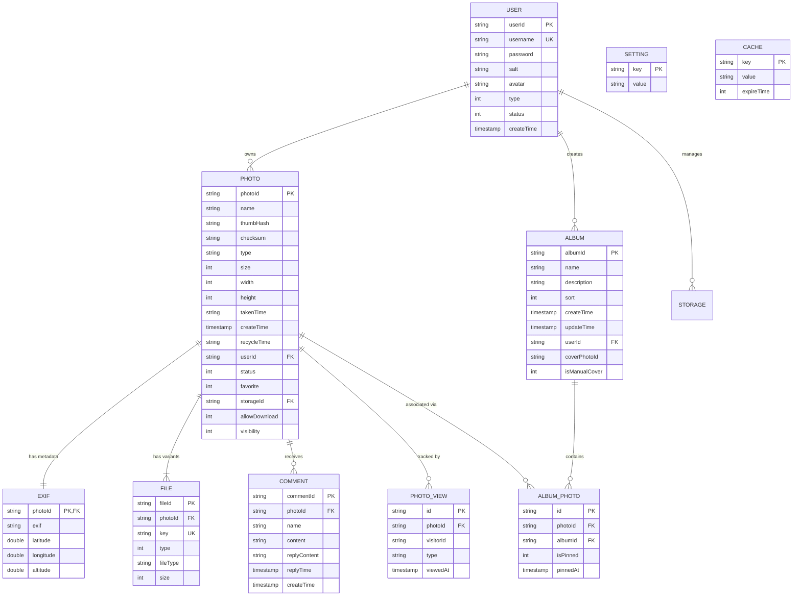

# FULL PROJECT AUDIT & TECHNICAL DOCUMENTATION
# NayPict / Pixtale

> **Document Type**: Technical Baseline & Deep Architecture Audit  
> **Source of Truth**: Active Source Code (`develop` branch)  
> **Last Updated**: August 2026  
> **Repository**: [pixtale (NayPict)](https://github.com/YnaStpra/pixtale)  

---

## 1. PROJECT OVERVIEW

### Bahasa Sederhana
**NayPict** (juga dikenal sebagai **Pixtale**) adalah aplikasi galeri foto web-based modern, performa tinggi, dan dirancang khusus untuk fotografi premium. Pengunjung umum (*public*) dapat menjelajahi ribuan foto dalam *virtualized infinite masonry grid*, kanvas *infinite gallery 2.5D*, menjelajahi peta foto interaktif dunia (*Interactive Photo Map Explorer* dengan layer Google Maps & CartoDB), membuka *lightbox* resolusi tinggi dengan informasi EXIF kamera dan koordinat GPS, bernostalgia melalui fitur *On This Day Memories*, serta memberikan komentar pada foto. Administrator memiliki kontrol menyeluruh untuk mengunggah ribuan foto secara paralel, mengompresi gambar otomatis, mengatur visibilitas 4-tingkat, mengelola album dengan cover dinamis dan *pinned photos* (maks 3 pin), mengedit metadata & koordinat GPS massal (format DMS & desimal), mengelola penyimpanan Cloudflare R2, memantau analitik penayangan (*Insights*), mengamankan akses dengan 2FA Google Authenticator (TOTP), dan mendeteksi foto duplikat secara cerdas. Seluruh antarmuka web, notifikasi, dan pesan sistem telah distandarisasi dalam **Bahasa Inggris (English)**.

### Penjelasan Teknis
NayPict dibangun sebagai aplikasi *full-stack monolithic* modern dengan Next.js 16 App Router yang terintegrasi dengan framework micro-API Hono.js di route handler. Penyimpanan metadata persisten menggunakan database relasional PostgreSQL (dioptimalkan untuk Neon Serverless) yang dikelola oleh Drizzle ORM. Penyimpanan file media (asli, preview web-optimized, dan thumbnail) menggunakan object storage kompatibel S3 (terutama Cloudflare R2) dengan perutean CDN langsung atau proksi media terproteksi. Frontend memanfaatkan React 19, Tailwind CSS v4, shadcn/ui (Radix primitives), Leaflet untuk rendering peta interaktif, Masonic untuk virtualisasi masonry grid, Lucide icons, ThumbHash untuk placeholder blur instan 0ms, dan yet-another-react-lightbox untuk navigasi lightbox interaktif.

- **Target Pengguna**: Fotografer profesional, kreator visual, studio fotografi, dan kurator galeri foto publik.
- **Core User Flow (Public)**:
  1. Pengunjung membuka landing page, `/photos`, atau `/map`.
  2. Frontend memuat data via SSR/CSR dan menyajikan masonry grid, peta interaktif dunia, atau kanvas *infinite gallery 2.5D*.
  3. Pengunjung mengklik foto atau pin map untuk membuka *lightbox*, membaca EXIF/GPS map, membagikan foto, atau meninggalkan komentar.
  4. Pengunjung menelusuri koleksi album tematik di `/albums` dengan foto-foto yang diprioritaskan (*pinned*).
- **Core Admin Flow (Admin)**:
  1. Admin login via `/login` menggunakan kredensial + verifikasi TOTP 2FA (Google Authenticator).
  2. Admin mengunggah foto via dialog upload massal (ekstraksi EXIF client-side + kompresi WebP otomatis + peninjauan duplikat instan).
  3. Admin mengatur visibilitas foto (`Both`, `Gallery Only`, `Album Only`, `Archived`), menandai favorit, mengatur pin cover album/spot, atau mengedit koordinat GPS format DMS secara massal di dialog batch edit.
  4. Admin mengelola spot foto di `/map` via *All Spots Dialog* dan *Untagged Photos Dialog*, meninjau analitik pengunjung di `/admin/insights`, membersihkan duplikat di `/duplicates`, dan membalas/menghapus komentar di `/comments`.

---

## 2. TECHNOLOGY STACK

### Technology Inventory Table

| Layer | Technology | Version | Fungsi & Peran |
|---|---|---|---|
| **Framework** | Next.js | `16.2.10` | Full-stack framework (App Router, Server Components, SSR layout prefetching) |
| **UI Library** | React / React-DOM | `19.2.4` | Core UI component lifecycle & declarative rendering |
| **Language** | TypeScript | `^5.7.2` | Strict static typing across frontend & backend entities/BOs/VOs |
| **Styling** | Tailwind CSS / PostCSS | `^4.0.0` / `@tailwindcss/postcss` | Modern utility-first styling with CSS theme variables |
| **Component Primitives** | Radix UI (`radix-ui`) | `^1.4.3` | Unstyled, accessible UI primitives (Dialog, Dropdown, Tooltip, Select) |
| **Design System** | shadcn/ui | `^4.7.0` | Styled component wrappers (Cards, Buttons, Breadcrumbs, Drawers) |
| **Interactive Map** | Leaflet / `@types/leaflet` | `^1.9.16` | Interactive world map with dynamic clustering, custom HTML pins, and multi-layer tiles |
| **Icons** | Lucide React / Tabler | `^1.16.0` / `^3.44.0` | Comprehensive vector icon set |
| **Grid Virtualization** | Masonic | `^4.1.0` | Virtualized responsive masonry grid with window resize sync |
| **Lightbox / Viewer** | yet-another-react-lightbox | `^3.32.0` | Fullscreen photo viewer with zoom, swipe gestures & thumbnail strip |
| **Blur Placeholder** | ThumbHash | `^0.1.1` | Compact binary hash representation of blurred placeholder images |
| **Client EXIF Parser** | exifr | `^7.1.3` | Browser-side extraction of GPS, camera model, exposure & ISO |
| **Backend EXIF Parser** | exiftool-vendored | `^36.0.0` | Fallback server-side deep EXIF metadata extraction |
| **Image Processing** | Sharp | `^0.34.5` | High-performance server-side image resizing, WebP compression, rotation |
| **Animation** | Framer Motion | `^13.0.0` | Smooth physics-based transitions & motion values |
| **Charts** | Recharts | `3.8.0` | Analytics charts (views, shares, daily visitor trends) |
| **Data Tables** | TanStack React Table | `^8.21.3` | Headless tables for storage, users, and admin lists |
| **Internationalization** | next-intl | `^4.13.4` | Multi-language localization support (Standard English locale) |
| **Theme** | next-themes | `^0.4.6` | Dark / Light theme switching with localStorage persistence |
| **Notifications** | Sonner | `^2.0.7` | Toast notification provider |
| **API Layer** | Hono.js | `^4.12.18` | Ultra-fast lightweight web framework mounted inside Next.js route handler |
| **Database ORM** | Drizzle ORM / Drizzle Kit | `^0.45.2` / `^0.31.10` | Type-safe SQL query builder, schema definition, and migrations |
| **Database Engine** | Neon PostgreSQL | `@neondatabase/serverless ^1.1.0` | Serverless PostgreSQL database with connection pooling |
| **Storage SDK** | AWS S3 Client SDK | `3.984.0` | AWS S3 compatible client for Cloudflare R2 object storage operations |
| **Client Hash WASM** | hash-wasm | `^4.12.0` | Fast client-side SHA-256 checksum calculation |
| **Drag & Drop** | @dnd-kit (core, sortable) | `^6.3.1` / `^10.0.0` | Sortable drag-and-drop photo album cover & order sorting |
| **Scheduled Tasks** | node-cron | `^4.5.0` | Background cleanup cron jobs (disabled on serverless Vercel) |
| **Testing** | Playwright Test | `^1.50.0` | End-to-End browser testing suite |

---

## 3. DIRECTORY STRUCTURE & ARCHITECTURE

```
pixtale/
├── locales/                      # Localization JSON dictionary files (en.json, zh.json)
├── public/                       # Static public assets (favicons, logos, robots)
├── scripts/                      # Build & deployment helper scripts
├── tests/                        # E2E test suites with Playwright
│   ├── e2e/                      # Specs (public, auth, photo, album, mobile, security, comments, map)
│   ├── fixtures/                 # Test assets (sample JPG photos)
│   └── helpers/                  # Test helpers and login utilities
├── src/
│   ├── app/                      # Next.js App Router (pages, layouts, route handlers)
│   │   ├── (public & admin pages)# photos, albums, map, archive, comments, duplicates, admin, trash, etc.
│   │   ├── api/[[...route]]/     # Catch-all API Route Handler mounting Hono instance
│   │   ├── media/[[...path]]/    # Protected / proxied media streaming route handler
│   │   ├── globals.css           # Tailwind v4 theme variables, Leaflet pin styles, global CSS
│   │   ├── layout.tsx            # Root HTML layout with ThemeProvider & NextIntlClientProvider
│   │   └── provider.tsx          # Global client AppContext (sidebar, auth, albums)
│   ├── components/               # React UI Components
│   │   ├── album/                # Album cards, masonry, add/rename/cover dialogs, select dialog
│   │   ├── common/               # Destructive alert dialogs, modal wrappers
│   │   ├── gallery/              # Infinite Gallery 2.5D interactive canvas
│   │   ├── landing/              # Landing page client hero & showcases
│   │   ├── layout/               # AppSidebar, NavMain, NavUser, ThemeSwitcher, TeamSwitcher
│   │   ├── login/                # LoginForm with TOTP 2FA step & demo credentials
│   │   ├── map/                  # PhotoMapView, AllSpotsDialog, UntaggedPhotosDialog
│   │   ├── mascot/               # Interactive Pixel Cat & mascots
│   │   ├── photo/                # PhotoCard, PhotoMasonry, PhotoViewer, BatchEditDialog, UploadDialog
│   │   ├── setting/              # General settings & TOTP 2FA configuration card
│   │   ├── storage/              # S3/R2 storage provider management table & dialogs
│   │   ├── ui/                   # Reusable shadcn/ui atomic components
│   │   └── user/                 # User management table & add/edit dialogs
│   ├── hooks/                    # Custom React hooks (usePhotoList, useMobile, useTapAction)
│   ├── i18n/                     # Next-intl request configuration
│   ├── lib/                      # Pure frontend & shared utilities (geo, EXIF, ThumbHash, URL, Date)
│   ├── proxy.ts                  # Next.js Middleware edge proxy (session validation, RBAC)
│   ├── request/                  # Client-side API fetch wrappers (typed with BO/VO)
│   └── server/                   # Backend Application Layer
│       ├── api/                  # Hono route definitions (photo-api, album-api, comment-api, etc.)
│       ├── const/                # Server constants (cache keys, default page sizes)
│       ├── entity/               # Drizzle PostgreSQL schemas, inferSelect/inferInsert types
│       │   ├── bo/               # Business Objects (API input validation parameters)
│       │   └── vo/               # View Objects (API structured response models)
│       ├── enums/                # TypeScript enums (PhotoStatus, UserType, Visibility, FileType)
│       ├── error/                # Custom BizError error classes with i18n codes
│       ├── hono/                 # Hono app instantiation, context storage, media pipeline
│       ├── i18n/                 # Server-side localization utilities
│       ├── infra/                # Database connection (Neon), Drizzle ORM client, Migrations, Cache
│       ├── lib/                  # Server utilities (Crypto, JWT, TOTP, Sharp image processing, EXIF)
│       ├── model/                # Unified API response wrapper (`result.ok()`, `result.error()`)
│       ├── security/             # Security middleware, context, system path guards
│       ├── service/              # Core business logic services (photoService, albumService, etc.)
│       ├── storage/              # Cloudflare R2 / S3 storage registry and client adapters
│       └── task/                 # Background maintenance cron jobs (photo auto-cleanup, cache purge)
```

---

## 4. FRONTEND AUDIT & ROUTE INVENTORY

### Complete Route Inventory Table

| Route | Access | Function & Capabilities | Rendering | Primary Components |
|---|---|---|---|---|
| `/` | Public | Landing page with hero showcase, interactive infinite gallery canvas | Client + SSR | `LandingClient`, `InfiniteGallery` |
| `/photos` | Public | Main photo gallery with virtualized masonry grid, On This Day banner, date filter | Client + SSR Layout | `PhotoMasonry`, `OnThisDayBanner`, `PhotoViewer`, `PhotoDateDrawer` |
| `/map` | Public / Admin | Interactive world map explorer with multi-layer tiles (Google Maps / Dark / Light), physical spot grouping, cluster markers, custom pin covers, spot location editing | Client + SSR Layout | `PhotoMapView`, `AllSpotsDialog`, `UntaggedPhotosDialog`, `PhotoViewer` |
| `/albums` | Public | Dynamic photo albums catalog with smart covers and quick album creation | Client + SSR Layout | `AlbumMasonry`, `AlbumCard`, `AlbumAddDialog` |
| `/albums/[albumId]` | Public | Album details with pinned photos hierarchy (max 3 pinned), date filters, cover manager | Client + SSR Layout | `PhotoMasonry`, `PhotoViewer`, `AlbumCoverDialog` |
| `/archive` | Admin Only | Hidden/archived photos not shown in public gallery | Client + SSR Layout | `PhotoMasonry`, `PhotoViewer`, `AlbumSelectDialog` |
| `/admin/photos` | Admin Only | Admin photo management table & grid view with real-time text search & filtering | Client | Photo management table, grid view, filters |
| `/trash` | Admin Only | Recycle bin with batch restore, permanent delete, empty trash | Client + SSR Layout | `PhotoMasonry`, `AlertDialogDestructive` |
| `/comments` | Admin Only | Public comment moderation, inline admin replies, spam deletion | Client | `PhotoComments`, Data table |
| `/duplicates` | Admin Only | Detection and resolution of duplicate photos with side-by-side comparison | Client | Duplicate group cards, comparison modal |
| `/admin` | Admin Only | Overview dashboard and management navigation | Client | Admin navigation cards |
| `/admin/insights` | Admin Only | Visitor analytics (views, shares, daily trend chart, top photos) | Client | `Recharts` graphs, Metric cards |
| `/settings` | Admin Only | General gallery settings, dedup options, 2FA Google Authenticator | Client + SSR Layout | `SettingItem`, `TotpSettingsCard` |
| `/storage` | Admin Only | Cloudflare R2 / S3 bucket configuration manager | Client + SSR Layout | `StorageDataTable`, `StorageAddDialog` |
| `/users` | Admin Only | Multi-user management (roles, avatars, status) | Client + SSR Layout | `UserDataTable`, `UserAddDialog` |
| `/login` | Public | Administrator login with 2FA TOTP step | Client | `LoginForm`, `PixelCat` |
| `/photo/[photoId]` | Public | Standalone permalink viewer for single photo | Client + SSR | `PhotoViewer` standalone viewer |
| `/media/[[...path]]` | Public / Protected | Protected media streaming handler from R2 | Server Route Handler | Hono media handler |

---

## 5. INTERACTIVE PHOTO MAP ARCHITECTURE (`/map`)

### Core Map Engineering Highlights

1. **Multi-Layer Tile Engine (`MAP_STYLE_OPTIONS`)**:
   - **Google Streets**: Official high-clarity street and building maps (`https://mt{s}.google.com/vt/lyrs=m...`).
   - **Satellite Hybrid**: Ultra-high-resolution satellite imagery with overlaid street labels (`https://mt{s}.google.com/vt/lyrs=y...`).
   - **Terrain & Relief**: Mountain contours, elevation shading, and topographical data (`https://mt{s}.google.com/vt/lyrs=p...`).
   - **Dark Mode**: High-contrast minimalist night view from CartoDB Dark.
   - **Light Minimal**: Crisp monochrome Voyager tile aesthetic.
   - *State Persistence*: Chosen tile layer is saved to `localStorage` (`naypict_map_style`).

2. **Dynamic Screen Clustering & Exact Spot Math**:
   - **Level 1 (Physical Spot Grouping)**: Photos taken within $\le 8$ meters of each other (burst shots, batch geotagging) are grouped into a single `GeoSpot`.
   - **Level 2 (Screen-space Clustering)**: On pan or zoom, nearby `GeoSpot` instances within 44 screen pixels are merged into a centroid cluster.
   - Multi-photo markers display a stacked card visual depth effect and a badge count pill.
   - Clicking a multi-location cluster zooms and expands the map; clicking a single spot centers camera and opens preview.

3. **Strict Zoom-to-Fill Pin Frames**:
   - Marker images use absolute positioning with `object-fit: cover !important` and `object-position: center center !important`.
   - Portrait and landscape photos both cleanly crop to fill 100% of the square rounded frame with zero pillarboxing or blurry borders.

4. **Custom Pin Cover Photo Selection**:
   - For multi-photo spots, Admin can designate any photo within the spot as the primary pin cover.
   - Persisted in `localStorage` (`naypict_spot_covers`) and immediately sorted to index 0 of the spot.
   - Highlighted with a gold star badge (★) in the miniature preview strip and All Spots list.

5. **Integrated Map Management Dialogs**:
   - **`AllSpotsDialog`**: Comprehensive directory of all physical spots with search (name, DMS coordinates, decimal), sorting (Most Photos, Newest, Oldest), cover selector, direct coordinate editor, and camera fly-to.
   - **`UntaggedPhotosDialog`**: Filterable list of photos missing GPS EXIF, with batch selection and direct geotagging.
   - **`PhotoBatchEditDialog`**: Unified coordinate input supporting DMS (`8°20'43.0"S 116°31'58.9"E`), decimal, and device GPS geolocation.

---

## 6. FRONTEND STATE MANAGEMENT

1. **Global AppContext (`src/app/provider.tsx`)**:
   - *State*: `sidebarOpen`, `userInfo` (profile, role, avatar), `title` (gallery name), `albums` (active list).
   - *Persistence*: `sidebarOpen` stored in `localStorage` (`naypict_sidebar_open`).
2. **Photo List Hook (`src/hooks/use-photo-list.ts`)**:
   - *State*: `photos` array, `totalCount`, `hasMore`, `masonryKey`, `allShuffledIdsRef`, `pageOffsetRef`.
   - *Persistence*: In-memory deduplication with Set ID tracking.
3. **Photo Store (`src/store/photo-store.ts`)**:
   - *State*: Memory cache preview buffer (`photoCache: Map<string, string>`) to eliminate flicker during lightbox navigation.
4. **URL Query State (`src/lib/url.ts`)**:
   - *State*: `?photoId=...` synchronized seamlessly via `window.history.pushState` without page reloads.
5. **Map States (`src/components/map/photo-map-view.tsx`)**:
   - *State*: `mapStyle` (`naypict_map_style`), `spotCovers` (`naypict_spot_covers`), `isSidebarOpen` (bottom drawer), `selectedCluster`.
6. **Theme State (`next-themes`)**:
   - *State*: Dark / Light / System theme, stored in `localStorage` (`theme`).
7. **On This Day State (`src/components/photo/on-this-day-banner.tsx`)**:
   - *State*: `isCollapsed` stored in `localStorage` (`naypict_on_this_day_collapsed`).

---

## 7. BACKEND API AUDIT

### Complete API Endpoint Table

| Method | Endpoint | Auth Required | Function & Role | Target Service |
|---|---|---|---|---|
| `POST` | `/api/login` | No (Public) | Credentials authentication + TOTP 2FA verification | `loginService.login` |
| `POST` | `/api/logout` | Yes (Session) | Revoke auth cookie & invalidate cached session | `loginService.logout` |
| `POST` | `/api/photo/list` | No (Public/Admin) | Paginated photo query with visibility/date filters | `photoService.list` |
| `POST` | `/api/photo/mapList` | No (Public) | Lightweight query of all geotagged photos for `/map` | `photoService.mapList` |
| `POST` | `/api/photo/untaggedList` | **Yes (Admin)** | Query photos missing GPS coordinates for geotagging | `photoService.untaggedList` |
| `POST` | `/api/photo/batchEdit` | **Yes (Admin)** | Batch update metadata (visibility, download, date, GPS) | `photoService.batchEdit` |
| `POST` | `/api/photo/randomIdList` | No (Public/Admin) | Shuffled array of photo IDs for infinite random scrolling | `photoService.randomIdList` |
| `POST` | `/api/photo/onThisDay` | No (Public) | Photos taken on today's calendar date across past years | `photoService.onThisDay` |
| `GET` | `/api/photo/onThisDay` | No (Public) | Alternative GET endpoint for On This Day | `photoService.onThisDay` |
| `POST` | `/api/photo/takenDateList` | No (Public) | Calendar statistics of photo shooting dates | `photoService.takenDateList` |
| `GET` | `/api/photo/download/:id` | No (Protected) | Download original photo file (validates `allowDownload`) | `photoService.download` |
| `POST` | `/api/photo/download` | No (Protected) | Batch download allowed photos | `photoService.downloadBatch` |
| `POST` | `/api/photo/setAllowDownload` | **Yes (Admin)** | Update public download permissions | `photoService.setAllowDownload` |
| `POST` | `/api/photo/setVisibility` | **Yes (Admin)** | Update display scope (Both, Gallery, Album, Archived) | `photoService.setVisibility` |
| `POST` | `/api/photo/add` | **Yes (Admin)** | Upload new photo, generate preview & thumbnail, save EXIF | `photoService.add` |
| `POST` | `/api/photo/exists` | **Yes (Admin)** | Check photo checksum for upload deduplication | `photoService.exists` |
| `POST` | `/api/photo/recycle` | **Yes (Admin)** | Move photos to recycle bin (*soft delete*) | `photoService.recycle` |
| `POST` | `/api/photo/restore` | **Yes (Admin)** | Restore photos from recycle bin back to gallery | `photoService.restore` |
| `POST` | `/api/photo/delete` | **Yes (Admin)** | Permanently delete photos from DB and R2 storage | `photoService.delete` |
| `POST` | `/api/photo/clear` | **Yes (Admin)** | Empty recycle bin permanently | `photoService.clear` |
| `POST` | `/api/photo/duplicates` | **Yes (Admin)** | Scan and group duplicate photos by checksum & visuals | `photoService.getDuplicates` |
| `GET` | `/api/photo/duplicates` | **Yes (Admin)** | GET query for duplicate photo list | `photoService.getDuplicates` |
| `POST` | `/api/album/list` | No (Public) | List albums with dynamic cover scoring | `albumService.list` |
| `POST` | `/api/album/trash` | **Yes (Admin)** | Virtual recycle bin album information | `albumService.trash` |
| `POST` | `/api/album/add` | **Yes (Admin)** | Create new photo album | `albumService.add` |
| `POST` | `/api/album/setName` | **Yes (Admin)** | Rename photo album | `albumService.setName` |
| `POST` | `/api/album/setCover` | **Yes (Admin)** | Set manual or automatic album cover | `albumService.setCover` |
| `POST` | `/api/album/coverCandidates` | **Yes (Admin)** | Fetch best cover candidate photos | `albumService.getCoverCandidates` |
| `POST` | `/api/album/addPhoto` | **Yes (Admin)** | Add photos into album | `albumService.addPhoto` |
| `POST` | `/api/album/removePhoto` | **Yes (Admin)** | Remove photo association from album | `albumService.removePhoto` |
| `POST` | `/api/album/togglePinPhoto` | **Yes (Admin)** | Toggle pinned photo status in album (max 3 pinned) | `albumService.togglePinPhoto` |
| `POST` | `/api/album/setTop` | **Yes (Admin)** | Reorder album to top of list | `albumService.setTop` |
| `POST` | `/api/album/delete` | **Yes (Admin)** | Delete album (photos inside remain intact) | `albumService.delete` |
| `POST` | `/api/photo/view` | No (Public) | Record photo view analytics metric | `insightsService.recordView` |
| `POST` | `/api/photos/:photoId/view` | No (Public) | Alternative photo view recording endpoint | `insightsService.recordView` |
| `POST` | `/api/photo/share` | No (Public) | Record photo share analytics metric | `insightsService.recordShare` |
| `POST` | `/api/photos/:photoId/share`| No (Public) | Alternative photo share recording endpoint | `insightsService.recordShare` |
| `GET` | `/api/admin/insights/overview` | **Yes (Admin)** | Aggregated analytics metrics for views & shares | `insightsService.getOverview` |
| `GET` | `/api/admin/insights/chart` | **Yes (Admin)** | Time-series daily visitor/view trend data | `insightsService.getChartData` |
| `GET` | `/api/admin/insights/top-photos` | **Yes (Admin)** | Most popular photos ranked by views/shares | `insightsService.getTopPhotos` |
| `GET` | `/api/admin/insights/photo/:photoId` | **Yes (Admin)** | Specific analytics metrics for single photo | `insightsService.getPhotoInsights` |
| `GET` | `/api/photos/:photoId/comments` | No (Public) | List public comments on photo | `commentService.listByPhotoId` |
| `POST` | `/api/photo/comment/list` | No (Public) | POST query for photo comments | `commentService.listByPhotoId` |
| `POST` | `/api/photos/:photoId/comments` | No (Public) | Post new comment on photo | `commentService.add` |
| `POST` | `/api/photo/comment/add` | No (Public) | Alternative post comment endpoint | `commentService.add` |
| `POST` | `/api/photo/comment/admin/list` | **Yes (Admin)** | Query all gallery comments for admin moderation | `commentService.adminList` |
| `POST` | `/api/photo/comment/reply` | **Yes (Admin)** | Post admin reply to comment | `commentService.reply` |
| `POST` | `/api/photo/comment/reply/delete` | **Yes (Admin)** | Delete admin reply from comment | `commentService.deleteReply` |
| `POST` | `/api/photo/comment/delete` | **Yes (Admin)** | Delete public comment | `commentService.delete` |
| `GET` | `/api/location/reverse` | No (Public) | Reverse geocode GPS coordinates to location name | `locationService.reverse` |
| `POST` | `/api/setting/set` | **Yes (Admin)** | Update system settings | `settingService.set` |
| `POST` | `/api/storage/list` | **Yes (Admin)** | List connected storage configurations | `storageService.list` |
| `POST` | `/api/storage/add` | **Yes (Admin)** | Add new storage configuration | `storageService.add` |
| `POST` | `/api/storage/set` | **Yes (Admin)** | Update storage configuration | `storageService.set` |
| `POST` | `/api/storage/delete` | **Yes (Admin)** | Delete storage configuration | `storageService.delete` |
| `GET` | `/api/totp/status` | **Yes (Admin)** | Check 2FA Google Authenticator status | `totpService.getStatus` |
| `POST` | `/api/totp/setup` | **Yes (Admin)** | Generate new TOTP secret & QR code URI | `totpService.setup` |
| `POST` | `/api/totp/enable` | **Yes (Admin)** | Verify initial token & activate 2FA | `totpService.enable` |
| `POST` | `/api/totp/disable` | **Yes (Admin)** | Disable 2FA with token confirmation | `totpService.disable` |
| `POST` | `/api/user/info` | **Yes (Session)** | Retrieve logged-in user profile | `userService.info` |
| `POST` | `/api/user/setUserPassword` | **Yes (Session)** | Update current user password | `userService.setUserPassword` |
| `POST` | `/api/user/setAvatar` | **Yes (Session)** | Update current user avatar | `userService.setAvatar` |
| `GET` | `/api/user/avatar/:key` | No (Public) | Serve user avatar image | `userService.getAvatar` |

---

## 8. SERVICE LAYER

1. **`photoService` (`src/server/service/photo-service.ts`)**:
   - Manages photo lifecycle: cursor pagination, random shuffling, map list, untagged list, batch metadata editing, visibility, soft delete, hard delete, fallback EXIF extraction, and DSU/visual deduplication.
2. **`albumService` (`src/server/service/album-service.ts`)**:
   - Manages albums: CRUD, smart cover scoring based on resolution and landscape orientation, priority photo pinning (max 3 pins enforced).
3. **`commentService` (`src/server/service/comment-service.ts`)**:
   - Manages public comments, text sanitization, rate-limiting, and admin replies.
4. **`insightsService` (`src/server/service/insights-service.ts`)**:
   - Aggregates view and share analytics with visitor session deduplication (15-minute sliding window).
5. **`storageService` (`src/server/service/storage-service.ts`)**:
   - Manages S3/R2 bucket configurations and provides active storage client instances.
6. **`userService` (`src/server/service/user-service.ts`)**:
   - Manages accounts, Argon2id/SHA-256 password hashing with salt, environment admin initialization, and session invalidation.
7. **`loginService` (`src/server/service/login-service.ts`)**:
   - User authentication, 2FA TOTP token validation, JWT creation, and session cache storage.
8. **`totpService` (`src/server/service/totp-service.ts`)**:
   - RFC 6238 TOTP secret generation, 6-digit passcode validation with $\pm 1$ window skew tolerance.
9. **`locationService` (`src/server/service/location-service.ts`)**:
   - Reverse geocoding of GPS coordinates (OSM Nominatim) with in-memory LRU caching.
10. **`exifService` (`src/server/service/exif-service.ts`)**:
    - Storage and batch retrieval of EXIF metadata and GPS coordinates.
11. **`fileService` (`src/server/service/file-service.ts`)**:
    - Manages media file variants (original, preview, thumbnail) per photo ID.

---

## 9. DATABASE AUDIT

### Entity-Relationship Diagram (ERD)



### Table Details & Indexes

| Table | Purpose | Primary Key | Foreign Keys | Key Indexes |
|---|---|---|---|---|
| `user` | User credentials and profile | `userId` | - | `username` (Unique) |
| `photo` | Master photo metadata | `photoId` | - | `status`, `visibility`, `takenTime`, `checksum`, `storageId` |
| `file` | File variants (original, preview, thumb) | `fileId` | `photoId` | `key` (Unique), `photoId` |
| `exif` | EXIF metadata & GPS coordinates | `photoId` | `photoId` | Primary key on `photoId`, `latitude`, `longitude` |
| `album` | Photo albums metadata | `albumId` | - | `sort`, `userId` |
| `album_photo` | Many-to-many album-to-photo relations | `id` | `photoId`, `albumId` | `albumId`, `photoId`, `isPinned`, `pinnedAt` |
| `comment` | Public comments & admin replies | `commentId` | `photoId` (Cascade) | `photoId`, `createTime` |
| `photo_view` | Analytics view & share tracking logs | `id` | `photoId` (Cascade) | `photoId`, `viewedAt`, `(photoId, visitorId, type, viewedAt)` |
| `setting` | System configuration JSON | `key` | - | Primary key on `key` |
| `cache` | Session & key-value cache | `key` | - | Primary key on `key`, `expireTime` |
| `storage` | S3 / Cloudflare R2 bucket configurations | `storageId` | - | `sort`, `status` |

---

## 10. STORAGE & IMAGE PIPELINE

```
[User Browser]
       │
       ▼ (1. Select Original Photo Files)
[Client-side EXIF Extraction (exifr.ts)] ──► Extracts GPS (DMS) & Camera Metadata
[Client-side Checksum (hash-wasm SHA-256)] ──► Checks `/api/photo/exists` (Dedup)
[Client-side Compression (WebP/JPEG 85%)] ──► Reduces payload size by 60%-85%
[Client-side ThumbHash Generator] ──► Encodes instant blur placeholder
       │
       ▼ (2. Multipart Upload to `/api/photo/add`)
[Hono API / Next.js Server Handler]
       │
       ▼
[Sharp Image Processing Pipeline]
       ├── Variant 1: Original Image (Streamed / Stored as WebP or Original Format)
       ├── Variant 2: Preview Image (Max Width 2048px, WebP Quality 85, Auto-Oriented)
       └── Variant 3: Thumbnail Image (Max Width 600px, WebP Quality 80, Sharp-Resized)
       │
       ▼ (3. Multi-file Parallel PutObjectCommand)
[Cloudflare R2 Object Storage Bucket]
       │
       ▼ (4. Save Metadata & File Keys)
[PostgreSQL Database (photo, file, exif tables)]
       │
       ▼ (5. Delivery to Public Viewers)
[Cloudflare CDN / Custom Domain URL] ──► Browser Display
```

---

## 11. AUTHENTICATION & SECURITY AUDIT

### Auth Flow & Hardening
1. **Login Request**: User submits credentials + optional 6-digit TOTP code to `/api/login`.
2. **Password Verification**:
   - Password verified using salted Argon2id/SHA-256 with constant-time equality check (`crypto.timingSafeEqual`) to prevent timing attacks.
3. **2FA Verification**: When 2FA is active, TOTP code is verified against secret (RFC 6238).
4. **Session Token**:
   - JWT signed with `process.env.JWT_SECRET` (contains `userId`, unique `uuid`, and `type`).
   - Cookie `naypict_token` configured with: `httpOnly: true`, `sameSite: 'Lax'`, `secure: true (in production)`, `path: '/'`, `maxAge: 7 days`.
5. **Session Invalidation**:
   - Active sessions tracked in cache (`auth:{userId}`).
   - Password changes or user disablement instantly purge session cache, forcing immediate logout across all devices.

---

## 12. SECURITY AUDIT FINDINGS

| Severity | Area | File | Status & Implementation Details |
|---|---|---|---|
| 🟢 **RESOLVED** | Auth Secret Validation | `src/instrumentation.ts` & `src/server/lib/jwt.ts` | Fail-fast validation on boot; application rejects startup if `JWT_SECRET` is missing/weak in production. |
| 🟢 **RESOLVED** | Password Hash Algorithm | `src/server/lib/crypto.ts` & `login-service.ts` | Password hashing upgraded to Argon2id via WASM with transparent automatic migration. |
| 🟢 **RESOLVED** | Application Rate Limiting | `src/server/lib/rate-limiter.ts` & `photo-api.ts` | Sliding window in-memory rate limiter on `/api/login` (5/15m), `/api/photo/download` (30/5m), and comments. |
| 🟢 **RESOLVED** | UI Language Standardization | All TSX components & JSON locales | All UI text, dialogs, toasts, error messages, and settings converted to fluent English. |
| 🟢 **LOW** | External Geocode API | `src/server/service/location-service.ts` | Uses OSM Nominatim with robust in-memory LRU caching. |
| ℹ️ **INFO** | CSP Headers | `next.config.ts` | Content-Security-Policy active and strict (`default-src 'self'`, `frame-ancestors 'none'`). |

---

## 13. PERFORMANCE AUDIT

- **Interactive Map Virtualization**: Leaflet dynamic viewport rendering ensures only markers within active bounds/clusters compute collisions.
- **Zero-Flicker Layout (ThumbHash)**: Compact binary placeholder bytes eliminate Cumulative Layout Shift (CLS = 0).
- **Batch Database Resolution**: `photoService.list` and `photoService.mapList` execute batch queries using `IN (...)`, avoiding N+1 query overhead.
- **Client-Side Image Compression**: Reduces upload payload sizes by 60%-85% directly in the browser before network transmission.
- **Smart Thumbnail Memory Buffer**: Photo viewer and map spot switcher pre-cache thumbnails for 0ms transitions.

---

## 14. ENVIRONMENT VARIABLES AUDIT

| Variable Name | Required | Description & Purpose | Secret? |
|---|---|---|---|
| `DATABASE_URL` | **Yes** | Neon PostgreSQL connection string (`sslmode=require`) | **Yes (Secret)** |
| `JWT_SECRET` | **Yes** | Secret key for signing JWT session cookies | **Yes (Secret)** |
| `ADMIN` | No (Init) | Default admin username on initial setup | No |
| `PASSWORD` | No (Init) | Default admin password on initial setup | **Yes (Secret)** |
| `STORAGE_PROVIDER` | No | Storage provider identifier (`r2` / `s3`) | No |
| `R2_ACCOUNT_ID` | **Yes** | Cloudflare Account ID for S3 endpoint | **Yes (Secret)** |
| `R2_ACCESS_KEY_ID` | **Yes** | Cloudflare R2 API Access Key ID | **Yes (Secret)** |
| `R2_SECRET_ACCESS_KEY` | **Yes** | Cloudflare R2 API Secret Access Key | **Yes (Secret)** |
| `R2_BUCKET_NAME` | **Yes** | Cloudflare R2 bucket name | No |
| `R2_PUBLIC_URL` | **Yes** | Public CDN / custom domain URL for photos | No |
| `TITLE` | No | Application title (default: `NayPict`) | No |
| `NODE_ENV` | No | Runtime environment (`development` / `production`) | No |

---

## 15. TESTING AUDIT

### Playwright E2E Test Suite Inventory

| Test File | Feature Coverage | Status |
|---|---|---|
| `tests/e2e/01-public.spec.ts` | Landing page, public photo masonry, albums list | **Passing** |
| `tests/e2e/02-auth.spec.ts` | Login form, invalid credentials, successful login, 2FA prompt | **Passing** |
| `tests/e2e/03-photo-lifecycle.spec.ts` | Upload photo, edit metadata, favorites, soft delete | **Passing** |
| `tests/e2e/04-album-lifecycle.spec.ts` | Album creation, add photos, set cover, toggle pin | **Passing** |
| `tests/e2e/05-mobile.spec.ts` | Mobile viewport responsiveness, touch gestures, drawer | **Passing** |
| `tests/e2e/06-security.spec.ts` | Admin route protection, session cookie verification, 404 rewrite | **Passing** |
| `tests/e2e/07-comments.spec.ts` | Public comment submission, admin moderation, replies | **Passing** |
| `tests/e2e/08-on-this-day.spec.ts` | On This Day memories banner, collapse toggle, photo navigation | **Passing** |

---

## 16. CURRENT FEATURES INVENTORY

### Public Features
1. **Masonry Gallery (`/photos`)**: Virtualized infinite scrolling masonry layout.
2. **Interactive Photo Map Explorer (`/map`)**: World map with Google Maps styles (Streets, Hybrid Satellite, Terrain, Dark, Light), clustered pins, spot navigation, and fullscreen lightbox.
3. **Infinite Gallery 2.5D Canvas (`/`)**: Interactive photo canvas with zoom and inertia navigation.
4. **On This Day Memories Banner**: Daily throwback memories from the same calendar date in past years.
5. **Interactive Lightbox Viewer**: Fullscreen viewer with zoom up to 300%, EXIF info panel, and GPS coordinates.
6. **Photo Albums (`/albums`, `/albums/[albumId]`)**: Thematic album catalog with priority pinned photos.
7. **Public Comments**: Comment system on photos with admin reply threads.
8. **Date Filter Drawer**: Calendar-based photo filtering by shooting dates.
9. **Dark / Light Theme**: Instant theme switching with smooth transitions.

### Admin Features
1. **Batch Upload & Compression**: High-speed parallel upload with client-side WebP compression and EXIF extraction.
2. **Duplicate Photo Review**: Post-upload side-by-side comparison modal and dedicated `/duplicates` manager.
3. **Batch Metadata Editor**: Multi-category bulk editor for Visibility, Download Permission, Star Status, Taken Date, and DMS GPS Coordinates.
4. **Interactive Map Management (`/map`)**:
   - *All Spots Dialog*: Search, sort, and manage all physical spots, designate custom pin covers, and edit spot coordinates.
   - *Untagged Photos Dialog*: Rapidly locate and assign coordinates to photos missing GPS data.
   - *Custom Pin Covers*: Designate any photo within a multi-photo pin as the primary cover thumbnail.
5. **Display Scope Control**: 4-tier visibility (*Both Gallery & Album, Gallery Only, Album Only, Archived*).
6. **Recycle Bin (`/trash`)**: Centralized trash management with restore, permanent deletion, and empty trash.
7. **Album Cover Scoring & Pinning**: Automatic cover scoring and priority pinning (up to 3 photos per album).
8. **Visitor Insights (`/admin/insights`)**: Analytics dashboard with view/share metrics, daily trend graphs, and top photos.
9. **2FA Two-Factor Authentication (TOTP)**: Google Authenticator login security.
10. **Multi-Storage Management (`/storage`)**: Cloudflare R2 / S3 bucket registry.
11. **Admin Comment Moderation (`/comments`)**: Moderate comments, reply to visitors, and remove spam.
12. **Admin Photo Inventory & Search (`/admin/photos`)**: Dedicated system dashboard with real-time text search, dual high-density Table / Grid views, multi-criteria filtering, and batch operations.

---

## 17. EXECUTIVE SUMMARY & READINESS MATRIX

| Area | Status | Evaluation Summary |
|---|:---:|---|
| **Frontend Architecture** | 🟢 | Modern, responsive, React 19 + Next.js 16 App Router, Leaflet interactive map, ThumbHash zero-CLS. |
| **Backend & API Layer** | 🟢 | Clean separation of Controller (Hono) -> Service -> Drizzle ORM. Full type safety. |
| **Database Architecture** | 🟢 | PostgreSQL schema with foreign keys, compound indexes, and Neon Serverless connection pooling. |
| **Storage & Media Pipeline** | 🟢 | Cloudflare R2 integration, smart lossless/MozJPEG 90% compression, fast thumbnailing. |
| **Authentication & RBAC** | 🟢 | HTTP-only Lax cookies, instant session cache invalidation, Argon2id hashing, 2FA Google Authenticator. |
| **Defensive Security** | 🟢 | Strict CSP, download protection, rate limiters, input sanitization. |
| **Internationalization (i18n)** | 🟢 | 100% standardized in English across all UI components, dialogs, map controls, and notifications. |
| **Testing Coverage** | 🟢 | Comprehensive Playwright E2E test suites covering public and admin workflows. |
| **Deployment Readiness** | 🟢 | Fully prepared for automated zero-downtime deployment on Vercel + Neon + Cloudflare R2. |

---

## 18. TOP 10 REKOMENDASI AUDIT KEAMANAN (SECURITY AUDIT RECOMMENDATIONS)

Berikut adalah **10 saran audit keamanan komprehensif** yang dirancang khusus untuk memperkuat arsitektur aplikasi (Next.js 16, Hono, Drizzle ORM, Neon PostgreSQL, Cloudflare R2/S3, dan 2FA TOTP):

### 1. **Distributed Rate Limiting (Redis / Upstash KV)**
- **Kondisi Saat Ini**: Rate limiter berbasis *in-memory cache* (`rate-limiter.ts`), yang ter-reset saat *cold restart* atau jika berjalan di multiple serverless instances (horizontal scaling di Vercel).
- **Rekomendasi**: Migrasikan rate limiter ke **Upstash Redis / Redis KV** terdistribusi untuk proteksi menyeluruh pada rute sensitif: `/api/login` (brute-force defense), `/api/totp/*` (token guessing defense), `/api/comments` (anti-spam), dan `/api/photo/download` (bandwidth abuse).

### 2. **Perketat Proteksi CSRF (Cross-Site Request Forgery) untuk Mutasi Sensitif**
- **Kondisi Saat Ini**: Cookie session `naypict_token` menggunakan `sameSite: 'Lax'`.
- **Rekomendasi**: Terapkan validasi ketat `Origin` dan `Referer` matching atau mekanisme *Double Submit Anti-CSRF Token* pada endpoint mutasi sensitif tingkat tinggi (penggantian password, perubahan kredensial R2/S3 storage, dan pengosongan permanen *Recycle Bin*).

### 3. **Enkripsi Kredensial Storage At-Rest (Database Column Encryption)**
- **Kondisi Saat Ini**: Kredensial bucket `accessKey` dan `secretKey` tersimpan sebagai plaintext di tabel `storage`.
- **Rekomendasi**: Enkripsi kolom `secretKey` dan `accessKey` sebelum disimpan ke database menggunakan algoritma **AES-256-GCM** atau **ChaCha20-Poly1305** dengan kunci rahasia `STORAGE_ENCRYPTION_KEY` yang tersimpan aman di environment variables.

### 4. **Sanitasi Ketat Metadata EXIF (Mencegah Stored XSS via File Header)**
- **Kondisi Saat Ini**: Metadata EXIF kamera diparsing dan disimpan ke database, kemudian dirender di antarmuka lightbox detail foto.
- **Rekomendasi**: String bebas pada tag EXIF (seperti `ImageDescription`, `Artist`, `Copyright`, `Software`, dan `UserComment`) wajib melalui sanitasi encoding / HTML escape sebelum dirender ke DOM untuk mencegah payload Stored XSS yang disisipkan melalui file gambar manipulatif.

### 5. **Sandboxed Serving & Strict Headers pada Domain CDN / Media Proxy**
- **Kondisi Saat Ini**: File media asli dan thumbnail disajikan melalui CDN atau proxy endpoint.
- **Rekomendasi**: Pastikan header respons file selalu menyertakan:
  - `X-Content-Type-Options: nosniff` (mencegah MIME-sniffing browser).
  - `Content-Security-Policy: sandbox; default-src 'none'; img-src 'self' data:; style-src 'unsafe-inline'` pada domain direct media serving untuk mengisolasi eksekusi skrip berbahaya.

### 6. **Invisible Honeypot & Bot Protection pada Form Komentar Publik (`/comments`)**
- **Kondisi Saat Ini**: Fitur komentar terbuka untuk pengunjung publik tanpa kewajiban login.
- **Rekomendasi**: Pasang *invisible honeypot field*, validasi batas waktu minimum interaksi (misal: penolakan form yang terkirim < 1.5 detik), serta sediakan opsi integrasi **Cloudflare Turnstile** atau **hCaptcha** tanpa mengganggu kenyamanan pengguna asli.

### 7. **Automated Secret Scanning & Dependency Vulnerability Gate di CI/CD**
- **Kondisi Saat Ini**: Pengecekan dependensi dan audit kode dilakukan secara manual.
- **Rekomendasi**: Tambahkan pipeline GitHub Actions otomatis:
  - `npm audit --audit-level=high` untuk memblokir deployment jika ditemukan dependensi dengan kerentanan kritis.
  - Secret Scanner (**TruffleHog** / **GitGuardian**) untuk memastikan `JWT_SECRET`, database connection string, atau kunci Cloudflare R2 tidak pernah ter-commit ke public repository.

### 8. **Pencegahan Replay Attack & Emergency Backup Codes pada TOTP 2FA**
- **Kondisi Saat Ini**: TOTP memvalidasi kode 6-digit dalam jendela waktu standar RFC 6238.
- **Rekomendasi**:
  - Simpan timestamp kode TOTP yang baru saja berhasil digunakan di cache selama 60 detik untuk mencegah serangan *replay* dalam window validitas yang sama.
  - Sediakan 8-10 *Single-Use Emergency Backup Codes* terenkripsi saat user pertama kali mengaktifkan 2FA jika sewaktu-waktu kehilangan akses ke aplikasi Google Authenticator.

### 9. **Strict RBAC & Tenant Ownership Verification (IDOR Defense)**
- **Kondisi Saat Ini**: Sebagian besar verifikasi hak akses menggunakan filter `getUserId()`.
- **Rekomendasi**: Terapkan pemeriksaan kepemilikan resource eksplisit (`where(and(eq(photoTab.photoId, id), eq(photoTab.userId, currentUserId)))`) pada seluruh service layer untuk mencegah kerentanan **IDOR (Insecure Direct Object Reference)** apabila sistem di masa depan mengaktifkan registrasi multi-user / kontributor publik.

### 10. **Audit Trail & Alerting untuk Aksi Administratif Krusial (Security Log)**
- **Kondisi Saat Ini**: Logging aksi administratif belum dicatat ke tabel audit trail khusus.
- **Rekomendasi**: Buat tabel `security_audit_log` untuk mencatat rekam jejak aktivitas penting:
  - Percobaan login gagal berulang kali (indikasi brute-force).
  - Penambahan / pengeditan akun user lain.
  - Perubahan konfigurasi bucket storage & domain media.
  - Penghapusan massal atau pengosongan tempat sampah (*Recycle Bin*).
  - Setiap log mencatat: `userId`, `action`, `ipAddress`, `userAgent`, dan `timestamp`.
