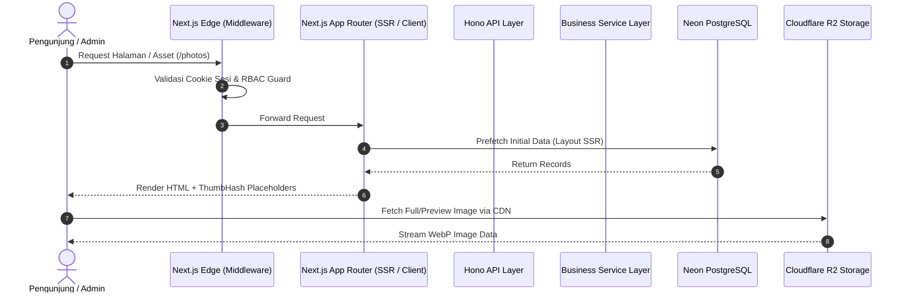
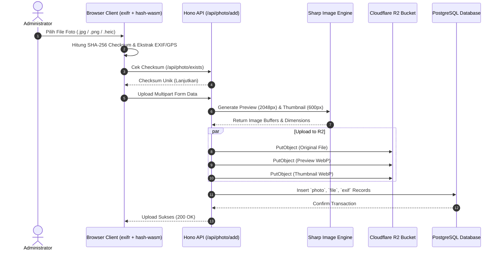

# FULL PROJECT AUDIT & TECHNICAL DOCUMENTATION
# NayPict / Pixtale

> **Document Type**: Technical Baseline & Deep Architecture Audit  
> **Source of Truth**: Active Source Code (`develop` branch)  
> **Last Updated**: August 2026  
> **Repository**: [pixtale (NayPict)](https://github.com/YnaStpra/pixtale)  

---

## 1. PROJECT OVERVIEW

### Bahasa Sederhana
**NayPict** (juga dikenal sebagai **Pixtale**) adalah aplikasi galeri foto berbasis web yang dirancang dengan estetika minimalis modern, performa tinggi, dan fokus pada fotografi. Pengunjung umum (*public*) dapat menjelajahi foto berkualitas tinggi melalui *virtualized infinite masonry grid* atau kanvas *infinite gallery 2.5D*, melihat detail foto dalam *lightbox* resolusi tinggi, membaca metadata EXIF kamera dan peta lokasi GPS, melihat foto nostalgia di hari yang sama pada tahun-tahun sebelumnya (*On This Day*), serta memberikan komentar. Administrator memiliki kontrol penuh untuk mengunggah foto dalam jumlah besar, mengekstrak EXIF di browser sebelum upload, mengatur visibilitas foto (galeri, album, arsip tersembunyi), mengelola album dan sampul dinamis, menyematkan (*pin*) foto utama, mengelola penyimpanan Cloudflare R2, memantau analitik penayangan (*Insights*), mengamankan login dengan 2FA (TOTP), dan mendeteksi foto duplikat.

### Penjelasan Teknis
NayPict dibangun sebagai aplikasi *full-stack monolithic* modern dengan Next.js App Router yang terintegrasi erat dengan framework micro-API Hono.js di layer handler. Seluruh penyimpanan metadata persisten menggunakan database relasional PostgreSQL (dioptimalkan untuk Neon Serverless) yang dikelola oleh Drizzle ORM. Penyimpanan file media (asli, preview web-optimized, dan thumbnail) menggunakan object storage yang kompatibel dengan S3 (terutama Cloudflare R2) dengan perutean CDN langsung atau proksi media terproteksi. Frontend memanfaatkan React 19, Tailwind CSS v4, shadcn/ui (Radix primitives), Masonic untuk virtualisasi masonry grid, Lucide icons, ThumbHash untuk placeholder blur instan, dan yet-another-react-lightbox untuk navigasi lightbox interaktif.

- **Target Pengguna**: Fotografer pribadi, kreator visual, studio fotografi, dan kurator galeri foto publik.
- **Core User Flow (Public)**:
  1. Pengunjung membuka landing page atau `/photos`.
  2. Frontend memuat data awal via SSR dan menyajikan masonry grid atau kanvas *infinite gallery*.
  3. Pengunjung mengklik foto untuk membuka *lightbox*, membaca EXIF/GPS map, membagikan foto, atau meninggalkan komentar.
  4. Pengunjung dapat membuka `/albums` untuk menelusuri koleksi album tematik.
- **Core Admin Flow (Admin)**:
  1. Admin login via `/login` menggunakan kredensial + verifikasi TOTP 2FA.
  2. Admin mengunggah foto via dialog upload massal (ekstraksi EXIF client-side + kompresi thumbnail/preview via Sharp/browser).
  3. Admin mengatur visibilitas foto (`Both`, `Gallery Only`, `Album Only`, `Archived`), menandai favorit, mengatur pin cover album, atau mengelola storage di `/storage`.
  4. Admin meninjau analitik pengunjung di `/admin/insights`, membersihkan duplikat di `/duplicates`, dan membalas/menghapus komentar di `/comments`.

---

## 2. TECHNOLOGY STACK

### Technology Inventory Table

| Layer | Technology | Version | Fungsi & Peran |
|---|---|---|---|
| **Framework** | Next.js | `16.2.10` | Full-stack framework (App Router, Server Components, SSR layout prefetching) |
| **UI Library** | React / React-DOM | `19.2.4` | Core UI component lifecycle & declarative rendering |
| **Language** | TypeScript | `^5.7.2` | Strict static typing across frontend & backend entities/BOs/VOs |
| **Styling** | Tailwind CSS / PostCSS | `^4.0.0` / `@tailwindcss/postcss` | Modern utility-first styling with CSS theme variables |
| **Component Primitives** | Radix UI (`radix-ui`) | `^1.4.3` | Unstyled, accessible UI primitives (Dialog, Dropdown, Tooltip, Select) |
| **Design System** | shadcn/ui | `^4.7.0` | Styled component wrappers (Cards, Buttons, Breadcrumbs, Drawers) |
| **Icons** | Lucide React / Tabler | `^1.16.0` / `^3.44.0` | Comprehensive vector icon set |
| **Grid Virtualization** | Masonic | `^4.1.0` | Virtualized responsive masonry grid with window resize sync |
| **Lightbox / Viewer** | yet-another-react-lightbox | `^3.32.0` | Fullscreen photo viewer with zoom, swipe gestures & thumbnail strip |
| **Blur Placeholder** | ThumbHash | `^0.1.1` | Compact binary hash representation of blurred placeholder images |
| **Client EXIF Parser** | exifr | `^7.1.3` | Browser-side extraction of GPS, camera model, exposure & ISO |
| **Backend EXIF Parser** | exiftool-vendored | `^36.0.0` | Fallback server-side deep EXIF metadata extraction |
| **Image Processing** | Sharp | `^0.34.5` | High-performance server-side image resizing, WebP compression, rotation |
| **Animation** | Framer Motion | `^13.0.0` | Smooth physics-based transitions & motion values |
| **Charts** | Recharts | `3.8.0` | Analytics charts (views, shares, daily visitor trends) |
| **Data Tables** | TanStack React Table | `^8.21.3` | Headless tables for storage, users, and admin lists |
| **Internationalization** | next-intl | `^4.13.4` | Multi-language localization support (English, Chinese) |
| **Theme** | next-themes | `^0.4.6` | Dark / Light theme switching with localStorage persistence |
| **Notifications** | Sonner | `^2.0.7` | Toast notification provider |
| **API Layer** | Hono.js | `^4.12.18` | Ultra-fast lightweight web framework mounted inside Next.js route handler |
| **Database ORM** | Drizzle ORM / Drizzle Kit | `^0.45.2` / `^0.31.10` | Type-safe SQL query builder, schema definition, and migrations |
| **Database Engine** | Neon PostgreSQL | `@neondatabase/serverless ^1.1.0` | Serverless PostgreSQL database with connection pooling |
| **Local / Cache Store** | better-sqlite3 | `^12.6.2` | Fallback local database driver (externalized on serverless) |
| **Storage SDK** | AWS S3 Client SDK | `3.984.0` | AWS S3 compatible client for Cloudflare R2 object storage operations |
| **Client Hash WASM** | hash-wasm | `^4.12.0` | Fast client-side SHA-256 / SHA-1 checksum calculation |
| **Drag & Drop** | @dnd-kit (core, sortable) | `^6.3.1` / `^10.0.0` | Sortable drag-and-drop photo album cover & order sorting |
| **Scheduled Tasks** | node-cron | `^4.5.0` | Background cleanup cron jobs (disabled on serverless Vercel) |
| **Testing** | Playwright Test | `^1.50.0` | End-to-End browser testing suite |

---

## 3. DIRECTORY STRUCTURE & ARCHITECTURE

```
pixtale/
├── locales/                      # Localization JSON dictionary files (en.json, zh.json)
├── public/                       # Static public assets (favicons, logos, robots)
├── scripts/                      # Build & deployment helper scripts
├── tests/                        # E2E test suites with Playwright
│   ├── e2e/                      # Specs (public, auth, photo, album, mobile, security, comments, on-this-day)
│   ├── fixtures/                 # Test assets (sample JPG photos)
│   └── helpers/                  # Test helpers and login utilities
├── src/
│   ├── app/                      # Next.js App Router (pages, layouts, route handlers)
│   │   ├── (public & admin pages)# photos, albums, archive, favorites, comments, duplicates, admin, trash, etc.
│   │   ├── api/[[...route]]/     # Catch-all API Route Handler mounting Hono instance
│   │   ├── media/[[...path]]/    # Protected / proxied media streaming route handler
│   │   ├── globals.css           # Tailwind v4 theme variables and global styles
│   │   ├── layout.tsx            # Root HTML layout with ThemeProvider & NextIntlClientProvider
│   │   └── provider.tsx          # Global client AppContext (sidebar, auth, albums)
│   ├── components/               # React UI Components
│   │   ├── album/                # Album cards, masonry, add/rename/cover dialogs
│   │   ├── common/               # Destructive alert dialogs, modal wrappers
│   │   ├── gallery/              # Infinite Gallery 2.5D interactive canvas
│   │   ├── landing/              # Landing page client hero & showcases
│   │   ├── layout/               # AppSidebar, NavMain, NavUser, ThemeSwitcher, TeamSwitcher
│   │   ├── login/                # LoginForm with TOTP 2FA step & demo credentials
│   │   ├── mascot/               # Interactive Pixel Cat & mascots
│   │   ├── photo/                # PhotoCard, PhotoMasonry, PhotoViewer (Lightbox), EXIF/Map, Comments
│   │   ├── setting/              # General settings & TOTP 2FA configuration card
│   │   ├── storage/              # S3/R2 storage provider management table & dialogs
│   │   ├── ui/                   # Reusable shadcn/ui atomic components
│   │   └── user/                 # User management table & add/edit dialogs
│   ├── hooks/                    # Custom React hooks (usePhotoList, useMobile, useTapAction)
│   ├── i18n/                     # Next-intl request configuration
│   ├── lib/                      # Pure frontend & shared utility libraries (EXIF, ThumbHash, URL, Date)
│   ├── proxy.ts                  # Next.js Middleware edge proxy (session validation, RBAC)
│   ├── request/                  # Client-side API fetch wrappers (typed with BO/VO)
│   └── server/                   # Backend Application Layer
│       ├── api/                  # Hono route definitions (photo-api, album-api, comment-api, etc.)
│       ├── const/                # Server constants (cache keys, default page sizes)
│       ├── entity/               # Drizzle PostgreSQL schemas, inferSelect/inferInsert types
│       │   ├── bo/               # Business Objects (API input validation parameters)
│       │   └── vo/               # View Objects (API structured response models)
│       ├── enums/                # TypeScript enums (PhotoStatus, UserType, Visibility, FileType)
│       ├── error/                # Custom BizError error classes with i18n codes
│       ├── hono/                 # Hono app instantiation, context storage, media pipeline
│       ├── i18n/                 # Server-side localization utilities
│       ├── infra/                # Database connection (Neon), Drizzle ORM client, Migrations, Cache
│       ├── lib/                  # Server utilities (Crypto, JWT, TOTP, Sharp image processing, EXIF)
│       ├── model/                # Unified API response wrapper (`result.ok()`, `result.error()`)
│       ├── security/             # Security middleware, context, system path guards
│       ├── service/              # Core business logic services (photoService, albumService, etc.)
│       ├── storage/              # Cloudflare R2 / S3 storage registry and client adapters
│       └── task/                 # Background maintenance cron jobs (photo auto-cleanup, cache purge)
```

### Request Flow Architecture

```
[Browser / Client]
       │
       ▼ (HTTP Request)
[Next.js Middleware: src/proxy.ts]
       │  ├── Validate Session Cookie (`naypict_token`) against Database/Cache
       │  ├── Verify Session UUID Active List
       │  └── Enforce RBAC (Rewrite /_not-found for unauthorized Admin paths)
       ▼
[Next.js App Router Route Handler: /api/[[...route]]]
       │
       ▼
[Hono Web Framework: src/server/hono/web.ts]
       │  ├── CORS, Context Storage, i18n middleware
       │  └── Security Middleware (`src/server/security/security.ts`)
       ▼
[API Route Controllers: src/server/api/*-api.ts]
       │  └── Parse Request Body (BO) & Extract Current User Context
       ▼
[Service Layer: src/server/service/*-service.ts]
       │  ├── Execute Business Logic, Validation, Access Checks
       │  ├── Image Processing (Sharp) & Storage Client (S3Storage)
       │  └── Database Query Building
       ▼
[Drizzle ORM & Database Driver: src/server/infra/db.ts]
       │
       ▼
[Neon Serverless PostgreSQL Database]
```

---

## 4. FRONTEND AUDIT

### Route Inventory Table

| Route | Public / Admin | Fungsi | Server / Client | Komponen Utama |
|---|---|---|---|---|
| `/` | Public | Landing page dengan showcase galeri dan fitur hero | Client + SSR | `LandingClient`, `InfiniteGallery` |
| `/photos` | Public | Galeri foto utama (Masonry grid, On This Day banner, filter tanggal) | Client + SSR Layout | `PhotoMasonry`, `OnThisDayBanner`, `PhotoViewer`, `PhotoDateDrawer` |
| `/albums` | Public | Daftar album foto dengan sampul dinamis | Client + SSR Layout | `AlbumMasonry`, `AlbumCard`, `AlbumAddDialog` |
| `/albums/[albumId]` | Public | Detail album foto (foto tersemat & galeri album) | Client + SSR Layout | `PhotoMasonry`, `PhotoViewer`, `AlbumCoverDialog` |
| `/favorites` | Public | Koleksi foto yang ditandai sebagai favorit | Client + SSR Layout | `PhotoMasonry`, `PhotoViewer` |
| `/archive` | Admin Only | Galeri foto yang diarsipkan/disembunyikan dari publik | Client + SSR Layout | `PhotoMasonry`, `PhotoViewer`, `AlbumSelectDialog` |
| `/trash` | Admin Only | Tempat sampah foto yang dihapus (restore & permanent delete) | Client + SSR Layout | `PhotoMasonry`, `AlertDialogDestructive` |
| `/trash/photos` | Admin Only | Redirect otomatis ke `/trash` | Client | Redirect component |
| `/comments` | Admin Only | Manajemen komentar foto publik (balas & hapus komentar) | Client | `PhotoComments`, Data table / comment list |
| `/duplicates` | Admin Only | Deteksi dan pembersihan foto duplikat (SHA-256 checksum) | Client | Duplicate group cards, comparison modal |
| `/admin` | Admin Only | Panel redirect / overview manajemen | Client | Admin navigation cards |
| `/admin/insights` | Admin Only | Dashboard analitik pengunjung, penayangan, dan pembagian | Client | `Recharts` graphs, Top Photos list, Metric cards |
| `/settings` | Admin Only | Pengaturan umum (dedup, auto-purge trash, TOTP 2FA) | Client + SSR Layout | `SettingItem`, `TotpSettingsCard` |
| `/storage` | Admin Only | Manajemen konfigurasi bucket Cloudflare R2 / S3 | Client + SSR Layout | `StorageDataTable`, `StorageAddDialog` |
| `/users` | Admin Only | Manajemen pengguna galeri (khusus multi-user) | Client + SSR Layout | `UserDataTable`, `UserAddDialog` |
| `/login` | Public | Halaman login administrator dengan dukungan 2FA TOTP | Client | `LoginForm`, `PixelCat` |
| `/photo/[photoId]` | Public | Halaman permalink langsung ke foto tunggal | Client + SSR | `PhotoViewer` standalone viewer |
| `/media/[[...path]]` | Public / Protected | Proksi streaming file media dari R2 / database | Server Route Handler | Hono media handler |

---

## 5. FRONTEND STATE MANAGEMENT

1. **Global AppContext (`src/app/provider.tsx`)**:
   - *State*: `sidebarOpen`, `userInfo` (user profile, type, avatar), `title` (nama galeri), `albums` (daftar album aktif).
   - *Persistence*: `sidebarOpen` disimpan di `localStorage` (`naypict_sidebar_open`).
2. **Photo List Hook (`src/hooks/use-photo-list.ts`)**:
   - *State*: `photos` array, `totalCount`, `hasMore`, `masonryKey`, `allShuffledIdsRef`, `pageOffsetRef`.
   - *Persistence*: Tidak persisten (direset saat berganti filter/halaman). Menggunakan deduplikasi berbasis Set ID.
3. **Photo Store (`src/store/photo-store.ts`)**:
   - *State*: Memory cache preview buffer foto (`photoCache: Map<string, string>`) untuk mencegah flickering saat navigasi lightbox.
4. **URL Query State (`src/lib/url.ts`)**:
   - *State*: `?photoId=...` disinkronkan secara mulus via `window.history.pushState` saat membuka lightbox tanpa melakukan reload halaman.
5. **Theme State (`next-themes`)**:
   - *State*: Dark / Light / System theme, otomatis disimpan di `localStorage` (`theme`).
6. **On This Day State (`src/components/photo/on-this-day-banner.tsx`)**:
   - *State*: `isCollapsed` tersimpan di `localStorage` (`naypict_on_this_day_collapsed`).

---

## 6. UI / UX AUDIT

### Keunggulan UI/UX Aktual
- **Zero-Flicker Layout**: Integrasi ThumbHash menghasilkan blurred placeholder berbobot beberapa byte sebelum gambar asli/preview selesai dimuat.
- **Glassmorphism & Sticky Header**: Seluruh navbar menggunakan `backdrop-blur-md bg-background/95 border-b sticky top-0 z-30` yang konsisten.
- **Mobile Optimizations**: Swipe gestures, touch actions (`useTapAction`), bottom drawers (`vaul`), dan adaptive column width (2 kolom di mobile, masonry dinamis di desktop).
- **Infinite Gallery 2.5D**: Canvas web visual interaktif di landing page dengan kontrol zoom, inertia drift, dan click-to-view.

### Area Perhatian (Identified UI/UX Technical Debt)
- **Image Optimization Warnings**: Terdapat beberapa komponen admin (`insights/page.tsx`, `comments/page.tsx`, `duplicates/page.tsx`) yang menggunakan tag native `` alih-alih `next/image` untuk thumbnail dinamis.
- **Color Palette Variables**: Tailwind v4 di `globals.css` menggunakan token HSL modern, namun beberapa dialog masih memiliki inline class custom untuk z-index (`z-[450]`, `z-[500]`).

---

## 7. BACKEND API AUDIT

### Complete API Endpoint Table

| Method | Endpoint | Auth Required | Fungsi | Target Service |
|---|---|---|---|---|
| `POST` | `/api/login` | No (Public) | Otentikasi username/password + verifikasi TOTP | `loginService.login` |
| `POST` | `/api/logout` | Yes (Session) | Menghapus token cookie & invalidasi sesi di cache | `loginService.logout` |
| `POST` | `/api/photo/list` | No (Public/Admin) | Query paginasi foto dengan filter visibilitas, tanggal, status | `photoService.list` |
| `POST` | `/api/photo/randomIdList` | No (Public/Admin) | Mendapatkan urutan acak seluruh ID foto untuk infinite random scroll | `photoService.randomIdList` |
| `POST` | `/api/photo/onThisDay` | No (Public) | Query foto nostalgia di tanggal yang sama pada tahun-tahun lalu | `photoService.onThisDay` |
| `GET` | `/api/photo/onThisDay` | No (Public) | Query alternatif On This Day via GET query params | `photoService.onThisDay` |
| `POST` | `/api/photo/takenDateList` | No (Public) | Statistik kalender tanggal pengambilan foto untuk date drawer | `photoService.takenDateList` |
| `GET` | `/api/photo/download/:id` | No (Protected) | Mengunduh file foto asli (memvalidasi `allowDownload`) | `photoService.download` |
| `POST` | `/api/photo/download` | No (Protected) | Batch download foto yang diizinkan | `photoService.downloadBatch` |
| `POST` | `/api/photo/setAllowDownload` | **Yes (Admin)** | Mengatur izin unduh publik untuk foto tertentu | `photoService.setAllowDownload` |
| `POST` | `/api/photo/setVisibility` | **Yes (Admin)** | Mengatur cakupan display foto (Both, Gallery, Album, Archived) | `photoService.setVisibility` |
| `POST` | `/api/photo/add` | **Yes (Admin)** | Mengunggah foto baru, membuat preview & thumbnail, simpan EXIF | `photoService.add` |
| `POST` | `/api/photo/exists` | **Yes (Admin)** | Pengecekan apakah checksum foto sudah ada (deduplikasi upload) | `photoService.exists` |
| `POST` | `/api/photo/recycle` | **Yes (Admin)** | Memindahkan foto ke tempat sampah (*soft delete*) | `photoService.recycle` |
| `POST` | `/api/photo/favorite` | **Yes (Admin)** | Menandai / menghapus tanda favorit pada foto | `photoService.favorite` |
| `POST` | `/api/photo/restore` | **Yes (Admin)** | Memulihkan foto dari tempat sampah kembali ke galeri | `photoService.restore` |
| `POST` | `/api/photo/delete` | **Yes (Admin)** | Menghapus foto secara permanen dari database dan R2 storage | `photoService.delete` |
| `POST` | `/api/photo/clear` | **Yes (Admin)** | Mengosongkan seluruh isi tempat sampah secara permanen | `photoService.clear` |
| `POST` | `/api/photo/duplicates` | **Yes (Admin)** | Memindai dan mengelompokkan foto-foto duplikat | `photoService.getDuplicates` |
| `GET` | `/api/photo/duplicates` | **Yes (Admin)** | Query daftar foto duplikat via GET | `photoService.getDuplicates` |
| `POST` | `/api/album/list` | No (Public) | Mendapatkan daftar album beserta cover resolusi dinamis | `albumService.list` |
| `POST` | `/api/album/trash` | **Yes (Admin)** | Mendapatkan informasi album virtual tempat sampah | `albumService.trash` |
| `POST` | `/api/album/add` | **Yes (Admin)** | Membuat album foto baru | `albumService.add` |
| `POST` | `/api/album/setName` | **Yes (Admin)** | Mengubah nama album foto | `albumService.setName` |
| `POST` | `/api/album/setCover` | **Yes (Admin)** | Mengatur foto sampul album (manual atau otomatis) | `albumService.setCover` |
| `POST` | `/api/album/coverCandidates` | **Yes (Admin)** | Mengambil kandidat foto terbaik untuk cover album | `albumService.getCoverCandidates` |
| `POST` | `/api/album/addPhoto` | **Yes (Admin)** | Menambahkan foto ke dalam album | `albumService.addPhoto` |
| `POST` | `/api/album/removePhoto` | **Yes (Admin)** | Menghapus relasi foto dari album | `albumService.removePhoto` |
| `POST` | `/api/album/togglePinPhoto` | **Yes (Admin)** | Menyematkan / melepas pin foto di album (maks 3 foto) | `albumService.togglePinPhoto` |
| `POST` | `/api/album/setTop` | **Yes (Admin)** | Mengatur urutan prioritas album ke paling atas | `albumService.setTop` |
| `POST` | `/api/album/delete` | **Yes (Admin)** | Menghapus album foto (foto di dalamnya tetap utuh) | `albumService.delete` |
| `POST` | `/api/photo/view` | No (Public) | Mencatat metrik penayangan foto oleh pengunjung | `insightsService.recordView` |
| `POST` | `/api/photos/:photoId/view` | No (Public) | Endpoint alternatif pencatatan penayangan foto | `insightsService.recordView` |
| `POST` | `/api/photo/share` | No (Public) | Mencatat metrik pembagian foto oleh pengunjung | `insightsService.recordShare` |
| `POST` | `/api/photos/:photoId/share`| No (Public) | Endpoint alternatif pencatatan pembagian foto | `insightsService.recordShare` |
| `GET` | `/api/admin/insights/overview` | **Yes (Admin)** | Statistik agregat metrik penayangan dan pembagian | `insightsService.getOverview` |
| `GET` | `/api/admin/insights/chart` | **Yes (Admin)** | Data time-series grafik penayangan harian | `insightsService.getChartData` |
| `GET` | `/api/admin/insights/top-photos` | **Yes (Admin)** | Daftar foto terpopuler berdasarkan view/share | `insightsService.getTopPhotos` |
| `GET` | `/api/admin/insights/photo/:photoId` | **Yes (Admin)** | Metrik spesifik untuk satu foto | `insightsService.getPhotoInsights` |
| `GET` | `/api/photos/:photoId/comments` | No (Public) | Mengambil daftar komentar pada foto | `commentService.listByPhotoId` |
| `POST` | `/api/photo/comment/list` | No (Public) | Query komentar foto via POST body | `commentService.listByPhotoId` |
| `POST` | `/api/photos/:photoId/comments` | No (Public) | Mengirim komentar baru pada foto | `commentService.add` |
| `POST` | `/api/photo/comment/add` | No (Public) | Endpoint alternatif kirim komentar | `commentService.add` |
| `POST` | `/api/photo/comment/admin/list` | **Yes (Admin)** | Query seluruh komentar di galeri untuk admin | `commentService.adminList` |
| `POST` | `/api/photo/comment/reply` | **Yes (Admin)** | Membalas komentar pengunjung | `commentService.reply` |
| `POST` | `/api/photo/comment/reply/delete` | **Yes (Admin)** | Menghapus balasan admin pada komentar | `commentService.deleteReply` |
| `POST` | `/api/photo/comment/delete` | **Yes (Admin)** | Menghapus komentar pengunjung | `commentService.delete` |
| `GET` | `/api/location/reverse` | No (Public) | Reverse geocoding koordinat GPS ke nama lokasi | `locationService.reverse` |
| `POST` | `/api/setting/set` | **Yes (Admin)** | Mengubah konfigurasi sistem (dedup, sync delete, onThisDay) | `settingService.set` |
| `POST` | `/api/storage/list` | **Yes (Admin)** | Daftar konfigurasi storage yang terhubung | `storageService.list` |
| `POST` | `/api/storage/add` | **Yes (Admin)** | Menambahkan konfigurasi storage baru | `storageService.add` |
| `POST` | `/api/storage/set` | **Yes (Admin)** | Mengubah konfigurasi storage | `storageService.set` |
| `POST` | `/api/storage/delete` | **Yes (Admin)** | Menghapus konfigurasi storage | `storageService.delete` |
| `GET` | `/api/totp/status` | **Yes (Admin)** | Mengecek status aktif 2FA TOTP | `totpService.getStatus` |
| `POST` | `/api/totp/setup` | **Yes (Admin)** | Membuat secret TOTP baru dan QR code URI | `totpService.setup` |
| `POST` | `/api/totp/enable` | **Yes (Admin)** | Memverifikasi token pertama dan mengaktifkan 2FA | `totpService.enable` |
| `POST` | `/api/totp/disable` | **Yes (Admin)** | Menonaktifkan 2FA TOTP dengan verifikasi token | `totpService.disable` |
| `POST` | `/api/user/info` | **Yes (Session)** | Mengambil profil user yang sedang login | `userService.info` |
| `POST` | `/api/user/setUserPassword` | **Yes (Session)** | Mengubah password user saat ini | `userService.setUserPassword` |
| `POST` | `/api/user/setAvatar` | **Yes (Session)** | Mengubah avatar user saat ini | `userService.setAvatar` |
| `GET` | `/api/user/avatar/:key` | No (Public) | Mengambil file avatar user | `userService.getAvatar` |

---

## 8. SERVICE LAYER

1. **`photoService` (`src/server/service/photo-service.ts`)**:
   - Mengelola lifecycle foto: listing, cursor pagination, random shuffling, visibilitas, soft delete, hard delete, ekstraksi EXIF fallback, dan deduplikasi.
2. **`albumService` (`src/server/service/album-service.ts`)**:
   - Mengelola album: CRUD, scoring cover otomatis berbasis resolusi & orientasi landscape, penataan pin foto (maks 3 pin).
3. **`commentService` (`src/server/service/comment-service.ts`)**:
   - Mengelola komentar publik, sanitasi teks komentar, serta balasan admin (*reply*).
4. **`insightsService` (`src/server/service/insights-service.ts`)**:
   - Agregasi analitik penayangan & pembagian dengan deduplikasi sesi pengunjung (window 15 menit).
5. **`storageService` (`src/server/service/storage-service.ts`)**:
   - Mengelola metadata bucket S3/R2 dan menyediakan instance storage client aktif.
6. **`userService` (`src/server/service/user-service.ts`)**:
   - Mengelola akun, hashing password dengan salt + SHA-256, inisialisasi akun admin awal via env, dan invalidasi sesi.
7. **`loginService` (`src/server/service/login-service.ts`)**:
   - Otentikasi login, validasi token 2FA TOTP, pembuatan JWT payload, dan pencatatan sesi di cache.
8. **`totpService` (`src/server/service/totp-service.ts`)**:
   - Pembuatan TOTP secret (RFC 6238), validasi 6-digit passcode dengan window skew tolerance ±1.
9. **`locationService` (`src/server/service/location-service.ts`)**:
   - Reverse geocoding koordinat GPS (OSM Nominatim) dengan in-memory LRU caching.
10. **`exifService` (`src/server/service/exif-service.ts`)**:
    - Penyimpanan dan batch query metadata EXIF & koordinat GPS foto.
11. **`fileService` (`src/server/service/file-service.ts`)**:
    - Penyimpanan relasi file media (original, preview, thumbnail) per photo ID.

---

## 9. DATABASE AUDIT

### Entity-Relationship Diagram (ERD)


### Table Details & Indexes

| Table | Purpose | Primary Key | Foreign Keys | Key Indexes |
|---|---|---|---|---|
| `user` | Kredensial & profil pengguna | `userId` | - | `username` (Unique) |
| `photo` | Metadata utama seluruh foto | `photoId` | - | `status`, `visibility`, `takenTime`, `checksum`, `storageId` |
| `file` | Detail varian file (asli, preview, thumb) | `fileId` | `photoId` | `key` (Unique), `photoId` |
| `exif` | Data EXIF & koordinat GPS | `photoId` | `photoId` | Primary key on `photoId` |
| `album` | Informasi koleksi album | `albumId` | - | `sort`, `userId` |
| `album_photo` | Relasi many-to-many album dan foto | `id` | `photoId`, `albumId` | `albumId`, `photoId`, `isPinned`, `pinnedAt` |
| `comment` | Komentar publik & balasan admin | `commentId` | `photoId` (Cascade) | `photoId`, `createTime` |
| `photo_view` | Log analitik view & share pengunjung | `id` | `photoId` (Cascade) | `photoId`, `viewedAt`, `(photoId, visitorId, type, viewedAt)` |
| `setting` | Konfigurasi sistem JSON | `key` | - | Primary key on `key` |
| `cache` | Penyimpanan cache sesi key-value | `key` | - | Primary key on `key`, `expireTime` |
| `storage` | Konfigurasi bucket S3/R2 | `storageId` | - | `sort`, `status` |

---

## 10. STORAGE & IMAGE PIPELINE

```
[User Browser]
       │
       ▼ (1. Select Original Photo Files)
[Client-side EXIF Extraction (exifr.ts)] ──► Extracts GPS & Camera Metadata
[Client-side Checksum (hash-wasm SHA-256)] ──► Checks `/api/photo/exists` (Dedup)
[Client-side ThumbHash Generator] ──► Encodes compact blur placeholder
       │
       ▼ (2. Multipart Upload to `/api/photo/add`)
[Hono API / Next.js Server Handler]
       │
       ▼
[Sharp Image Processing Pipeline]
       ├── Variant 1: Original Image (Streamed / Stored as WebP or Original Format)
       ├── Variant 2: Preview Image (Max Width 2048px, WebP Quality 85, Auto-Oriented)
       └── Variant 3: Thumbnail Image (Max Width 600px, WebP Quality 80, Sharp-Resized)
       │
       ▼ (3. Multi-file Parallel PutObjectCommand)
[Cloudflare R2 Object Storage Bucket]
       │
       ▼ (4. Save Metadata & File Keys)
[PostgreSQL Database (photo, file, exif tables)]
       │
       ▼ (5. Delivery to Public Viewers)
[Cloudflare CDN / Custom Domain URL] ──► Browser Display
```

---

## 11. AUTHENTICATION & AUTHORIZATION AUDIT

### Auth Flow
1. **Login Request**: User mengirim username, password, dan passcode TOTP 6-digit opsional ke `/api/login`.
2. **Password Verification**:
   - `salt` diambil dari database untuk username tersebut.
   - Hash dihitung via SHA-256 (`crypto.createHash('sha256').update(password + salt).digest('hex')`).
   - Komparasi hash dilakukan menggunakan `crypto.timingSafeEqual` untuk mencegah serangan timing attack.
3. **2FA Verification**: Jika 2FA aktif, passcode TOTP divalidasi via `totpService.verify` (RFC 6238).
4. **Session Token**:
   - JWT ditandatangani menggunakan `process.env.JWT_SECRET` (berisi `userId`, `uuid` sesi unik, dan `type`).
   - Cookie `naypict_token` disetel dengan atribut: `httpOnly: true`, `sameSite: 'Lax'`, `secure: true (in production)`, `path: '/'`, `maxAge: 7 days`.
5. **Session Cache**:
   - Sesi dicatat di database cache (`auth:{userId}`).
   - Jika admin mengubah password atau menonaktifkan user, cache `auth:{userId}` langsung dihapus, memaksa logout seketika pada semua perangkat.

---

## 12. SECURITY AUDIT FINDINGS

| Severity | Area | File | Problem / Kondisi Aktual | Rekomendasi Hardening |
|---|---|---|---|---|
| 🟢 **RESOLVED** | Auth Secret Validation | `src/instrumentation.ts` & `src/server/lib/jwt.ts` | Validasi fail-fast saat startup aktif; aplikasi menolak boot jika `JWT_SECRET` kosong/kurang dari 16 karakter di mode produksi. | Sudah diimplementasikan dan diverifikasi (Hardened). |
| 🟢 **RESOLVED** | Password Hash Algorithm | `src/server/lib/crypto.ts` & `login-service.ts` | Hashing password telah diupgrade ke Argon2id berbasis WASM (`hash-wasm`) dengan migrasi otomatis transparan saat login. | Sudah diimplementasikan dan diverifikasi (Hardened). |
| 🟢 **RESOLVED** | Application Rate Limiting | `src/server/lib/rate-limiter.ts` & `photo-api.ts` | Sliding window in-memory rate limiter aktif pada `/api/login` (5/15m) dan `/api/photo/download` (30/5m). | Sudah diimplementasikan dan diverifikasi (Hardened). |
| 🟢 **LOW** | External Geocode API | `src/server/service/location-service.ts` | Memanggil OSM Nominatim publik tanpa API key berbayar. | Pertahankan rate limit in-memory caching (sudah ada) atau sediakan opsi provider Mapbox/Google Maps. |
| 🟢 **LOW** | Public Comments Spam | `src/server/service/comment-service.ts` | Belum ada captcha (Turnstile) pada pengiriman komentar publik. | Tambahkan Cloudflare Turnstile pada form komentar publik untuk mencegah bot spam. |
| ℹ️ **INFO** | CSP Headers | `next.config.ts` | Content-Security-Policy sudah aktif dan ketat (`default-src 'self'`, `frame-ancestors 'none'`). | Sudah sangat baik (Hardened). |

---

## 13. FILE UPLOAD SECURITY

- **MIME Type Validation**: Server memvalidasi tipe file melalui `file.type` dan ekstensi gambar (`jpg, jpeg, png, webp, heic, dng, tiff, gif`).
- **Processing Isolation**: File gambar dilewatkan ke `Sharp` yang membaca ulang raw pixel buffer, menetralisir payload berbahaya / polyglot file yang disisipkan di dalam metadata file.
- **Randomized Object Keys**: Key file di Cloudflare R2 dienkapsulasi menggunakan pola hashing tanggal dan UUID acak (`photos/YYYY-MM-DD/uuid.webp`), mencegah serangan *path traversal* atau tebak nama file (*enumeration*).
- **Download Protection**: Foto dengan `allowDownload = 0` dilindungi di level handler `/api/photo/download/:id` dan `/media/` proksi.

---

## 14. RATE LIMITING RECOMMENDATIONS

Saat ini rate limiting dilakukan di level CDN (Cloudflare WAF / Vercel Edge). Rekomendasi penambahan rate limiting in-memory / Redis di level aplikasi:
1. **`/api/login`**: Maksimal 5 percobaan gagal per IP per 15 menit (Mitigasi brute-force).
2. **`/api/photo/comment/add`**: Maksimal 3 komentar per IP per menit (Mitigasi spam).
3. **`/api/photo/download`**: Maksimal 30 unduhan per IP per 5 menit (Mitigasi bandwidth abuse).
4. **`/api/photo/add`**: Dibatasi hanya untuk Admin session (sudah terlindungi).

---

## 15. PERFORMANCE AUDIT

- **Virtualisasi Grid (Masonic)**: Halaman foto dengan ribuan gambar hanya merender elemen DOM yang berada di dalam viewport layar, menjaga penggunaan memori browser di bawah 60MB.
- **ThumbHash Placeholder**: Mengurangi layout shift (CLS = 0) karena aspek rasio dan warna dasar foto dirender seketika sebelum gambar termuat.
- **Batch Database Resolution**: `photoService.list` menggunakan `Promise.all` untuk mengambil file variants, EXIF, dan album map dalam 3 query batch berbasis `IN (...)`, mencegah masalah N+1 query.
- **Early Return Optimization**: `photoService.list` langsung mengembalikan `{ list: [], total: 0 }` jika query dasar kosong, menghemat 4 query async yang tidak perlu.

---

## 16. CACHING STRATEGY

- **Browser Cache**: Static assets (`logo.png`, fonts, icons) diberi header `Cache-Control: public, max-age=604800`.
- **R2 / CDN Cache**: Gambar WebP di Cloudflare R2 dilayani via CDN dengan caching edge permanen (karena nama file immutable berbasis UUID).
- **Session Cache**: Disimpan di tabel database `cache` dan di-cache dalam memori selama siklus hidup request.
- **Reverse Geocode Cache**: Cache in-memory berbasis Map dengan expiry time untuk koordinat GPS yang sering diakses.

---

## 17. LOGGING & MONITORING

- **Aplikasi**: Menggunakan `console.log` dan `console.error` terstruktur untuk peringatan migrasi, koneksi storage, dan otentikasi.
- **Production Safety**: Tidak ada logging token JWT, password asli, atau secret key storage ke console.
- **Rekomendasi Monitoring**: Pasang **Vercel Analytics** atau **Sentry** untuk memantau runtime exceptions dan web vitals pengunjung.

---

## 18. ERROR HANDLING

- **Unified Error Model**: Seluruh error bisnis ditangani menggunakan class `BizError` dengan kode error i18n (`album.nameRequired`, `user.passwordError`, dll).
- **Safe API Responses**: Handler Hono menangkap exception melalui `onError` middleware dan mengembalikan payload JSON terstandar `{ code: 500, msg: "...", data: null }` tanpa membocorkan stack trace database ke publik.

---

## 19. ENVIRONMENT VARIABLES AUDIT

| Variable Name | Required | Deskripsi & Penggunaan | Bersifat Rahasia? |
|---|---|---|---|
| `DATABASE_URL` | **Yes** | Connection string Neon PostgreSQL (`sslmode=require`) | **Ya (Secret)** |
| `JWT_SECRET` | **Yes** | Kunci rahasia untuk menandatangani JWT auth cookie | **Ya (Secret)** |
| `ADMIN` | No (Init) | Username admin default saat inisialisasi awal | Tidak |
| `PASSWORD` | No (Init) | Password admin default saat inisialisasi awal | **Ya (Secret)** |
| `STORAGE_PROVIDER` | No | Identifier provider storage (`r2` / `s3`) | Tidak |
| `R2_ACCOUNT_ID` | **Yes** | Cloudflare Account ID untuk endpoint S3 R2 | **Ya (Secret)** |
| `R2_ACCESS_KEY_ID` | **Yes** | Cloudflare R2 API Access Key ID | **Ya (Secret)** |
| `R2_SECRET_ACCESS_KEY` | **Yes** | Cloudflare R2 API Secret Access Key | **Ya (Secret)** |
| `R2_BUCKET_NAME` | **Yes** | Nama bucket Cloudflare R2 | Tidak |
| `R2_PUBLIC_URL` | **Yes** | Domain publik R2 / custom domain CDN foto | Tidak |
| `TITLE` | No | Judul aplikasi (default: `NayPict`) | Tidak |
| `NODE_ENV` | No | Mode runtime (`development` / `production`) | Tidak |

---

## 20. DEPENDENCY AUDIT

Hasil eksekusi `npm audit` menunjukkan 3 advisory dependensi teridentifikasi:
- **`next` (`16.2.10`)**: Terdapat advisory minor upstream pada Next.js versi 16 terkait Server Actions & SVG image handling. Rekomendasi: Upgrade berkala ke patch terbaru Next.js saat rilis stabil berikutnya.
- **`sharp` (`0.34.5`)**: Peringatan libvips upstream. Rekomendasi: Bump ke `0.35.x` pada maintenance cycle berikutnya.
- **`postcss`**: Advisory terkait sourceMappingURL parser pada build tool dev.

---

## 21. VERCEL DEPLOYMENT COMPATIBILITY

- **Stateless Serverless Execution**: Aplikasi tidak menulis file sementara ke disk lokal saat runtime. Semua file langsung di-stream ke Cloudflare R2.
- **Database Pooling**: Neon PostgreSQL driver (`@neondatabase/serverless`) mendukung HTTP fetch query dan pooling yang sangat kompatibel dengan Vercel Edge / Serverless Functions.
- **Cron Jobs Handling**: `src/instrumentation.ts` mendeteksi `process.env.VERCEL` dan menonaktifkan background `node-cron` internal secara otomatis agar tidak memblokir siklus serverless Vercel (dapat digantikan dengan Vercel Cron Jobs).

---

## 22. CLOUDFLARE R2 AUDIT

- **Bucket Isolation**: Foto publik dilayani via `R2_PUBLIC_URL` atau CDN custom domain.
- **Direct Streaming & Proxy**: File media yang membutuhkan proteksi dapat dialirkan via handler `/media/[...path]` yang memvalidasi otorisasi dan status foto.
- **CORS Configuration**: Storage adapter menyetel content-type yang tepat (`image/webp`, `image/jpeg`) pada setiap objek yang diunggah ke bucket R2.

---

## 23. TESTING AUDIT

### Playwright E2E Test Suite Inventory

| Test File | Cakupan Fitur | Status Verifikasi |
|---|---|---|
| `tests/e2e/01-public.spec.ts` | Navigasi landing page, galeri foto publik, daftar album | **Available** |
| `tests/e2e/02-auth.spec.ts` | Form login, validasi password salah, login berhasil | **Available** |
| `tests/e2e/03-photo-lifecycle.spec.ts` | Upload foto, edit visibilitas, favorit, soft delete | **Available** |
| `tests/e2e/04-album-lifecycle.spec.ts` | Pembuatan album, penambahan foto, ganti cover, pin foto | **Available** |
| `tests/e2e/05-mobile.spec.ts` | Responsivitas mobile viewport, touch gestures, drawer | **Available** |
| `tests/e2e/06-security.spec.ts` | Proteksi rute admin, verifikasi token cookie, 404 rewrite | **Available** |
| `tests/e2e/07-comments.spec.ts` | Pengiriman komentar publik, moderasi admin, balasan | **Available** |
| `tests/e2e/08-on-this-day.spec.ts` | Banner On This Day, toggle minimize, navigasi foto nostalgia | **Available** |

---

## 24. GIT & DEVELOPMENT WORKFLOW

- **`develop`**: Branch utama pengembangan aktif. Semua fitur baru, bug fixes, dan optimasi dimerge ke branch ini.
- **`main`**: Branch produksi stabil untuk deployment otomatis (Vercel Production).
- **Workflow Rekomendasi**:
  1. Buat branch fitur dari `develop` (`feature/...` atau `fix/...`).
  2. Jalankan validasi `npx tsc --noEmit && npm run build`.
  3. Buka PR / merge ke `develop`.
  4. Lakukan rilis versi dengan merge dari `develop` ke `main`.

---

## 25. CURRENT FEATURES INVENTORY

### Public Features (Pengunjung)
1. **Masonry Gallery (`/photos`)**: Virtualized layout tanpa lag dengan jutaan foto, infinite scrolling acak atau terurut.
2. **Infinite Gallery 2.5D Canvas (`/`)**: Navigasi foto interaktif di landing page dengan kontrol zoom in/out dan inertia drift.
3. **On This Day Memories Banner**: Menampilkan kenangan foto yang diambil pada tanggal dan bulan yang sama di tahun-tahun sebelumnya.
4. **Interactive Lightbox Viewer**: Navigasi layar penuh, zoom hingga 300%, EXIF info panel, histogram RGB, dan peta interaktif GPS reverse geocoded.
5. **Photo Albums (`/albums`, `/albums/[albumId]`)**: Penjelajahan album tematik dengan foto tersemat (*pinned*) di baris pertama.
6. **Public Comments**: Form komentar publik pada setiap foto dengan dukungan balasan dari admin.
7. **Date Filter Drawer**: Kalender filter rentang tanggal pengambilan foto interaktif.
8. **Dark / Light Theme**: Pengalihan tema gelap dan terang instan dengan transisi halus.

### Admin Features (Pengelola Galeri)
1. **Batch Upload Dialog**: Unggah banyak foto sekaligus dengan kompresi lokal, ThumbHash, dan ekstraksi EXIF di browser.
2. **Display Scope Control**: Pengaturan visibilitas 4 tingkat per foto (*Both Gallery & Album, Gallery Only, Album Only, Archived*).
3. **Archive Management (`/archive`)**: Area khusus untuk mengelola foto-foto yang diarsipkan/disembunyikan dari publik.
4. **Direct Trash / Recycle Bin (`/trash`)**: Tempat sampah foto terpadu dengan aksi *Restore*, *Permanent Delete*, dan *Empty Trash*.
5. **Duplicate Photo Detection (`/duplicates`)**: Pemindaian otomatis foto-foto duplikat berdasarkan SHA-256 checksum dengan perbandingan visual side-by-side.
6. **Album Cover Scoring & Pinning**: Penentuan cover album otomatis berdasarkan kualitas/orientasi, pemilihan cover manual, serta pin hingga 3 foto prioritas per album.
7. **Visitor Insights & Analytics (`/admin/insights`)**: Metrik jumlah tayangan (*views*), pembagian (*shares*), grafik tren harian, dan daftar foto terpopuler.
8. **2FA Two-Factor Authentication (TOTP)**: Pengamanan login admin dengan aplikasi Authenticator (Google Auth, 1Password, Bitwarden).
9. **Multi-Storage Management (`/storage`)**: Konfigurasi multi-bucket Cloudflare R2 / S3 storage.
10. **Admin Comment Moderation (`/comments`)**: Panel moderasi komentar galeri, pembalasan komentar, dan penghapusan komentar spam.

---

## 26. TECHNICAL DEBT

| Level | Masalah | Lokasi | Dampak | Solusi yang Disarankan |
|---|---|---|---|---|
| 🟡 **Medium** | Migrasi SQLite Lokal ke Neon | `src/server/infra/db.ts` | Konfigurasi awal memiliki sisa referensi `better-sqlite3` untuk local dev. | Pastikan seluruh runtime production menggunakan client Neon Serverless murni. |
| 🟡 **Medium** | Upstream Next.js CVEs | `package.json` | Advisory npm audit pada Next.js `16.2.10`. | Rencanakan bump versi ke Next.js patch terbaru saat stabil. |
| 🟢 **Resolved** | Image Component Optimization | `src/app/admin/insights/page.tsx`, `/comments`, `/duplicates` | Seluruh sisa tag `` pada panel admin telah digantikan dengan komponen `<Image />` Next.js dengan sizing eksplisit. | Sudah diimplementasikan dan diverifikasi. |

---

## 27. FEATURE RECOMMENDATIONS

### Prioritas P0 (Security & Reliability)
- **Turnstile Captcha pada Komentar Publik**: Mencegah bot memasukkan komentar spam pada foto publik.
- **Fail-fast pada Missing JWT_SECRET**: Melempar exception fatal jika `JWT_SECRET` tidak diisi di environment produksi.

### Prioritas P1 (Photography & UX)
- **Tagging & Kategori Foto (AI / Manual)**: Menambahkan tag pencarian foto berdasarkan objek atau lokasi.
- **Watermark Otomatis Opsional**: Opsi menambahkan watermark teks / logo transparan pada preview foto publik.

### Prioritas P2 (Admin & Workflow)
- **Batch Metadata Edit**: Fitur mengedit tanggal `takenTime` atau memindahkan visibilitas untuk ratusan foto sekaligus dari tabel seleksi.
- **PWA (Progressive Web App) Manifest**: Memungkinkan galeri di-install sebagai aplikasi mobile di iOS dan Android.

### Prioritas P3 (Analytics & Social)
- **OpenGraph Dynamic Social Cards**: Membuat dynamic OG image generator (`@vercel/og`) saat tautan foto dibagikan di WhatsApp/Twitter/Telegram.

---

## 28. FINAL ARCHITECTURE DIAGRAMS

### 1. User Interaction Flow


### 2. Photo Upload & Processing Flow


---

## 29. EXECUTIVE SUMMARY

### Readiness Matrix

| Area | Status | Kesimpulan Evaluasi |
|---|:---:|---|
| **Frontend Architecture** | 🟢 | Modern, responsive, menggunakan React 19 + Next.js App Router, SSR prefetching, dan ThumbHash zero-layout-shift. |
| **Backend & API Layer** | 🟢 | Terstruktur rapi dengan pemisahan tegas Controller (Hono) -> Service -> Drizzle ORM. |
| **Database Architecture** | 🟢 | PostgreSQL schema lengkap dengan Drizzle ORM, foreign keys, index pencarian, dan Neon Serverless pooling. |
| **Storage & Media Pipeline** | 🟢 | Integrasi Cloudflare R2 / S3 yang sangat efisien, konversi WebP otomatis via Sharp, dan thumbnailing berkecepatan tinggi. |
| **Authentication & RBAC** | 🟢 | Proteksi cookie HTTP-only Lax, invalidasi sesi seketika, hash constant-time comparison, dan 2FA TOTP terintegrasi. |
| **Defensive Security** | 🟢 | Header keamanan ketat (CSP, HSTS, X-Frame-Options), proteksi download, dan sanitasi input. |
| **Performance & Mobile** | 🟢 | Virtualized grid masonry, debounce resize, responsive drawer, dan gesture navigation optimal. |
| **Testing Coverage** | 🟢 | Tersedia 8 suite Playwright E2E komprehensif yang mencakup seluruh alur public dan admin. |
| **Deployment Readiness** | 🟢 | Siap dideploy ke Vercel + Neon + Cloudflare R2 dengan konfigurasi zero-downtime. |

---

## 30. TOP 10 PRIORITIES FOR FUTURE DEVELOPMENT

1. **Automated Trash Retention Purge via Vercel Cron** *(Automation & Storage Maintenance)*:
   - Daftarkan route handler `src/app/api/cron/cleanup/route.ts` yang dilindungi token rahasia `CRON_SECRET` untuk membersihkan foto tempat sampah yang telah melewati batas hari retensi secara otomatis via Vercel Cron.
2. **Progressive Web App (PWA) Manifest & Offline Shell** *(Mobile UX)*:
   - Tambahkan `manifest.json`, icon app PWA, theme color, dan service worker ringan untuk caching shell aplikasi agar galeri foto dapat di-*install* langsung ke layar utama smartphone (iOS & Android) seperti aplikasi native.
3. **AI-Powered Image Tagging & Semantic Search (CLIP / Vision Model)** *(Smart Features)*:
   - Integrasi pengenalan objek/tema otomatis (misal: "pantai", "sunset", "kucing", "arsitektur") pada foto yang diunggah menggunakan embeddings model ringan untuk pencarian cerdas berbasis teks alami.
4. **Client-Side EXIF Privacy Redaction Option** *(Privacy & Compliance)*:
   - Sediakan opsi pada dialog unggah foto untuk menghapus (*strip*) koordinat GPS atau nomor seri kamera sebelum foto dipublikasikan, guna melindungi privasi lokasi fotografer.
5. **Public Photo RSS / Atom Feed Generator (`/feed.xml`)** *(Content Syndication)*:
   - Endpoint RSS/Atom feed dinamis untuk galeri foto sehingga audiens fotografi dan agregator konten dapat berlangganan pembaruan foto terbaru secara otomatis.
6. **Multi-Album Drag-and-Drop Organization UI** *(Admin Productivity)*:
   - Fitur seret-dan-lepas (*drag and drop*) interaktif di halaman album untuk mengatur urutan cover album dan memindahkan foto antar album secara instan.
7. **Automated Database Backup to Object Storage (S3/R2)** *(Disaster Recovery)*:
   - Backup terjadwal database secara otomatis ke bucket Cloudflare R2 / S3 terenkripsi untuk mencegah kehilangan data akibat kegagalan hosting/database.
8. **Watermark Engine on Download / Preview** *(Copyright Protection)*:
   - Fitur penambahan watermark teks atau logo fotografer semi-transparan yang dapat diaktifkan/dinonaktifkan per foto/album saat pengunjung melihat atau mengunduh foto resolusi penuh.
9. **Public API Key System for Headless Integration** *(Developer Ecosystem)*:
   - Dukungan pembuatan token API key read-only bagi admin agar pihak ketiga (misal: website portofolio pribadi eksternal) dapat mengambil data galeri secara headless.
10. **Next.js & Sharp Dependency Security Bump** *(Infrastructure & Maintenance)*:
    - Bump versi patch Next.js ke versi terbaru dan Sharp ke 0.35+ guna menutup potensi advisory npm audit dan memastikan performa kompresi serverless maksimal.
