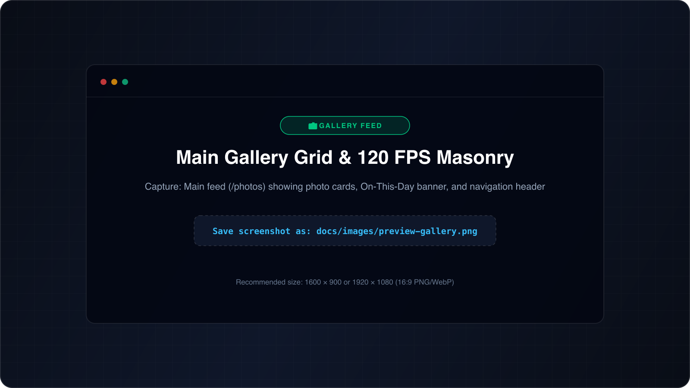
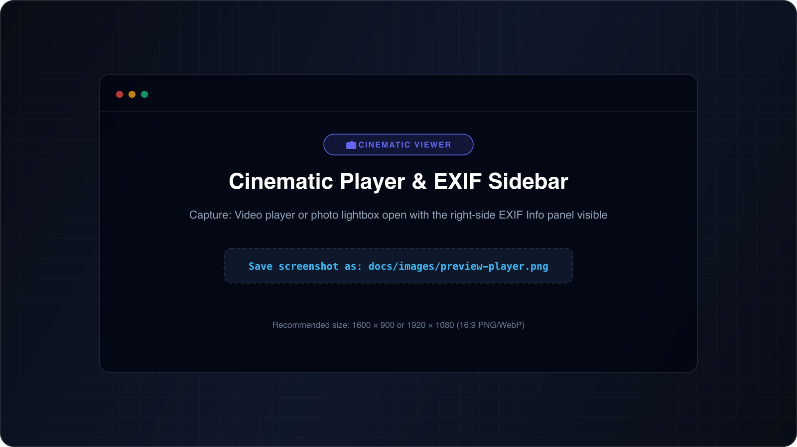
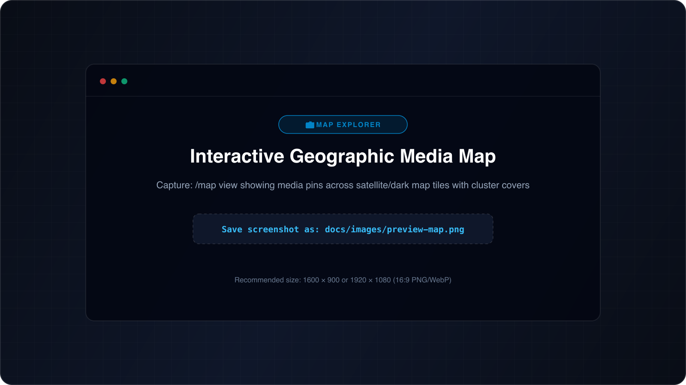
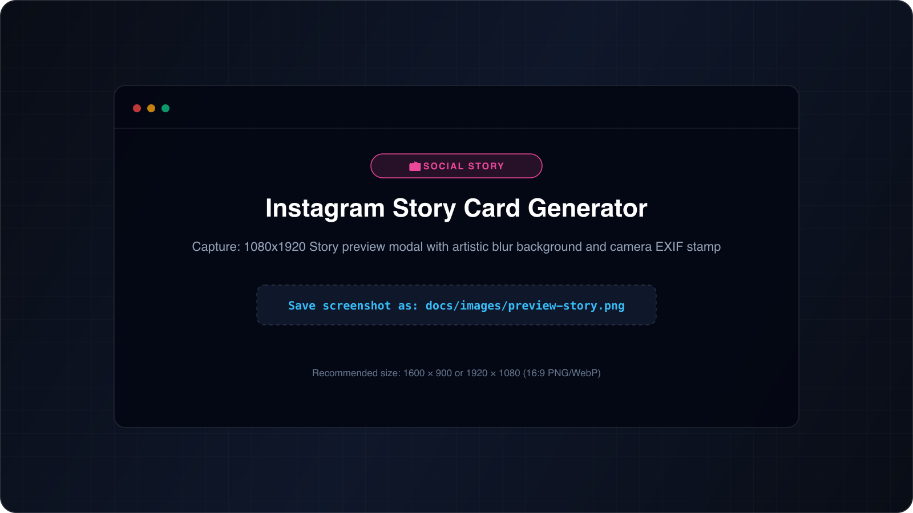
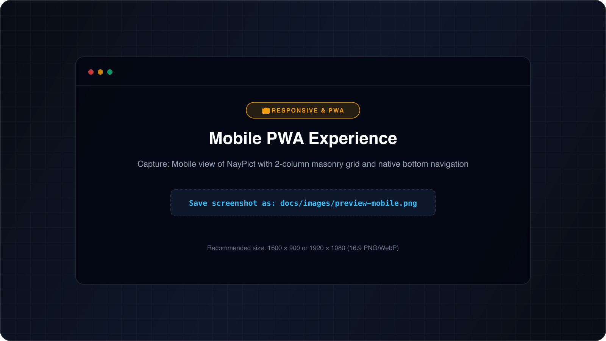

<p align="center">
  <a href="https://www.naypict.my.id">
    
  </a>
  <h1 align="center">NayPict</h1>
  <p align="center">
    <strong>Your Memories, Reimagined.</strong><br>
    A blazing-fast, self-hosted modern photo & video gallery engineered with Next.js 16, Cloudflare R2, Neon PostgreSQL, and interactive media intelligence.
  </p>
  <p align="center">
    <a href="https://www.naypict.my.id"></a>
    <a href="#-quick-start"></a>
  </p>
  <p align="center">
    
    
    
    
    
    
  </p>
  <p align="center">
    
  </p>
</p>

---

## 🧭 Overview

**NayPict** is an elegant, privacy-first alternative to cloud photo lockers. Designed specifically for photographers, creators, and visual collectors, NayPict combines modern web performance engineering with cinematic aesthetics. 

Experience **zero-blur 120 FPS gallery scrolling**, **instant video streaming with background pre-buffering**, **interactive geographic map discovery**, **smart duplicate detection**, and **Apple-grade fluid animations** — all running on your own infrastructure with zero egress fees.

[Explore Live Demo →](https://www.naypict.my.id)

---

## ✨ Features & Capabilities

### ⚡ Ultra-Fast 120 FPS Media Scrolling Engine
- **Directional Lookahead Prefetching**: Intelligently predicts scrolling direction and pre-caches incoming media up to 5 screens ahead.
- **In-Memory Session Warm Cache**: Instant 0ms recall for previously viewed images (`loadedThumbnails`) — say goodbye to blur placeholders when scrolling up or down.
- **Instant ThumbHash Decoding**: High-fidelity, ultra-compact visual placeholders decoded in milliseconds with zero layout shift (CLS 0.00).
- **Above-The-Fold Priority Loading**: Automatic LCP boost prioritizing viewport media first before loading background elements.

---

### 🎬 Cinematic Video Player & Instant Pre-Buffering
- **Zero-Lag Video Playback**: Background pre-buffering (`video-prebuffer`) warms video chunks into cache so videos start playing instantaneously on click.
- **Hover & Touch Autoplay**: Smooth video preview on mouse hover or touch hold with sound indicator badges and seamless looping.
- **Custom Player Controls**: Precision scrub bar, full-screen cinema mode, volume memory, and gesture controls designed to avoid touch-swipe conflicts.
- **Client-Side Video Transcoding**: WebAssembly-powered compression (`@ffmpeg/ffmpeg`) capable of shrinking 4K drone/camera footage by up to 90% right inside your browser before upload.

<p align="center">
  
</p>

---

### 🗺️ Interactive Geographic Media Map (`/map`)
- **Spatial Discovery**: View your photos and videos pinned across 5 high-resolution map styles (Satellite Hybrid, Google Streets, CartoDB Dark, CartoDB Light, and Topographic Terrain).
- **Live Proximity Distance**: Automatic calculation of distance from your current location (*"12 km from where you are"*).
- **Smart Burst Clustering**: Automatically groups photos taken at the same spot to keep map exploration fluid and organized.
- **Reverse Geocoding & Untagged Media Hub**: 1-click GPS assignment for photos without coordinates and spot cover customization.

<p align="center">
  
</p>

---

### 🌐 Self-Healing Network & Offline Defense
- **Smart Connection Alerts**: Polished, non-intrusive *"Connection Lost"* and *"Connection Restored"* status updates — no ugly raw technical fetch errors.
- **Active Heartbeat Probing**: Proactive background probes detect restored connectivity even if your mobile device or browser misses native online events.
- **Media-Driven Self Healing**: As soon as media tiles paint or API requests succeed during scrolling, connection warnings dismiss automatically.
- **In-Player Buffering Badges**: Clear network congestion warnings (*"Slow connection detected. Buffering..."*) keep users informed during poor signal conditions.

---

### 📅 Nostalgic "On This Day" Time-Machine
- Automatically highlights unforgettable moments captured on the current date in previous years.
- Dynamic relative age tags (*"Captured 2 years ago today"*) featured in an expandable header carousel on your main gallery page.

---

### 📱 1-Click Instagram Story Card Generator
- Turn any photo or video frame into a stunning **1080×1920 Instagram Story** card in seconds.
- Automatically embeds camera EXIF tags (Camera Model, Lens, Focal Length, Aperture, Shutter Speed, ISO) with customizable artistic backdrop blurs.
- Direct image download or 1-tap clipboard copy ready for immediate social sharing.

<p align="center">
  
</p>

---

### 🔍 Multi-Factor Duplicate Media Detector (`/duplicates`)
- **Visual & Hash Fingerprinting**: Scans your entire gallery using pixel ThumbHash fingerprints, byte dimensions, and SHA-256 checksums.
- **1-Click Batch Cleanup**: Safely delete duplicate files and free up storage while automatically preserving original album associations and metadata.

---

### 💬 Community Reactions & Threaded Comments
- **Live Reactions**: Instant optimistic emoji reactions (🔥, ❤️, ✨, 👏, 🎉) with delightful floating heart burst micro-animations.
- **Threaded Discussions**: Nested comment threads with administrative moderation, pinned highlights, and built-in **Cloudflare Turnstile CAPTCHA** bot protection.

---

### 🌿 Adaptive Eco Performance Engine
- Automatically detects **Data Saver mode**, **low battery levels**, or **weak cellular networks (2G/3G)**.
- Intelligently throttles auto-play videos, heavy animations, and lookahead prefetching to preserve battery life and mobile data.

---

### 🔒 Enterprise Privacy & Zero Public Egress
- **100% Private Cloudflare R2**: Public bucket access is completely disabled. Media keys and storage paths are never leaked to public clients.
- **Secure Media Gateway**: Media derivatives (thumbnails & previews) are transformed and served through a lightweight, cache-accelerated Cloudflare Worker.
- **Role-Based Admin Protection**: Robust JWT session management, bcrypt password hashing, and strict rate limiting.

---

### 📲 Progressive Web App (PWA)
- Install NayPict directly onto **iOS, Android, macOS, and Windows** as a standalone app.
- Full offline shell caching via Service Worker with a complete pixel-sharp branded icon suite.

<p align="center">
  
</p>

---

## 🛠️ Built With Modern Tech

| Area | Technologies |
|---|---|
| **Core Framework** | [Next.js 16](https://nextjs.org/) (App Router, Server Actions, Turbopack) |
| **UI & Styling** | [React 19](https://react.dev/), [Tailwind CSS v4](https://tailwindcss.com/), [Framer Motion](https://www.framer.com/motion/) |
| **Backend & Routing**| [Hono](https://hono.dev/) on Next.js Edge / Node Route Handlers |
| **Database & ORM** | [Neon Serverless PostgreSQL](https://neon.tech/) (Production) / [SQLite](https://www.sqlite.org/) (Local) via [Drizzle ORM](https://orm.drizzle.team/) |
| **Object Storage** | [Cloudflare R2](https://www.cloudflare.com/products/r2/) via AWS S3 Client SDK v3 |
| **Media Processing** | [Sharp](https://sharp.pixelplumbing.com/), [@ffmpeg/ffmpeg](https://ffmpegwasm.netlify.app/) (Wasm), [ThumbHash](https://github.com/evanw/thumbhash) |
| **Interactive Maps** | [Leaflet](https://leafletjs.com/) with Google, CartoDB, and OpenStreetMap layers |
| **Security & Defense**| Cloudflare Turnstile, Upstash Redis Rate Limiting, Strict Security Headers |

---

## 🚀 Quick Start

### Prerequisites
- Node.js 20+ and `pnpm` (recommended) or `npm`
- *(Optional)* Cloudflare account for R2 Object Storage (or use local storage for quick testing)

### 1. Clone & Install
```bash
git clone https://github.com/YnaStpra/NayPict.git
cd NayPict
pnpm install
```

### 2. Configure Environment
Create a `.env` file in the root directory:
```env
# Application
TITLE=NayPict
APP_URL=http://localhost:3000
JWT_SECRET=generate_a_secure_random_string_here

# Administrator Account
ADMIN=admin
PASSWORD=your_secure_password_here

# Database (Leave blank for instant zero-config local SQLite, or provide Neon PostgreSQL URL)
DATABASE_URL=

# Media Gateway (Optional Cloudflare Worker URL for edge thumbnail acceleration)
R2_MEDIA_GATEWAY_URL=

# Distributed Rate Limiting (Optional Upstash Redis)
UPSTASH_REDIS_REST_URL=
UPSTASH_REDIS_REST_TOKEN=

# Bot Protection (Optional Cloudflare Turnstile)
NEXT_PUBLIC_TURNSTILE_SITE_KEY=
TURNSTILE_SECRET_KEY=
```

### 3. Launch Development Server
```bash
pnpm dev
```
Open [http://localhost:3000](http://localhost:3000) in your browser and experience NayPict.

---

## 🌐 Deployment Guide

### Deploying to Vercel (Recommended)
1. Fork or push your NayPict repository to GitHub.
2. Import the project into [Vercel](https://vercel.com/).
3. Add your environment variables in Vercel Project Settings (`TITLE`, `ADMIN`, `PASSWORD`, `JWT_SECRET`, `DATABASE_URL`).
4. Click **Deploy**. Vercel will automatically build and host your app with global edge caching.

### Deploying the Cloudflare Media Gateway
For maximum performance with zero egress fees:
```bash
cd workers/media-gateway
npx wrangler deploy
```
Copy the generated Worker URL into your `R2_MEDIA_GATEWAY_URL` environment variable.

---

## ⚙️ Configuration Reference

| Variable | Type | Default | Description |
|---|---|---|---|
| `TITLE` | Optional | `NayPict` | Gallery branding and browser tab title |
| `APP_URL` | **Required** | `http://localhost:3000` | Canonical origin URL for CORS & metadata |
| `ADMIN` | **Required** | — | Administrator username |
| `PASSWORD` | **Required** | — | Administrator password |
| `JWT_SECRET` | **Required** | — | Secret key used for signing authentication cookies |
| `DATABASE_URL` | Optional | `data/naypict.sqlite` | Neon PostgreSQL connection string (or SQLite path) |
| `R2_MEDIA_GATEWAY_URL` | Optional | — | Edge Worker endpoint for derivative media caching |
| `UPSTASH_REDIS_REST_URL` | Optional | — | Redis REST URL for distributed rate limiting |
| `NEXT_PUBLIC_TURNSTILE_SITE_KEY` | Optional | — | Turnstile Site Key for anti-bot protection |

---

## 📸 Customizing Showcase Screenshots

To replace the preview images in this README with your own gallery screenshots, simply capture your screen at **1600×900** (or **1920×1080**) and save them to `docs/images/`:

| File Path | What to Capture | Feature Location |
|---|---|---|
| `docs/images/preview-gallery.png` | Main Masonry Feed with photo cards & On-This-Day banner | `/photos` |
| `docs/images/preview-player.png` | Video player or photo lightbox with EXIF sidebar open | `/photo/[id]` |
| `docs/images/preview-map.png` | Interactive Map with photo pins & cluster spots | `/map` |
| `docs/images/preview-story.png` | Instagram Story 1080×1920 generator card dialog | Inside photo modal |
| `docs/images/preview-mobile.png` | Mobile responsive 2-column view or PWA home screen | Mobile viewport |

---

## 🤝 Contributing & Community

Contributions, issues, and feature suggestions are always welcome! Feel free to check the [issues page](https://github.com/YnaStpra/NayPict/issues) or submit a pull request.

If you enjoy using NayPict, please consider giving it a ⭐ on GitHub — it helps the project grow!

---

## 📄 License

NayPict is open-source software licensed under the [AGPL-3.0 License](LICENSE).
