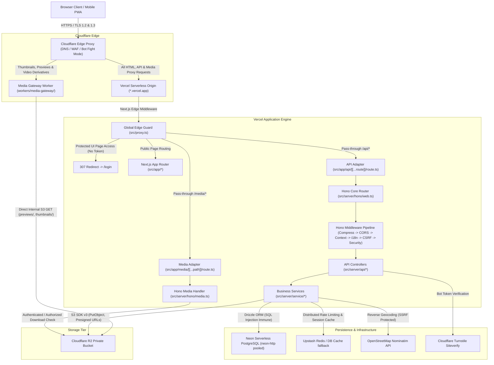

# Security Context Report: NayPict Web Application

**Document Version**: 1.0.0  
**Target Environment**: Production (`https://www.naypict.my.id/`)  
**Assessment Type**: Security Context & Attack Surface Profile (Preparation for Pentest Phase 2)  
**Date**: September 16, 2026  
**Confidentiality Level**: Strictly Confidential / Internal Security Review  

---

## 1. Project Overview

NayPict is a modern, high-performance, web-based photo and video gallery application designed for professional photography exhibition, media archiving, and interactive visitor engagement. It provides distraction-free masonry layouts, full-screen lightbox viewing, geotagged mapping, client-side video compression, time-machine showcases, community reactions/comments, and visitor telemetry analytics.

- **Project Name**: NayPict
- **Application Purpose**: Self-hosted photography and videography portfolio, interactive media discovery, and multi-media exhibition platform.
- **Application Type**: Full-Stack Multi-Media Web Application (Next.js App Router + Hono API + Edge Worker Gateway + PWA).
- **Production URL**: `https://www.naypict.my.id/`
- **Staging / Fallback URL**: `https://naypict.vercel.app` (Permanently redirected via HTTP 308 to production domain).
- **Source Code Repository**: Clean Git repository synchronizing `main` and `develop` branches.
- **Secrets Policy Notification**: Potential secret discovered in `/.env` (keys: `JWT_SECRET`, `PASSWORD`, `DATABASE_URL`). Secret values are strictly redacted per security guidelines.

---

## 2. Technology Stack

| Component Layer | Technology / Framework | Version | Evidence |
| :--- | :--- | :--- | :--- |
| **Frontend Framework** | Next.js (App Router, Turbopack, React Server Components) | `16.2.10` | [`package.json:50`](file:///Users/yansaputra/Naypict/package.json#L50) |
| **UI Library** | React | `19.2.4` | [`package.json:56`](file:///Users/yansaputra/Naypict/package.json#L56) |
| **Styling & Design** | Tailwind CSS v4, Radix UI, Framer Motion, Tabler Icons | `^4.0.0` / `1.4.3` | [`package.json:55`](file:///Users/yansaputra/Naypict/package.json#L55), [`package.json:86`](file:///Users/yansaputra/Naypict/package.json#L86) |
| **State Management** | Zustand | `5.0.13` | [`package.json:70`](file:///Users/yansaputra/Naypict/package.json#L70) |
| **Interactive Maps** | Leaflet | `1.9.4` | [`package.json:46`](file:///Users/yansaputra/Naypict/package.json#L46) |
| **Backend API Engine** | Hono (mounted on Next.js Route Handlers) | `4.13.7` | [`package.json:45`](file:///Users/yansaputra/Naypict/package.json#L45), [`src/server/hono/web.ts`](file:///Users/yansaputra/Naypict/src/server/hono/web.ts) |
| **Programming Language**| TypeScript | `5.7.2` | [`package.json:87`](file:///Users/yansaputra/Naypict/package.json#L87) |
| **Package Manager** | pnpm (with patched dependencies for `masonic` and `yet-another-react-lightbox`) | `9.15.4` | [`package.json:6`](file:///Users/yansaputra/Naypict/package.json#L6) |
| **Production Database** | Neon Serverless PostgreSQL (`@neondatabase/serverless`) | `1.1.0` | [`package.json:33`](file:///Users/yansaputra/Naypict/package.json#L33), [`src/server/infra/db.ts`](file:///Users/yansaputra/Naypict/src/server/infra/db.ts) |
| **Local Database** | SQLite (`better-sqlite3`, stored at `data/naypict.sqlite`) | `12.6.2` | [`package.json:37`](file:///Users/yansaputra/Naypict/package.json#L37) |
| **ORM / Query Builder** | Drizzle ORM (`drizzle-orm`, `drizzle-kit`) | `0.45.2` | [`package.json:40`](file:///Users/yansaputra/Naypict/package.json#L40), [`src/server/infra/schema.ts`](file:///Users/yansaputra/Naypict/src/server/infra/schema.ts) |
| **Object Storage** | Cloudflare R2 (Private bucket accessed via AWS S3 SDK v3) | `3.984.0` | [`package.json:27`](file:///Users/yansaputra/Naypict/package.json#L27), [`src/server/storage/s3-storage.ts`](file:///Users/yansaputra/Naypict/src/server/storage/s3-storage.ts) |
| **Media Derivative Gateway**| Dedicated Cloudflare Worker (`workers/media-gateway/`) | Edge Runtime | [`workers/media-gateway/src/index.js`](file:///Users/yansaputra/Naypict/workers/media-gateway/src/index.js) |
| **Media Processing** | Sharp, WebAssembly `@ffmpeg/ffmpeg`, ThumbHash, ExifTool | `0.34.5` / `1.56.0` | [`package.json:61`](file:///Users/yansaputra/Naypict/package.json#L61), [`package.json:64`](file:///Users/yansaputra/Naypict/package.json#L64) |
| **Password Hashing** | Argon2id WebAssembly (`hash-wasm`) | `4.12.0` | [`package.json:44`](file:///Users/yansaputra/Naypict/package.json#L44), [`src/server/lib/crypto.ts`](file:///Users/yansaputra/Naypict/src/server/lib/crypto.ts) |
| **Bot Defense / CAPTCHA** | Cloudflare Turnstile | REST API | [`src/server/lib/turnstile.ts`](file:///Users/yansaputra/Naypict/src/server/lib/turnstile.ts) |
| **Cache & Rate Limiting**| Upstash Redis REST API (with Neon PostgreSQL DB fallback) | REST API | [`src/server/lib/rate-limiter.ts`](file:///Users/yansaputra/Naypict/src/server/lib/rate-limiter.ts), [`src/server/infra/cache.ts`](file:///Users/yansaputra/Naypict/src/server/infra/cache.ts) |
| **Hosting Platform** | Vercel Serverless Platform | Node.js Runtime | [`vercel.json`](file:///Users/yansaputra/Naypict/vercel.json) |
| **Edge CDN / WAF** | Cloudflare (Full Strict SSL/TLS, Bot Fight Mode, HSTS) | Edge Proxy | [`security-results/testssl.txt`](file:///Users/yansaputra/Naypict/security-results/testssl.txt) |
| **DNS Provider** | DomaiNesia delegated to Cloudflare Nameservers | DNS | `clayton.ns.cloudflare.com`, `sloan.ns.cloudflare.com` |

---

## 3. Application Architecture



### End-to-End Request Flow Walkthrough
1. **Edge Ingestion**: Client requests arrive at Cloudflare edge proxy IPs (`104.21.53.199`, `172.67.218.117`). Cloudflare enforces TLS termination (minimum TLS 1.2), evaluates WAF rules, and blocks malicious volumetric crawlers.
2. **Derivative Offloading**: If an image derivative (`previews/`, `thumbnails/`) or public gallery video is requested, Cloudflare routes it directly to the Cloudflare Worker Media Gateway. The worker verifies hotlinking headers and streams bytes directly from private Cloudflare R2 storage without hitting Vercel origin compute.
3. **Edge Route Guard**: For application traffic, Cloudflare proxies to Vercel. Next.js edge router executes `src/proxy.ts`. If an unauthenticated user attempts accessing protected management paths (`/admin`, `/storage`, `/settings`, `/users`, `/comments`, `/duplicates`, `/trash`, `/insights`), `proxy.ts` clears invalid cookies and issues an HTTP 307 temporary redirect to `/login`.
4. **API Gateway & Middleware Pipeline**: API requests reaching `/api/*` pass into `src/server/hono/hono.ts`. The pipeline executes in order:
   - `compress()`: HTTP compression.
   - `apiCors`: Strict CORS validation.
   - `contextStorage()`: Per-request context initialization.
   - `i18nMiddleware`: Locale detection (`en`, `id`).
   - `csrfProtection`: CSRF origin verification for mutating methods.
   - `security`: Verifies `__Host-token` JWT, checks `tokenVersion` and active session UUID against cache/database, and enforces role boundaries (rejects `NORMAL` users attempting `SYSTEM_PATHS` with 403 Forbidden).
5. **Business Logic & Database**: API controllers validate incoming BO schemas (`src/server/entity/bo/*`) and invoke service classes (`src/server/service/*`). Database interactions strictly use Drizzle ORM parameterized SQL against Neon PostgreSQL.

---

## 4. Deployment Architecture

- **Primary Production Domain**: `https://www.naypict.my.id`
- **Origin Hosting**: Vercel Serverless Platform (`sin1` Singapore edge compute region, `iad1` Northern Virginia serverless origin).
- **Domain Routing & Proxies**:
  - Registered through DomaiNesia.
  - Nameservers delegated to Cloudflare (`clayton.ns.cloudflare.com`, `sloan.ns.cloudflare.com`).
  - Cloudflare Edge proxy configuration: **Full (Strict) SSL/TLS**, **Bot Fight Mode**, **Minimum TLS Version 1.2**, **HSTS enabled (max-age 63072000; includeSubDomains; preload)**.
  - Vercel URL `https://naypict.vercel.app` permanently redirects with HTTP 308 to `https://www.naypict.my.id`.
- **Media Delivery Architecture**:
  - Private Cloudflare R2 bucket (`STORAGE_PROVIDER=r2`).
  - Native R2 public access (`r2.dev`) is completely disabled.
  - Cloudflare Worker Media Gateway (`workers/media-gateway/`) serves public derivatives.
  - Origin photo downloads are server-proxied through `/media/{key}` with authentication and download permission checks.
- **Scheduled Automation**: Vercel Cron triggered daily at `0 3 * * *` targeting `/api/cron/cleanup` with `CRON_SECRET` authorization.

---

## 5. Authentication Architecture

- **Login Mechanism**: Form-based JSON payload to `POST /api/login`.
  - Parameters: `username`, `password`, `turnstileToken` (optional/env-dependent), `totpCode` (optional).
  - Rate Limiting: Max 5 failed attempts per 15 minutes per IP enforced via `loginRateLimiter`.
  - Bot Defense: Cloudflare Turnstile token validation against `challenges.cloudflare.com`.
- **Password Hashing & Verification**:
  - Modern Algorithm: Salted **Argon2id** (`iterations: 3`, `memorySize: 65536 KB [64 MB]`, `parallelism: 1`, `hashLength: 32 bytes`) implemented via `hash-wasm`.
  - Legacy Support: Automatic transparent upgrade from legacy salted SHA-256 to Argon2id upon successful authentication.
  - Verification Security: Constant-time equality comparison via `crypto.timingSafeEqual` to eliminate timing side-channel attacks.
- **Multi-Factor Authentication (MFA / 2FA)**:
  - Time-based One-Time Password (TOTP / RFC 6238) compatible with Google Authenticator.
  - Setup Endpoint: `POST /api/totp/setup` generates a Base32 secret and QR code data URL.
  - Verification: `POST /api/totp/enable` validates the 6-digit OTP code before enabling 2FA for the account.
- **Session & Token Lifecycle**:
  - Token Type: Stateless JWT signed with HMAC-SHA256 (`HS256`) via `hono/jwt`.
  - Token Claims: `userId` (string), `uuid` (session ID), `tokenVersion` (integer), `iat` (timestamp), `exp` (30 days = 2,592,000 seconds).
  - Secret: `process.env.JWT_SECRET` (loaded at runtime; throws fatal error if absent).
  - Refresh Tokens: **None**. The architecture utilizes a single long-lived JWT paired with server-side revocation validation.
- **Revocation Mechanisms**:
  - Global Invalidation: `userTab.tokenVersion` is incremented upon password change or administrative modification. Any token presenting an outdated `tokenVersion` is instantly rejected with HTTP 401.
  - Device Session Revocation: Active session UUIDs are tracked in Redis/PostgreSQL cache (`sessionService`). Users can terminate specific remote devices via `POST /api/session/revoke` or all other sessions via `POST /api/session/revoke-others`.
- **Cookie Configuration**:
  - Name: `__Host-token` (Production HTTPS) / `token` (Local Dev).
  - Attributes: `HttpOnly: true`, `Secure: true` (in production), `SameSite: Lax`, `Path: /`, `Max-Age: 2592000`.
  - RFC 6265bis Compliance: The `__Host-` prefix enforces that the cookie cannot be overwritten by sibling subdomains and must not have a `Domain` attribute set.
  - Visitor Cookie: `naypict_vid` (`HttpOnly: true`, `SameSite: Lax`, `Max-Age: 31536000`, `Secure: true`).

---

## 6. Authorization Architecture

- **Authorization Model**: Role-Based Access Control (RBAC) with Edge and Application Layer Guards.
- **Guard Levels**:
  1. **Edge Middleware (`src/proxy.ts`)**: Evaluates `isSystemPath(pathname)`. Unauthenticated requests to protected pages are redirected to `/login` (307). Normal users attempting to access system routes receive an HTTP 404 rewrite to prevent administrative path discovery.
  2. **API Interceptor (`src/server/security/security.ts`)**: Evaluates every request targeting `/api/*`. Rejects unauthenticated requests with `401 Unauthorized` (unless in `PUBLIC_API_PATHS`). For `SYSTEM_PATHS`, validates `authInfo.type === UserTypeEnum.ADMIN`; if caller is `NORMAL`, throws `403 Forbidden`.
  3. **Media Download Guard (`src/server/hono/media.ts`)**: Evaluates `/media/{key}`. If requested file is an original photo, verifies `allowDownload === 1 || Boolean(userId)`. If unauthorized, returns HTTP 403 `DOWNLOAD_PROTECTED`.
  4. **Self-Demotion Safeguard (`src/server/service/user-service.ts`)**: Prevents an administrator from demoting themselves or deleting the last active administrator account in the system.

---

## 7. User Roles

The application codebase defines exactly three user privilege levels:

### Role: Guest (Public Visitor)
- **Authentication Required**: No.
- **Main Permissions**: Browse public gallery photos and albums; search geotagged media on the interactive map; view photo EXIF and technical parameters; view approved comments; post comments (subject to Turnstile CAPTCHA); submit micro-reactions/likes; download photos where download protection is disabled (`allowDownload = 1`).
- **Accessible Pages**: `/`, `/photos`, `/albums`, `/map`, `/photo/[id]`, `/login`.
- **Accessible APIs**: `/api/photo/list`, `/api/photo/randomIdList`, `/api/photo/onThisDay`, `/api/photo/takenDateList`, `/api/photo/download` (if permitted), `/api/album/list`, `/api/photo/comment/list`, `/api/photo/comment/add`, `/api/photo/reactions`, `/api/photo/reaction/add`, `/api/photo/view`, `/api/photo/share`, `/api/location/reverse`, `/api/sync/version`, `/api/storage/select`, `/api/csp-report`, `/api/health`, `/media/*` (derivatives only).
- **Sensitive Actions**: Submitting comments and micro-reactions. Cannot modify, upload, or delete any gallery data.

### Role: User / Ordinary User (`UserTypeEnum.NORMAL = 2`)
- **Authentication Required**: Yes (`__Host-token` cookie).
- **Main Permissions**: Inherits all Guest permissions; can download original photos regardless of public download protection flags; view own profile; change own password; update own avatar; view and revoke active device sessions; configure personal TOTP 2FA.
- **Accessible Pages**: Public pages + User settings.
- **Accessible APIs**: Public APIs + `/api/user/info`, `/api/user/setUserPassword`, `/api/user/setAvatar`, `/api/user/avatar/:key`, `/api/session/list`, `/api/session/revoke`, `/api/session/revoke-others`, `/api/totp/*`.
- **Sensitive Actions**: Password change and session termination. Explicitly forbidden from accessing `SYSTEM_PATHS` (HTTP 403 Forbidden).

### Role: Administrator (`UserTypeEnum.ADMIN = 1`)
- **Authentication Required**: Yes (`__Host-token` cookie with Admin privilege).
- **Main Permissions**: Unrestricted system administration; upload photos and videos via direct presigned R2 URLs; batch edit photo metadata and GPS tags; create, edit, archive, and delete albums; manage recycle bin and permanently wipe media; run duplicate media detector; moderate, pin, heart, and reply to comments; create, edit, demote, and delete user accounts; configure Cloudflare R2 / S3 storage credentials; export encrypted AES-256 database snapshots; inspect visitor telemetry and engagement insights; modify watermark and system settings.
- **Accessible Pages**: All pages (`/admin`, `/admin/photos`, `/admin/analytics`, `/admin/insights`, `/duplicates`, `/comments`, `/settings`, `/storage`, `/trash`, `/users`).
- **Accessible APIs**: All APIs across the application.
- **Sensitive Actions**: Storage credential modification, user account creation/deletion, database backup export, mass media deletion.

---

## 8. Role Permission Matrix

| Resource / Action | Guest (Public) | User (Normal) | Admin | Source Code Guard Location |
| :--- | :---: | :---: | :---: | :--- |
| **Browse Public Gallery (`/photos`, `/albums`)** | ✅ | ✅ | ✅ | [`src/proxy.ts:17`](file:///Users/yansaputra/Naypict/src/proxy.ts#L17) |
| **Explore Interactive Map (`/map`)** | ✅ | ✅ | ✅ | [`src/proxy.ts:21`](file:///Users/yansaputra/Naypict/src/proxy.ts#L21) |
| **View Photo Metadata & EXIF** | ✅ | ✅ | ✅ | [`src/server/api/photo-api.ts:200`](file:///Users/yansaputra/Naypict/src/server/api/photo-api.ts#L200) |
| **Download Unprotected Photo Originals** | ✅ | ✅ | ✅ | [`src/server/hono/media.ts:117`](file:///Users/yansaputra/Naypict/src/server/hono/media.ts#L117) |
| **Download Protected Photo Originals** | ❌ (403) | ✅ | ✅ | [`src/server/hono/media.ts:120`](file:///Users/yansaputra/Naypict/src/server/hono/media.ts#L120) |
| **Submit Micro-Reaction / Like** | ✅ (Rate limited) | ✅ | ✅ | [`src/server/api/reaction-api.ts:53`](file:///Users/yansaputra/Naypict/src/server/api/reaction-api.ts#L53) |
| **Post Comment (Turnstile CAPTCHA)** | ✅ | ✅ | ✅ | [`src/server/api/comment-api.ts:48`](file:///Users/yansaputra/Naypict/src/server/api/comment-api.ts#L48) |
| **Change Own Password** | ❌ (401) | ✅ | ✅ | [`src/server/api/user-api.ts:55`](file:///Users/yansaputra/Naypict/src/server/api/user-api.ts#L55) |
| **Update Own Avatar** | ❌ (401) | ✅ | ✅ | [`src/server/api/user-api.ts:68`](file:///Users/yansaputra/Naypict/src/server/api/user-api.ts#L68) |
| **View Active Sessions / Revoke Device** | ❌ (401) | ✅ | ✅ | [`src/server/api/session-api.ts:13`](file:///Users/yansaputra/Naypict/src/server/api/session-api.ts#L13) |
| **Setup / Configure TOTP 2FA** | ❌ (401) | ✅ | ✅ | [`src/server/api/totp-api.ts:23`](file:///Users/yansaputra/Naypict/src/server/api/totp-api.ts#L23) |
| **Generate Presigned R2 Upload URLs** | ❌ (401) | ❌ (403) | ✅ | [`src/server/security/security.ts:36`](file:///Users/yansaputra/Naypict/src/server/security/security.ts#L36) |
| **Upload Photos & Videos** | ❌ (401) | ❌ (403) | ✅ | [`src/server/security/security.ts:33`](file:///Users/yansaputra/Naypict/src/server/security/security.ts#L33) |
| **Batch Edit Media Metadata / GPS** | ❌ (401) | ❌ (403) | ✅ | [`src/server/security/security.ts:27`](file:///Users/yansaputra/Naypict/src/server/security/security.ts#L27) |
| **Recycle / Restore / Delete Photos** | ❌ (401) | ❌ (403) | ✅ | [`src/server/security/security.ts:28`](file:///Users/yansaputra/Naypict/src/server/security/security.ts#L28) |
| **Duplicate Photo Cleanup** | ❌ (401) | ❌ (403) | ✅ | [`src/server/security/security.ts:32`](file:///Users/yansaputra/Naypict/src/server/security/security.ts#L32) |
| **Create / Edit / Delete Albums** | ❌ (401) | ❌ (403) | ✅ | [`src/server/security/security.ts:41`](file:///Users/yansaputra/Naypict/src/server/security/security.ts#L41) |
| **Comment Moderation (Pin/Heart/Reply/Delete)**| ❌ (401) | ❌ (403) | ✅ | [`src/server/security/security.ts:51`](file:///Users/yansaputra/Naypict/src/server/security/security.ts#L51) |
| **View Admin Insights & Telemetry** | ❌ (401) | ❌ (403) | ✅ | [`src/server/security/security.ts:57`](file:///Users/yansaputra/Naypict/src/server/security/security.ts#L57) |
| **User Account Management (Add/Set/Delete)** | ❌ (401) | ❌ (403) | ✅ | [`src/server/security/security.ts:19`](file:///Users/yansaputra/Naypict/src/server/security/security.ts#L19) |
| **Storage Configuration (R2/S3 Credentials)** | ❌ (401) | ❌ (403) | ✅ | [`src/server/security/security.ts:24`](file:///Users/yansaputra/Naypict/src/server/security/security.ts#L24) |
| **System Settings & Watermark Configuration** | ❌ (401) | ❌ (403) | ✅ | [`src/server/security/security.ts:18`](file:///Users/yansaputra/Naypict/src/server/security/security.ts#L18) |
| **Export Encrypted Database Backup** | ❌ (401) | ❌ (403) | ✅ | [`src/server/security/security.ts:62`](file:///Users/yansaputra/Naypict/src/server/security/security.ts#L62) |
| **Execute Scheduled Maintenance (`/cron/cleanup`)**| ❌ (401) | ❌ (401) | ❌ (Bearer) | [`src/server/api/cron-api.ts:14`](file:///Users/yansaputra/Naypict/src/server/api/cron-api.ts#L14) |

---

## 9. API & Route Inventory

### PUBLIC ROUTES (Pages)
- `GET /` — Landing page / photo exhibition ([`src/app/page.tsx`](file:///Users/yansaputra/Naypict/src/app/page.tsx))
- `GET /photos` — Infinite masonry photo gallery ([`src/app/photos/page.tsx`](file:///Users/yansaputra/Naypict/src/app/photos/page.tsx))
- `GET /albums` — Public photo albums showcase ([`src/app/albums/page.tsx`](file:///Users/yansaputra/Naypict/src/app/albums/page.tsx))
- `GET /archive` — Public archived albums ([`src/app/archive/page.tsx`](file:///Users/yansaputra/Naypict/src/app/archive/page.tsx))
- `GET /map` — Interactive Leaflet geotagged photo map ([`src/app/map/page.tsx`](file:///Users/yansaputra/Naypict/src/app/map/page.tsx))
- `GET /photo/[id]` — Individual photo viewer ([`src/app/photo/[id]/page.tsx`](file:///Users/yansaputra/Naypict/src/app/photo/[id]/page.tsx))
- `GET /login` — Authentication portal ([`src/app/login/page.tsx`](file:///Users/yansaputra/Naypict/src/app/login/page.tsx))

### AUTHENTICATED & ADMIN ROUTES (Pages)
- `GET /admin` — Administrative management dashboard ([`src/app/admin/page.tsx`](file:///Users/yansaputra/Naypict/src/app/admin/page.tsx))
- `GET /admin/photos` — Media management and batch uploader
- `GET /admin/insights` — Detailed engagement analytics
- `GET /admin/analytics` — Visitor session telemetry
- `GET /duplicates` — Multi-factor duplicate photo cleaner ([`src/app/duplicates/page.tsx`](file:///Users/yansaputra/Naypict/src/app/duplicates/page.tsx))
- `GET /comments` — Photo comment moderation center ([`src/app/comments/page.tsx`](file:///Users/yansaputra/Naypict/src/app/comments/page.tsx))
- `GET /settings` — System configuration & watermark settings ([`src/app/settings/page.tsx`](file:///Users/yansaputra/Naypict/src/app/settings/page.tsx))
- `GET /storage` — Cloudflare R2 / S3 storage provider configuration ([`src/app/storage/page.tsx`](file:///Users/yansaputra/Naypict/src/app/storage/page.tsx))
- `GET /trash` — Virtual trash and media recycle bin ([`src/app/trash/page.tsx`](file:///Users/yansaputra/Naypict/src/app/trash/page.tsx))
- `GET /users` — User account management & access control ([`src/app/users/page.tsx`](file:///Users/yansaputra/Naypict/src/app/users/page.tsx))

### API ROUTES INVENTORY
| Method | Path | Auth Required | Role | Purpose | Source File |
| :--- | :--- | :---: | :---: | :--- | :--- |
| `POST` | `/api/login` | No | Public | User authentication with rate limit & Turnstile | [`login-api.ts:15`](file:///Users/yansaputra/Naypict/src/server/api/login-api.ts#L15) |
| `POST` | `/api/logout` | Yes | Normal/Admin | Invalidate session UUID and clear auth cookies | [`login-api.ts:44`](file:///Users/yansaputra/Naypict/src/server/api/login-api.ts#L44) |
| `GET/POST`| `/api/photo/list` | No | Public | Retrieve paginated photos for gallery | [`photo-api.ts:200`](file:///Users/yansaputra/Naypict/src/server/api/photo-api.ts#L200) |
| `GET/POST`| `/api/photo/randomIdList` | No | Public | Fetch randomized photo IDs for client shuffle | [`photo-api.ts:224`](file:///Users/yansaputra/Naypict/src/server/api/photo-api.ts#L224) |
| `GET/POST`| `/api/photo/onThisDay` | No | Public | Retrieve photos taken on this calendar day | [`photo-api.ts:236`](file:///Users/yansaputra/Naypict/src/server/api/photo-api.ts#L236) |
| `POST` | `/api/photo/takenDateList` | No | Public | Count photos grouped by capture date | [`photo-api.ts:248`](file:///Users/yansaputra/Naypict/src/server/api/photo-api.ts#L248) |
| `POST` | `/api/photo/download` | No | Public/User | Validate download permissions and return asset key | [`photo-api.ts:348`](file:///Users/yansaputra/Naypict/src/server/api/photo-api.ts#L348) |
| `POST` | `/api/photo/presignedUploadUrl`| Yes | Admin | Generate presigned S3/R2 PUT URL | [`photo-api.ts:48`](file:///Users/yansaputra/Naypict/src/server/api/photo-api.ts#L48) |
| `POST` | `/api/photo/multipart/initiate`| Yes | Admin | Initiate multipart upload session | [`photo-api.ts:62`](file:///Users/yansaputra/Naypict/src/server/api/photo-api.ts#L62) |
| `POST` | `/api/photo/multipart/partUrl` | Yes | Admin | Generate part PUT URL for multipart upload | [`photo-api.ts:76`](file:///Users/yansaputra/Naypict/src/server/api/photo-api.ts#L76) |
| `POST` | `/api/photo/multipart/complete`| Yes | Admin | Finalize multipart upload session | [`photo-api.ts:83`](file:///Users/yansaputra/Naypict/src/server/api/photo-api.ts#L83) |
| `POST` | `/api/photo/multipart/abort` | Yes | Admin | Abort and cleanup multipart upload | [`photo-api.ts:90`](file:///Users/yansaputra/Naypict/src/server/api/photo-api.ts#L90) |
| `POST` | `/api/photo/batchEdit` | Yes | Admin | Batch update photo metadata and GPS tags | [`photo-api.ts:97`](file:///Users/yansaputra/Naypict/src/server/api/photo-api.ts#L97) |
| `POST` | `/api/photo/setAllowDownload` | Yes | Admin | Toggle download protection status | [`photo-api.ts:372`](file:///Users/yansaputra/Naypict/src/server/api/photo-api.ts#L372) |
| `POST` | `/api/photo/add` | Yes | Admin | Single photo upload fallback (form data) | [`photo-api.ts:379`](file:///Users/yansaputra/Naypict/src/server/api/photo-api.ts#L379) |
| `POST` | `/api/photo/addVideo` | Yes | Admin | Register video uploaded via presigned URL | [`photo-api.ts:392`](file:///Users/yansaputra/Naypict/src/server/api/photo-api.ts#L392) |
| `POST` | `/api/photo/exists` | Yes | Admin | Check if photo checksum already exists | [`photo-api.ts:406`](file:///Users/yansaputra/Naypict/src/server/api/photo-api.ts#L406) |
| `POST` | `/api/photo/recycle` | Yes | Admin | Soft-delete photos to recycle bin | [`photo-api.ts:413`](file:///Users/yansaputra/Naypict/src/server/api/photo-api.ts#L413) |
| `POST` | `/api/photo/restore` | Yes | Admin | Restore photos from recycle bin | [`photo-api.ts:420`](file:///Users/yansaputra/Naypict/src/server/api/photo-api.ts#L420) |
| `POST` | `/api/photo/delete` | Yes | Admin | Permanently purge photos from storage & DB | [`photo-api.ts:427`](file:///Users/yansaputra/Naypict/src/server/api/photo-api.ts#L427) |
| `POST` | `/api/photo/clear` | Yes | Admin | Empty all contents of recycle bin | [`photo-api.ts:434`](file:///Users/yansaputra/Naypict/src/server/api/photo-api.ts#L434) |
| `GET/POST`| `/api/photo/duplicates` | Yes | Admin | Detect duplicate photos via hash & checksum | [`photo-api.ts:446`](file:///Users/yansaputra/Naypict/src/server/api/photo-api.ts#L446) |
| `GET/POST`| `/api/album/list` | No | Public | Retrieve public albums list | [`album-api.ts:48`](file:///Users/yansaputra/Naypict/src/server/api/album-api.ts#L48) |
| `POST` | `/api/album/trash` | Yes | Admin | View virtual trash album metadata | [`album-api.ts:52`](file:///Users/yansaputra/Naypict/src/server/api/album-api.ts#L52) |
| `POST` | `/api/album/add` | Yes | Admin | Create a new photo album | [`album-api.ts:58`](file:///Users/yansaputra/Naypict/src/server/api/album-api.ts#L58) |
| `POST` | `/api/album/setCover` | Yes | Admin | Update album cover photo | [`album-api.ts:65`](file:///Users/yansaputra/Naypict/src/server/api/album-api.ts#L65) |
| `POST` | `/api/album/coverCandidates` | Yes | Admin | List eligible cover candidates | [`album-api.ts:72`](file:///Users/yansaputra/Naypict/src/server/api/album-api.ts#L72) |
| `POST` | `/api/album/addPhoto` | Yes | Admin | Add photo associations to album | [`album-api.ts:79`](file:///Users/yansaputra/Naypict/src/server/api/album-api.ts#L79) |
| `POST` | `/api/album/removePhoto` | Yes | Admin | Dissociate photos from album | [`album-api.ts:86`](file:///Users/yansaputra/Naypict/src/server/api/album-api.ts#L86) |
| `POST` | `/api/album/togglePinPhoto` | Yes | Admin | Toggle pinned status of photo in album | [`album-api.ts:93`](file:///Users/yansaputra/Naypict/src/server/api/album-api.ts#L93) |
| `POST` | `/api/album/setName` | Yes | Admin | Rename photo album | [`album-api.ts:100`](file:///Users/yansaputra/Naypict/src/server/api/album-api.ts#L100) |
| `POST` | `/api/album/setTop` | Yes | Admin | Pin album to top of list | [`album-api.ts:107`](file:///Users/yansaputra/Naypict/src/server/api/album-api.ts#L107) |
| `POST` | `/api/album/archive` | Yes | Admin | Archive album | [`album-api.ts:114`](file:///Users/yansaputra/Naypict/src/server/api/album-api.ts#L114) |
| `POST` | `/api/album/unarchive` | Yes | Admin | Restore archived album | [`album-api.ts:121`](file:///Users/yansaputra/Naypict/src/server/api/album-api.ts#L121) |
| `POST` | `/api/album/delete` | Yes | Admin | Delete album record | [`album-api.ts:128`](file:///Users/yansaputra/Naypict/src/server/api/album-api.ts#L128) |
| `GET/POST`| `/api/photo/comment/list` | No | Public | List approved comments for a photo | [`comment-api.ts:26`](file:///Users/yansaputra/Naypict/src/server/api/comment-api.ts#L26) |
| `POST` | `/api/photo/comment/add` | No | Public | Post a new comment (Turnstile CAPTCHA guarded) | [`comment-api.ts:48`](file:///Users/yansaputra/Naypict/src/server/api/comment-api.ts#L48) |
| `POST` | `/api/photo/comment/admin/list`| Yes | Admin | List all comments for administrative moderation | [`comment-api.ts:58`](file:///Users/yansaputra/Naypict/src/server/api/comment-api.ts#L58) |
| `POST` | `/api/photo/comment/reply` | Yes | Admin | Admin replies to a visitor comment | [`comment-api.ts:65`](file:///Users/yansaputra/Naypict/src/server/api/comment-api.ts#L65) |
| `POST` | `/api/photo/comment/reply/delete`| Yes | Admin | Delete photographer reply | [`comment-api.ts:72`](file:///Users/yansaputra/Naypict/src/server/api/comment-api.ts#L72) |
| `POST` | `/api/photo/comment/delete` | Yes | Admin | Delete a visitor comment | [`comment-api.ts:79`](file:///Users/yansaputra/Naypict/src/server/api/comment-api.ts#L79) |
| `POST` | `/api/photo/comment/heart` | Yes | Admin | Toggle photographer heart ❤️ badge on comment | [`comment-api.ts:86`](file:///Users/yansaputra/Naypict/src/server/api/comment-api.ts#L86) |
| `POST` | `/api/photo/comment/pin` | Yes | Admin | Pin comment to top of discussion | [`comment-api.ts:93`](file:///Users/yansaputra/Naypict/src/server/api/comment-api.ts#L93) |
| `POST` | `/api/photo/reactions` | No | Public | Query reaction tallies and caller state | [`reaction-api.ts:45`](file:///Users/yansaputra/Naypict/src/server/api/reaction-api.ts#L45) |
| `POST` | `/api/photo/reaction/add` | No | Public | Add or toggle emoji reaction (rate limited) | [`reaction-api.ts:53`](file:///Users/yansaputra/Naypict/src/server/api/reaction-api.ts#L53) |
| `POST` | `/api/photo/view` | No | Public | Record photo view event for analytics | [`insights-api.ts:53`](file:///Users/yansaputra/Naypict/src/server/api/insights-api.ts#L53) |
| `POST` | `/api/photo/share` | No | Public | Record photo share event for analytics | [`insights-api.ts:63`](file:///Users/yansaputra/Naypict/src/server/api/insights-api.ts#L63) |
| `GET` | `/api/location/reverse` | No | Public | Reverse geocode coordinates via OSM Nominatim | [`location-api.ts:14`](file:///Users/yansaputra/Naypict/src/server/api/location-api.ts#L14) |
| `POST` | `/api/user/info` | Yes | Normal/Admin | Retrieve current authenticated user record | [`user-api.ts:14`](file:///Users/yansaputra/Naypict/src/server/api/user-api.ts#L14) |
| `POST` | `/api/user/list` | Yes | Admin | List all registered users and storage stats | [`user-api.ts:20`](file:///Users/yansaputra/Naypict/src/server/api/user-api.ts#L20) |
| `POST` | `/api/user/add` | Yes | Admin | Create a new user account | [`user-api.ts:26`](file:///Users/yansaputra/Naypict/src/server/api/user-api.ts#L26) |
| `POST` | `/api/user/set` | Yes | Admin | Edit user details / reset password / change type | [`user-api.ts:40`](file:///Users/yansaputra/Naypict/src/server/api/user-api.ts#L40) |
| `POST` | `/api/user/setUserPassword` | Yes | Normal/Admin | Change currently logged in user's password | [`user-api.ts:55`](file:///Users/yansaputra/Naypict/src/server/api/user-api.ts#L55) |
| `POST` | `/api/user/setAvatar` | Yes | Normal/Admin | Upload and associate personal avatar | [`user-api.ts:68`](file:///Users/yansaputra/Naypict/src/server/api/user-api.ts#L68) |
| `GET` | `/api/user/avatar/:key` | No | Public | Load cached avatar image | [`user-api.ts:75`](file:///Users/yansaputra/Naypict/src/server/api/user-api.ts#L75) |
| `POST` | `/api/user/toggleStatus` | Yes | Admin | Enable/disable user account | [`user-api.ts:92`](file:///Users/yansaputra/Naypict/src/server/api/user-api.ts#L92) |
| `POST` | `/api/user/delete` | Yes | Admin | Delete user account and associated records | [`user-api.ts:106`](file:///Users/yansaputra/Naypict/src/server/api/user-api.ts#L106) |
| `GET` | `/api/session/list` | Yes | Normal/Admin | List active device sessions for current user | [`session-api.ts:13`](file:///Users/yansaputra/Naypict/src/server/api/session-api.ts#L13) |
| `POST` | `/api/session/revoke` | Yes | Normal/Admin | Revoke a specific device session by UUID | [`session-api.ts:26`](file:///Users/yansaputra/Naypict/src/server/api/session-api.ts#L26) |
| `POST` | `/api/session/revoke-others` | Yes | Normal/Admin | Revoke all sessions except caller's session | [`session-api.ts:42`](file:///Users/yansaputra/Naypict/src/server/api/session-api.ts#L42) |
| `GET` | `/api/totp/status` | Yes | Normal/Admin | Get 2FA configuration status | [`totp-api.ts:13`](file:///Users/yansaputra/Naypict/src/server/api/totp-api.ts#L13) |
| `POST` | `/api/totp/setup` | Yes | Normal/Admin | Generate TOTP secret and QR code | [`totp-api.ts:23`](file:///Users/yansaputra/Naypict/src/server/api/totp-api.ts#L23) |
| `POST` | `/api/totp/enable` | Yes | Normal/Admin | Verify initial code and enable 2FA | [`totp-api.ts:35`](file:///Users/yansaputra/Naypict/src/server/api/totp-api.ts#L35) |
| `POST` | `/api/totp/disable` | Yes | Normal/Admin | Disable 2FA for current user | [`totp-api.ts:47`](file:///Users/yansaputra/Naypict/src/server/api/totp-api.ts#L47) |
| `GET/POST`| `/api/storage/select` | No | Public | List active storage IDs for upload routing | [`storage-api.ts:22`](file:///Users/yansaputra/Naypict/src/server/api/storage-api.ts#L22) |
| `POST` | `/api/storage/list` | Yes | Admin | List all storage configurations with keys | [`storage-api.ts:26`](file:///Users/yansaputra/Naypict/src/server/api/storage-api.ts#L26) |
| `POST` | `/api/storage/add` | Yes | Admin | Add S3/R2 storage provider credentials | [`storage-api.ts:32`](file:///Users/yansaputra/Naypict/src/server/api/storage-api.ts#L32) |
| `POST` | `/api/storage/set` | Yes | Admin | Update storage configuration credentials | [`storage-api.ts:46`](file:///Users/yansaputra/Naypict/src/server/api/storage-api.ts#L46) |
| `POST` | `/api/storage/toggleStatus` | Yes | Admin | Enable/disable storage provider | [`storage-api.ts:67`](file:///Users/yansaputra/Naypict/src/server/api/storage-api.ts#L67) |
| `POST` | `/api/storage/delete` | Yes | Admin | Delete storage configuration | [`storage-api.ts:80`](file:///Users/yansaputra/Naypict/src/server/api/storage-api.ts#L80) |
| `POST` | `/api/setting/set` | Yes | Admin | Update system-wide configuration & watermark | [`setting-api.ts:14`](file:///Users/yansaputra/Naypict/src/server/api/setting-api.ts#L14) |
| `GET` | `/api/backup/stats` | Yes | Admin | Query database disk statistics and size | [`backup-api.ts:13`](file:///Users/yansaputra/Naypict/src/server/api/backup-api.ts#L13) |
| `POST` | `/api/backup/export` | Yes | Admin | Download encrypted AES-256-GCM database dump | [`backup-api.ts:19`](file:///Users/yansaputra/Naypict/src/server/api/backup-api.ts#L19) |
| `POST` | `/api/analytics/session/init` | No | Public | Initialize visitor telemetry session | [`analytics-api.ts:88`](file:///Users/yansaputra/Naypict/src/server/api/analytics-api.ts#L88) |
| `POST` | `/api/analytics/session/ping` | No | Public | Heartbeat update for visitor session | [`analytics-api.ts:89`](file:///Users/yansaputra/Naypict/src/server/api/analytics-api.ts#L89) |
| `POST` | `/api/analytics/session/location`| No | Public | Update client country/city telemetry | [`analytics-api.ts:90`](file:///Users/yansaputra/Naypict/src/server/api/analytics-api.ts#L90) |
| `POST` | `/api/analytics/media/track` | No | Public | Track engagement time on photos/videos | [`analytics-api.ts:91`](file:///Users/yansaputra/Naypict/src/server/api/analytics-api.ts#L91) |
| `POST` | `/api/analytics/overview` | Yes | Admin | Fetch aggregated analytics overview | [`analytics-api.ts:59`](file:///Users/yansaputra/Naypict/src/server/api/analytics-api.ts#L59) |
| `POST` | `/api/analytics/sessions` | Yes | Admin | Inspect individual visitor telemetry logs | [`analytics-api.ts:60`](file:///Users/yansaputra/Naypict/src/server/api/analytics-api.ts#L60) |
| `POST` | `/api/analytics/reset` | Yes | Admin | Wipe analytics data | [`analytics-api.ts:61`](file:///Users/yansaputra/Naypict/src/server/api/analytics-api.ts#L61) |
| `GET` | `/api/sync/version` | No | Public | Edge-cached catalog version vector | [`sync-api.ts:12`](file:///Users/yansaputra/Naypict/src/server/api/sync-api.ts#L12) |
| `POST` | `/api/csp-report` | No | Public | Capture browser CSP violation reports | [`csp-api.ts:9`](file:///Users/yansaputra/Naypict/src/server/api/csp-api.ts#L9) |
| `GET/HEAD`| `/api/health` | No | Public | Uptime probe (Sanitized: status & timestamp only)| [`health-api.ts:12`](file:///Users/yansaputra/Naypict/src/server/api/health-api.ts#L12) |
| `GET` | `/api/cron/cleanup` | Yes | Cron Secret | Automated cleanup of expired trash and cache | [`cron-api.ts:12`](file:///Users/yansaputra/Naypict/src/server/api/cron-api.ts#L12) |
| `GET` | `/media/*` | No/Yes| Public/User | Media proxy (307 redirect or auth download)| [`media.ts:78`](file:///Users/yansaputra/Naypict/src/server/hono/media.ts#L78) |

---

## 10. Sensitive Data Inventory

| Sensitive Data Asset | Storage Location | Exposure Mechanism / Transmission | Access Control / Role | Protection Safeguards |
| :--- | :--- | :--- | :--- | :--- |
| **User Passwords** | Neon PostgreSQL (`userTab.password`, `userTab.salt`) | Never exposed via API. Stripped in all user queries. | Stored at rest. Internal verification only. | Salted Argon2id (64MB memory, 3 iterations) via `hash-wasm`. Constant-time comparison. |
| **JWT Signing Key** | Environment (`JWT_SECRET`) | Never exposed. Read strictly server-side. | Server runtime only. | Checked on startup; fatal exit if absent. Redacted in logs. |
| **Storage Credentials (S3/R2)** | Neon PostgreSQL (`storageTab.accessKey`, `storageTab.secretKey`) & Env (`R2_ACCESS_KEY_ID`, `R2_SECRET_ACCESS_KEY`) | Transmitted only to Admin via `POST /api/storage/list` and `POST /api/storage/set`. | `UserTypeEnum.ADMIN` only. | Transported exclusively over TLS; protected by RBAC. |
| **TOTP 2FA Secrets** | Neon PostgreSQL (`userTab` / `settingTab`) | Emitted once upon generation via `POST /api/totp/setup`. | Current Authenticated User only. | Transmitted over TLS in setup response; verified with timing-safe checks. |
| **Visitor IP Addresses**| Neon PostgreSQL (`visitorSessionTab.ip`) & Memory Cache | Visible to Admin in `/admin/analytics` and `/api/analytics/sessions`. | `UserTypeEnum.ADMIN` only. | Client IP extracted via Cloudflare-validated headers (`CF-Connecting-IP`). |
| **GPS Geolocation** | Neon PostgreSQL (`photoTab.latitude`, `photoTab.longitude`, `exifTab`) | Publicly rendered on `/map` for geotagged photos. | Public / Guest. | Reverse geocoding sanitizes coordinate ranges [-90,90], [-180,180] to prevent SSRF. |
| **Original Photos (High-Res)** | Cloudflare R2 Private Bucket (`photos/*`) | Served via `/media/{key}` proxy. | Public if `allowDownload=1`; Authenticated User/Admin if protected. | Private R2 bucket; public access disabled; download protection enforced in `media.ts`. |
| **Database Backups** | Ephemeral memory buffer | Downloadable snapshot via `POST /api/backup/export`. | `UserTypeEnum.ADMIN` only. | AES-256-GCM authenticated encryption using user-specified password. |

---

## 11. File Upload & Storage

- **Upload Routing Architecture**:
  1. **Primary Route (Direct-to-Storage Presigned URLs)**:
     - Admin invokes `POST /api/photo/presignedUploadUrl` or `POST /api/photo/multipart/initiate`.
     - Backend verifies Admin role, validates filename and MIME type, evaluates `uploadRateLimiter`, and uses `@aws-sdk/s3-request-presigner` to generate a presigned PUT URL directly to Cloudflare R2.
     - Browser uploads the binary payload directly to R2, bypassing serverless memory and transfer bottlenecks.
     - Admin finalizes the asset by calling `POST /api/photo/addVideo` or `POST /api/photo/multipart/complete`.
  2. **Secondary Fallback Route (Form Data Proxy)**:
     - Admin submits `multipart/form-data` to `POST /api/photo/add`.
     - Serverless backend processes image buffers with Sharp (`SHARP_SECURITY_OPTIONS` enforcing strict memory and pixel dimension ceilings), generates ThumbHash placeholders and derivative previews/thumbnails, and writes to R2 via S3 SDK.
- **Accepted File Types & Extensions**:
  - Images: JPEG (`.jpg`, `.jpeg`), PNG (`.png`), WebP (`.webp`), AVIF (`.avif`), HEIC (`.heic`), GIF (`.gif`).
  - Videos: MP4 (`.mp4`), WebM (`.webm`), QuickTime (`.mov`), Matroska (`.mkv`, `.m4v`).
- **Object Key Formatting**:
  - Photos: `photos/{photoId}.{ext}`
  - Previews: `previews/{photoId}.webp`
  - Thumbnails: `thumbnails/{photoId}.webp`
  - Avatars: `avatars/{avatarId}.webp`
- **Object Visibility & Gateway Access**:
  - R2 bucket public access (`r2.dev`) is completely disabled.
  - Public derivatives (`previews/`, `thumbnails/`) and gallery videos are served exclusively by the dedicated Cloudflare Worker Media Gateway (`workers/media-gateway/`).
  - The worker blocks requests not starting with `previews/` or `thumbnails/` or lacking approved video extensions (returns HTTP 403 Forbidden).
  - Original photos can only be retrieved via `/media/{key}`, which enforces server-side download authorization.

---

## 12. Third Party Services

| External Service | Functional Purpose | Where Configured | Security Significance |
| :--- | :--- | :--- | :--- |
| **Neon PostgreSQL** | Serverless SQL database storing all operational data | `DATABASE_URL` in `.env` / Vercel Env | Core datastore; contains hashed credentials, metadata, and analytics. Parameterized queries prevent SQLi. |
| **Cloudflare R2** | Private cloud object storage for binary media assets | `R2_*` env vars / `storageTab` in DB | Private asset store. Must remain shielded from unauthenticated public enumeration. |
| **Cloudflare Workers** | Edge media gateway serving derivatives & streaming | `R2_MEDIA_GATEWAY_URL` in `.env` | Edge execution layer. Implements path filtering and anti-hotlinking. |
| **Cloudflare Turnstile**| Smart CAPTCHA challenge without puzzle friction | `TURNSTILE_SECRET_KEY` in environment | Shields `/login` and `/photo/comment/add` from automated credential stuffing and spam bots. |
| **Cloudflare CDN/WAF** | Edge reverse proxy, DDoS mitigation, TLS termination | Nameservers at registrar (`clayton`, `sloan`) | Primary defensive shield; enforces HTTPS, HSTS, and Minimum TLS 1.2. |
| **Upstash Redis** | Distributed serverless rate limiting and shared cache | `UPSTASH_REDIS_REST_URL`, `TOKEN` | Shields serverless instances from distributed brute-force and request flooding. |
| **OpenStreetMap Nominatim** | Public reverse geocoding API for GPS coordinates | Hardcoded upstream in `location-service.ts` | External HTTP client dependency; input coordinates must be bounded to prevent SSRF. |
| **Vercel** | Serverless compute provider hosting Next.js application | Vercel Git repository link | Serverless runtime environment executing Next.js edge and node handlers. |
| **DomaiNesia** | Domain Registrar (`naypict.my.id`) | Registrar DNS management | Root domain authority. Delegated to Cloudflare nameservers. |

---

## 13. Pentest History

Prior to this context profile, an authorized, automated, non-destructive security assessment was conducted against `https://www.naypict.my.id/` on **September 16, 2026**.

- **Assessment Directory**: [`security-results/`](file:///Users/yansaputra/Naypict/security-results) (11 generated files, all committed).
- **Scope**: Production endpoint `https://www.naypict.my.id/`.
- **Methodology**: 12 structured phases covering Passive Reconnaissance, TLS Evaluation, CVE Template Scanning, OWASP ZAP Baseline Passive Spidering, Endpoint Fuzzing, Web Server Misconfiguration Testing, and Static Code Audit.
- **Constraints Enforced**: Strict prohibition of DoS/DDoS, brute-force password testing, database modification/deletion, malware/backdoor deployment, or destructive exploitation. Rate limits were capped at 15 req/sec.
- **Outcome Metrics**:
  - Critical: **0**
  - High: **0**
  - Medium: **1**
  - Low: **2**
  - Informational: **2**

---

## 14. Tools Previously Used

| Tool | Version | Target / Command | Type of Test | Result File | Findings Count | Identified Severity |
| :--- | :--- | :--- | :--- | :--- | :---: | :--- |
| `testssl.sh` | `3.2.4` (OpenSSL 4.0.2) | `www.naypict.my.id:443` across edge IPs `104.21.53.199`, `172.67.218.117` | SSL/TLS protocol & cipher evaluation | [`security-results/testssl.txt`](file:///Users/yansaputra/Naypict/security-results/testssl.txt) | 1 | Medium (TLS 1.0/1.1 enabled) |
| `nuclei` | `3.11.1` | `https://www.naypict.my.id/` (1,513 templates) | Automated CVE & vulnerability scan | [`security-results/nuclei.json`](file:///Users/yansaputra/Naypict/security-results/nuclei.json), [`nuclei.txt`](file:///Users/yansaputra/Naypict/security-results/nuclei.txt) | 1 | Low (Weak cipher suites on TLS 1.0/1.1) |
| `OWASP ZAP` | `2.17.0` (Passive Engine) | `https://www.naypict.my.id/` (spider + headers) | Passive DAST baseline & header audit | [`security-results/zap-report.json`](file:///Users/yansaputra/Naypict/security-results/zap-report.json), [`zap-report.html`](file:///Users/yansaputra/Naypict/security-results/zap-report.html) | 4 | 1 Medium, 2 Low, 1 Informational |
| `ffuf` | `2.3.0` | `https://www.naypict.my.id/FUZZ` (70 wordlist items) | Content discovery & endpoint fuzzing | [`security-results/ffuf.json`](file:///Users/yansaputra/Naypict/security-results/ffuf.json) | 0 Vulnerabilities (All protected routes return 307 or 401) | Informational |
| `nikto` | `2.6.1` | `https://www.naypict.my.id/` | Web server misconfiguration scanner | [`security-results/nikto.txt`](file:///Users/yansaputra/Naypict/security-results/nikto.txt) | 2 | Low (`X-Powered-By`), Info (`x-vercel-*`) |
| `curl` | `8.5.0` | `https://www.naypict.my.id/` | Banner inspection & socket verification | Terminal logs / Proof-of-concept | 3 | Verification of findings |
| `Node Test Runner`| `24.4.1` | `tests/security/*.test.ts` (16 unit tests) | Automated security regression unit tests | Console output | 0 Failures (16 passed) | Clean |

---

## 15. Pentest 1 Findings

### Finding NAYPICT-SEC-01: Deprecated TLS 1.0 and TLS 1.1 Enabled on Cloudflare Edge
- **Severity**: 🟡 **MEDIUM**
- **Discovered By**: `testssl.sh` v3.2.4, `nuclei` v3.11.1, `OWASP ZAP`
- **Endpoint**: `https://www.naypict.my.id:443` (IPs: `104.21.53.199`, `172.67.218.117`)
- **CWE / Reference**: [CWE-326: Inadequate Encryption Strength](https://cwe.mitre.org/data/definitions/326.html) | RFC 8996 | PCI-DSS v3.2.1
- **Description**: Cloudflare edge proxies accepted TLS 1.0 and TLS 1.1 handshakes with obsolete CBC suites (`TLS_ECDHE_ECDSA_WITH_AES_128_CBC_SHA`), capping SSL Labs rating to Grade B.
- **Status**: **CONFIRMED**
- **Remediation Status**: **FIXED & RETESTED**. (Remediated on Sep 16, 2026 by updating Cloudflare Minimum TLS Version to TLS 1.2. Retest via `testssl.sh` confirmed TLS 1.0 and 1.1 are now rejected).
- **Evidence Location**: [`security-results/testssl.txt`](file:///Users/yansaputra/Naypict/security-results/testssl.txt), [`security-results/findings.md:7`](file:///Users/yansaputra/Naypict/security-results/findings.md#L7).

### Finding NAYPICT-SEC-02: Framework Stack Disclosure via `X-Powered-By: Next.js`
- **Severity**: 🔵 **LOW**
- **Discovered By**: `nikto` v2.6.1, `OWASP ZAP`, `curl`
- **Endpoint**: `https://www.naypict.my.id/` (Global HTTP response headers)
- **CWE / Reference**: [CWE-200: Information Exposure](https://cwe.mitre.org/data/definitions/200.html) | OWASP WSTG-INFO-08
- **Description**: Server returned `x-powered-by: Next.js` on every HTTP response, fingerprinting the application framework to scanners.
- **Status**: **CONFIRMED**
- **Remediation Status**: **FIXED** in source code. (`poweredByHeader: false` added to [`next.config.ts`](file:///Users/yansaputra/Naypict/next.config.ts) in commit `2ff7057`; pending production deployment re-test).
- **Evidence Location**: [`security-results/nikto.txt:4`](file:///Users/yansaputra/Naypict/security-results/nikto.txt#L4), [`security-results/zap-report.json:15`](file:///Users/yansaputra/Naypict/security-results/zap-report.json#L15).

### Finding NAYPICT-SEC-03: Content Security Policy Uses `'unsafe-inline'` Directive
- **Severity**: 🔵 **LOW**
- **Discovered By**: `OWASP ZAP`, `curl`
- **Endpoint**: `https://www.naypict.my.id/` (Global CSP header)
- **CWE / Reference**: [CWE-693: Protection Mechanism Failure](https://cwe.mitre.org/data/definitions/693.html) | OWASP CSP Cheat Sheet
- **Description**: CSP header includes `'unsafe-inline'` for `script-src` and `style-src`. This is an architectural design trade-off to permit Next.js inline chunk hydration and Cloudflare Turnstile injection.
- **Status**: **CONFIRMED (Design Trade-Off)**
- **Remediation Status**: **NOT FIXED**. (Risk is mitigated by React automatic JSX encoding and strict `object-src 'none'`).
- **Evidence Location**: [`security-results/zap-report.json:33`](file:///Users/yansaputra/Naypict/security-results/zap-report.json#L33), [`next.config.ts:70`](file:///Users/yansaputra/Naypict/next.config.ts#L70).

### Finding NAYPICT-SEC-04: Infrastructure Origin & Routing Disclosure via Vercel Headers
- **Severity**: ⚪ **INFORMATIONAL**
- **Discovered By**: `nikto` v2.6.1, `OWASP ZAP`
- **Endpoint**: `https://www.naypict.my.id/` (Global HTTP response headers)
- **CWE / Reference**: [CWE-200: Information Exposure](https://cwe.mitre.org/data/definitions/200.html)
- **Description**: Headers `x-vercel-id` (e.g. `sin1::iad1::...`) and `x-vercel-cache` reveal the underlying multi-cloud hosting provider (Vercel) and serverless execution regions.
- **Status**: **CONFIRMED**
- **Remediation Status**: **NOT FIXED**. (Informational risk. Can be masked via an optional Cloudflare Transform Rule).
- **Evidence Location**: [`security-results/nikto.txt:10`](file:///Users/yansaputra/Naypict/security-results/nikto.txt#L10), [`security-results/zap-report.json:51`](file:///Users/yansaputra/Naypict/security-results/zap-report.json#L51).

### Finding NAYPICT-SEC-05: Server Uptime & Database State Disclosed via Public `/api/health`
- **Severity**: ⚪ **INFORMATIONAL**
- **Discovered By**: `ffuf` v2.3.0, `curl`
- **Endpoint**: `https://www.naypict.my.id/api/health`
- **CWE / Reference**: [CWE-200: Information Exposure](https://cwe.mitre.org/data/definitions/200.html)
- **Description**: Public unauthenticated GET request returned internal database connection status (`"database": "connected"`) and exact server process uptime in seconds (`"uptime": 536`).
- **Status**: **CONFIRMED**
- **Remediation Status**: **FIXED** in source code. (Endpoint sanitized in [`src/server/api/health-api.ts`](file:///Users/yansaputra/Naypict/src/server/api/health-api.ts) in commit `2ff7057` to return only `{ "status": "healthy", "timestamp": "..." }`; pending production deployment re-test).
- **Evidence Location**: [`security-results/ffuf.json`](file:///Users/yansaputra/Naypict/security-results/ffuf.json), [`src/server/api/health-api.ts:19`](file:///Users/yansaputra/Naypict/src/server/api/health-api.ts#L19).

---

## 16. Remediation Status Summary

| Finding ID | Title | Severity | Remediation State | Action Taken |
| :--- | :--- | :---: | :---: | :--- |
| **NAYPICT-SEC-01** | TLS 1.0 / 1.1 Enabled | Medium | ✅ **FIXED & RETESTED** | Cloudflare Minimum TLS Version raised to TLS 1.2; retest verified complete rejection of legacy protocols. |
| **NAYPICT-SEC-02** | `X-Powered-By` Header | Low | 🛠️ **FIXED (Pending Deploy)** | Set `poweredByHeader: false` in `next.config.ts` (Commit `2ff7057`). |
| **NAYPICT-SEC-03** | CSP `'unsafe-inline'` | Low | ⏸️ **NOT FIXED (Accepted)** | Accepted design trade-off for Next.js hydration & Turnstile CAPTCHA. |
| **NAYPICT-SEC-04** | Vercel Routing Headers | Info | ⏸️ **NOT FIXED (Optional)** | Informational finding; can be stripped via Cloudflare Transform Rule. |
| **NAYPICT-SEC-05** | `/api/health` Telemetry | Info | 🛠️ **FIXED (Pending Deploy)** | Sanitized payload in `src/server/api/health-api.ts` to omit uptime & db status (Commit `2ff7057`). |

---

## 17. Pentest Coverage Matrix

| Security Area | Testing Status | Tool / Methodology Used | Evidence / Artifact | Technical Assessment Notes |
| :--- | :---: | :--- | :--- | :--- |
| **TLS / HTTPS** | **TESTED** | `testssl.sh`, `nuclei` | [`testssl.txt`](file:///Users/yansaputra/Naypict/security-results/testssl.txt) | TLS 1.0/1.1 disabled; TLS 1.2 & 1.3 enforced; Post-Quantum KEM active. |
| **HTTP Security Headers** | **TESTED** | `OWASP ZAP`, `nikto`, `curl` | [`zap-report.json`](file:///Users/yansaputra/Naypict/security-results/zap-report.json) | HSTS A+, X-Frame-Options: DENY, nosniff, strict-origin Referrer-Policy confirmed. |
| **Cookies** | **TESTED** | `curl`, static audit | [`security.ts:116`](file:///Users/yansaputra/Naypict/src/server/security/security.ts#L116) | `__Host-token` cookie with HttpOnly, Secure, SameSite=Lax verified. |
| **CORS** | **TESTED** | `curl`, `workers/media-gateway` | [`media-gateway/index.js`](file:///Users/yansaputra/Naypict/workers/media-gateway/src/index.js) | Strict origin matching; non-reflective wildcard behavior verified. |
| **Content Security Policy**| **TESTED** | `OWASP ZAP`, `next.config.ts` | [`next.config.ts:70`](file:///Users/yansaputra/Naypict/next.config.ts#L70) | Complete CSP active; `'unsafe-inline'` trade-off documented. |
| **Server Misconfiguration**| **TESTED** | `nikto` v2.6.1 | [`nikto.txt`](file:///Users/yansaputra/Naypict/security-results/nikto.txt) | Cloudflare proxy and banner configuration verified. |
| **Technology Disclosure** | **TESTED** | `nikto`, `OWASP ZAP` | [`findings.md:62`](file:///Users/yansaputra/Naypict/security-results/findings.md#L62) | `X-Powered-By` and Vercel routing headers identified. |
| **Sensitive File Exposure**| **TESTED** | `ffuf` (70 wordlist items) | [`ffuf.json`](file:///Users/yansaputra/Naypict/security-results/ffuf.json) | Probed `.env`, `.git`, `backup.tar.gz`, `dump.sql` (All returned 307 redirect). |
| **Directory Discovery** | **TESTED** | `ffuf` v2.3.0 | [`ffuf.json`](file:///Users/yansaputra/Naypict/security-results/ffuf.json) | Common directories scanned at 15 req/sec. |
| **Hidden Endpoint Discovery**| **PARTIALLY TESTED**| `ffuf` v2.3.0 | [`ffuf.json`](file:///Users/yansaputra/Naypict/security-results/ffuf.json) | Tested 70 common names; complete dictionary fuzzing not executed. |
| **Known CVEs** | **TESTED** | `nuclei` v3.11.1 | [`nuclei.txt`](file:///Users/yansaputra/Naypict/security-results/nuclei.txt) | 1,513 CVE templates evaluated; zero application vulnerabilities matched. |
| **Dependency Vulnerabilities**| **NOT TESTED** | None | No artifact | No `npm audit`, `pnpm audit`, or Snyk scan performed in Pentest 1. |
| **Authentication (Login)** | **PARTIALLY TESTED**| `curl`, code audit, Turnstile | [`login-service.ts:75`](file:///Users/yansaputra/Naypict/src/server/service/login-service.ts#L75) | Rate limiter and Turnstile verified; active brute-force prohibited. |
| **Registration** | **NOT APPLICABLE** | Code review | [`user-api.ts:26`](file:///Users/yansaputra/Naypict/src/server/api/user-api.ts#L26) | No public registration endpoint exists; provisioning is Admin-only. |
| **Logout & Invalidation** | **PARTIALLY TESTED**| Code review | [`login-api.ts:44`](file:///Users/yansaputra/Naypict/src/server/api/login-api.ts#L44) | Cookie clearing verified; session UUID deletion confirmed in code. |
| **Password Reset** | **NOT APPLICABLE** | Code review | None | No email/SMS forgot-password workflow implemented in application. |
| **Email Verification** | **NOT APPLICABLE** | Code review | None | No email verification system implemented. |
| **2FA / TOTP** | **PARTIALLY TESTED**| Code review | [`totp-service.ts`](file:///Users/yansaputra/Naypict/src/server/service/totp-service.ts) | TOTP setup reviewed; dynamic code bypass/replay not tested on live API. |
| **Session Management** | **PARTIALLY TESTED**| Code review | [`session-service.ts`](file:///Users/yansaputra/Naypict/src/server/service/session-service.ts) | UUID tracking reviewed; multi-device session concurrency not tested. |
| **JWT Implementation** | **PARTIALLY TESTED**| Code review | [`jwt.ts:49`](file:///Users/yansaputra/Naypict/src/server/lib/jwt.ts#L49) | `HS256` verified; cryptographic tampering/replay not executed against API. |
| **Refresh Token** | **NOT APPLICABLE** | Code review | None | Architecture does not utilize refresh tokens. |
| **Authorization / RBAC** | **PARTIALLY TESTED**| `ffuf`, code review | [`security.ts:168`](file:///Users/yansaputra/Naypict/src/server/security/security.ts#L168) | Public vs Admin routes tested; normal user privilege escalation untested. |
| **Horizontal Escalation** | **NOT TESTED** | None | No artifact | User-to-user scoping not tested via multi-session replay. |
| **Vertical Escalation** | **NOT TESTED** | None | No artifact | Attempting admin APIs with a standard user JWT not performed. |
| **IDOR / BOLA** | **NOT TESTED** | None | No artifact | Object ID manipulation on comments/albums/photos not executed. |
| **API Authentication** | **TESTED** | `ffuf`, `curl` | [`ffuf.json`](file:///Users/yansaputra/Naypict/security-results/ffuf.json) | Unauthenticated access to protected APIs strictly returns 401. |
| **API Authorization** | **PARTIALLY TESTED**| Code review | [`security.ts:168`](file:///Users/yansaputra/Naypict/src/server/security/security.ts#L168) | RBAC logic reviewed; dynamic token role mutation not tested. |
| **Rate Limiting** | **TESTED** | Code review & unit tests | [`rate-limiter.ts`](file:///Users/yansaputra/Naypict/src/server/lib/rate-limiter.ts) | Login, upload, telemetry, and reaction rate limiters verified active. |
| **Brute Force Protection** | **TESTED** | Code review & passive scan | [`login-service.ts:81`](file:///Users/yansaputra/Naypict/src/server/service/login-service.ts#L81) | Max 5 failed attempts per 15 mins + Turnstile bot defense verified. |
| **Mass Assignment** | **NOT TESTED** | None | No artifact | Property injection on `POST /api/user/set` not tested dynamically. |
| **Excessive Data Exposure** | **TESTED** | `zap`, `ffuf`, code audit | [`user-service.ts:195`](file:///Users/yansaputra/Naypict/src/server/service/user-service.ts#L195) | Password hashes & salts omitted; `/api/health` sanitized. |
| **Input Validation** | **PARTIALLY TESTED**| Static audit & unit tests | [`location-bounds.test.ts`](file:///Users/yansaputra/Naypict/tests/security/location-bounds.test.ts)| TypeScript types & GPS bounds tested; full API fuzzing untested. |
| **SQL Injection** | **TESTED** | Static code review | [`src/server/infra/`](file:///Users/yansaputra/Naypict/src/server/infra) | 100% Drizzle ORM parameterized queries; raw SQL injection impossible. |
| **NoSQL Injection** | **NOT APPLICABLE** | Code review | None | No NoSQL datastore utilized. |
| **Command Injection** | **TESTED** | Static code review | Whole repository | No `child_process`, `exec`, or `eval` accepting user input. |
| **Stored XSS** | **PARTIALLY TESTED**| Static audit | [`comment-service.ts`](file:///Users/yansaputra/Naypict/src/server/service/comment-service.ts)| React JSX automatic escaping active; rich text injection not fuzzed. |
| **Reflected XSS** | **TESTED** | `nuclei`, `OWASP ZAP` | [`zap-report.json`](file:///Users/yansaputra/Naypict/security-results/zap-report.json) | Scanners confirmed URL query parameters are not reflected unescaped. |
| **DOM XSS** | **PARTIALLY TESTED**| `OWASP ZAP` passive | [`zap-report.json`](file:///Users/yansaputra/Naypict/security-results/zap-report.json) | Passive scan completed; manual DOM source-sink taint review untested. |
| **CSRF** | **TESTED** | Code review | [`csrf.ts`](file:///Users/yansaputra/Naypict/src/server/security/csrf.ts) | Custom Origin/Referer verification + `SameSite: Lax` cookie verified. |
| **SSRF** | **TESTED** | Unit tests & code review | [`ip-validation.test.ts`](file:///Users/yansaputra/Naypict/tests/security/ip-validation.test.ts) | Native IP parser blocks RFC 1918, CGNAT, Cloud Metadata (169.254). |
| **Open Redirect** | **TESTED** | `ffuf`, code review | [`ffuf.json`](file:///Users/yansaputra/Naypict/security-results/ffuf.json) | Redirects target internal `/login` or `/photos`; no external reflection. |
| **Path Traversal** | **TESTED** | Code review | [`media.ts:87`](file:///Users/yansaputra/Naypict/src/server/hono/media.ts#L87) | `decodeURIComponent` and key lookup bound to database records. |
| **File Upload Security** | **PARTIALLY TESTED**| Code review | [`photo-api.ts:48`](file:///Users/yansaputra/Naypict/src/server/api/photo-api.ts#L48) | Presigned URLs restricted to Admin; polyglot upload not tested. |
| **Object Storage Security** | **TESTED** | Code review & passive scan | [`media-gateway/index.js`](file:///Users/yansaputra/Naypict/workers/media-gateway/src/index.js)| R2 bucket is private; Worker restricts access to derivatives. |
| **Webhook Security** | **NOT APPLICABLE** | Code review | None | Inbound webhooks are not implemented in the application. |
| **Business Logic Flaws** | **NOT TESTED** | None | No artifact | Multi-step workflows and parameter tampering not tested. |
| **Race Conditions** | **NOT TESTED** | None | No artifact | Concurrent requests on reaction toggling or sessions not tested. |
| **Price / Order Manipulation**| **NOT APPLICABLE** | Code review | None | No e-commerce or financial transactions. |
| **User Enumeration** | **TESTED** | Code review | [`login-service.ts:133`](file:///Users/yansaputra/Naypict/src/server/service/login-service.ts#L133)| Generic failure message returned for non-existent users. |
| **Information Disclosure** | **TESTED** | `nikto`, `zap`, `ffuf` | [`findings.md`](file:///Users/yansaputra/Naypict/security-results/findings.md) | Header and endpoint disclosures identified and cataloged. |
| **Error Handling** | **TESTED** | Code review | [`hono.ts:47`](file:///Users/yansaputra/Naypict/src/server/hono/hono.ts#L47) | Internal errors return sanitized generic message; stack traces hidden. |
| **Logging & Secrets** | **TESTED** | Code review | [`hono.ts:41`](file:///Users/yansaputra/Naypict/src/server/hono/hono.ts#L41) | `sanitizeErrorLog` redacts passwords, tokens, and database URLs. |
| **Source Map Exposure** | **TESTED** | `ffuf`, `OWASP ZAP` | [`ffuf.json`](file:///Users/yansaputra/Naypict/security-results/ffuf.json) | Probing confirmed `.map` files are not publicly accessible in prod. |
| **Backup File Exposure** | **TESTED** | `ffuf` v2.3.0 | [`ffuf.json`](file:///Users/yansaputra/Naypict/security-results/ffuf.json) | Tested `.zip`, `.tar.gz`, `.sql` (All safely redirected to `/login`). |
| **Admin Panel Exposure** | **TESTED** | `ffuf` v2.3.0 | [`ffuf.json`](file:///Users/yansaputra/Naypict/security-results/ffuf.json) | Direct access to `/admin` returns HTTP 307 redirect to `/login`. |
| **GraphQL Security** | **NOT APPLICABLE** | Code review | None | No GraphQL endpoints implemented. |
| **WebSocket Security** | **NOT APPLICABLE** | Code review | None | No WebSockets implemented. |
| **Cloud Configuration** | **PARTIALLY TESTED**| `testssl.sh`, code review | [`testssl.txt`](file:///Users/yansaputra/Naypict/security-results/testssl.txt) | Cloudflare edge evaluated; Neon DB and Vercel IAM roles untested. |
| **CI/CD Security** | **PARTIALLY TESTED**| Static audit | [`.github/workflows`](file:///Users/yansaputra/Naypict/.github/workflows) | Workflow files reviewed; GitHub Actions runners and secrets untested. |
| **Supply Chain Security** | **NOT TESTED** | None | No artifact | No SBOM generation or third-party dependency provenance audit. |

---

## 18. OWASP Web Top 10 Coverage

| OWASP Top 10 Category | Status | Pentest 1 Evidence | Technical Assessment |
| :--- | :---: | :--- | :--- |
| **A01:2021 — Broken Access Control** | **PARTIAL** | [`security-results/ffuf.json`](file:///Users/yansaputra/Naypict/security-results/ffuf.json), [`src/server/security/security.ts`](file:///Users/yansaputra/Naypict/src/server/security/security.ts) | Public vs Admin route boundary verified. Vertical privilege escalation and IDOR object manipulation untested. |
| **A02:2021 — Cryptographic Failures** | **COVERED** | [`security-results/testssl.txt`](file:///Users/yansaputra/Naypict/security-results/testssl.txt), [`src/server/lib/crypto.ts`](file:///Users/yansaputra/Naypict/src/server/lib/crypto.ts) | Deprecated TLS 1.0/1.1 identified and fixed; Argon2id 64MB hashing and timing-safe equality verified. |
| **A03:2021 — Injection** | **COVERED** | [`src/server/infra/`](file:///Users/yansaputra/Naypict/src/server/infra), [`tests/security/`](file:///Users/yansaputra/Naypict/tests/security) | 100% Drizzle ORM parameterized SQL; command injection verified absent across all files. |
| **A04:2021 — Insecure Design** | **PARTIAL** | [`src/server/lib/rate-limiter.ts`](file:///Users/yansaputra/Naypict/src/server/lib/rate-limiter.ts), [`src/server/lib/turnstile.ts`](file:///Users/yansaputra/Naypict/src/server/lib/turnstile.ts) | Rate limiting, CAPTCHA, and single-admin architecture reviewed; threat modeling of business flows untested. |
| **A05:2021 — Security Misconfiguration** | **COVERED** | [`security-results/findings.md`](file:///Users/yansaputra/Naypict/security-results/findings.md), [`security-results/zap-report.json`](file:///Users/yansaputra/Naypict/security-results/zap-report.json) | TLS 1.0/1.1, `X-Powered-By`, Vercel headers, and `/api/health` configuration fully identified. |
| **A06:2021 — Vulnerable & Outdated Components** | **NOT COVERED**| None | No automated package dependency audit (`npm audit` / Snyk) was conducted. |
| **A07:2021 — Identification & Auth Failures** | **PARTIAL** | [`src/server/service/login-service.ts`](file:///Users/yansaputra/Naypict/src/server/service/login-service.ts) | Password complexity, rate limiting, and CAPTCHA verified; dynamic 2FA bypass and token replay untested. |
| **A08:2021 — Software & Data Integrity Failures**| **PARTIAL** | [`package.json`](file:///Users/yansaputra/Naypict/package.json), [`pnpm-lock.yaml`](file:///Users/yansaputra/Naypict/pnpm-lock.yaml) | Lockfile integrity verified; CI/CD pipeline and deployment artifact signatures untested. |
| **A09:2021 — Security Logging & Monitoring** | **COVERED** | [`src/server/lib/audit.ts`](file:///Users/yansaputra/Naypict/src/server/lib/audit.ts), [`src/server/hono/hono.ts`](file:///Users/yansaputra/Naypict/src/server/hono/hono.ts) | Audit logging on administrative mutations active; error logging redacts sensitive tokens and URLs. |
| **A10:2021 — Server-Side Request Forgery (SSRF)**| **COVERED** | [`tests/security/ip-validation.test.ts`](file:///Users/yansaputra/Naypict/tests/security/ip-validation.test.ts) | Reverse geocoding SSRF defense verified via 16 automated unit tests blocking private/reserved IPs. |

---

## 19. OWASP API Top 10 Coverage

| OWASP API Category | Status | Pentest 1 Evidence | Technical Assessment |
| :--- | :---: | :--- | :--- |
| **API1:2023 — Broken Object Level Authorization (BOLA)** | **NOT COVERED**| None | No dynamic testing of swapping IDs across comments, albums, or photo edits. |
| **API2:2023 — Broken Authentication** | **PARTIAL** | [`login-api.ts`](file:///Users/yansaputra/Naypict/src/server/api/login-api.ts), [`jwt.ts`](file:///Users/yansaputra/Naypict/src/server/lib/jwt.ts) | JWT structure, rate limits, and Turnstile verified; token signature manipulation untested. |
| **API3:2023 — Broken Object Property Authorization** | **NOT COVERED**| None | Mass assignment testing on `POST /api/user/set` and `POST /api/photo/batchEdit` untested. |
| **API4:2023 — Unrestricted Resource Consumption** | **COVERED** | [`rate-limiter.ts`](file:///Users/yansaputra/Naypict/src/server/lib/rate-limiter.ts) | Dedicated rate limiters enforced on upload, login, reaction, telemetry, and location APIs. |
| **API5:2023 — Broken Function Level Authorization (BFLA)**| **PARTIAL** | [`security-results/ffuf.json`](file:///Users/yansaputra/Naypict/security-results/ffuf.json) | Unauthenticated callers blocked from system APIs; authenticated normal user escalation untested. |
| **API6:2023 — Unrestricted Access to Sensitive Flows** | **COVERED** | [`login-service.ts`](file:///Users/yansaputra/Naypict/src/server/service/login-service.ts), [`turnstile.ts`](file:///Users/yansaputra/Naypict/src/server/lib/turnstile.ts) | Turnstile CAPTCHA protects comments and login; reaction rate limiting prevents tally spam. |
| **API7:2023 — Server Side Request Forgery (SSRF)** | **COVERED** | [`tests/security/ip-validation.test.ts`](file:///Users/yansaputra/Naypict/tests/security/ip-validation.test.ts) | Reverse geocoding client strictly bounds coordinates and validates public IPs. |
| **API8:2023 — Security Misconfiguration** | **COVERED** | [`security-results/findings.md`](file:///Users/yansaputra/Naypict/security-results/findings.md) | Header disclosure, TLS legacy ciphers, and health endpoint telemetry evaluated. |
| **API9:2023 — Improper Inventory Management** | **PARTIAL** | [`security-results/ffuf.json`](file:///Users/yansaputra/Naypict/security-results/ffuf.json) | 70 common endpoints discovered; complete OpenAPI/Swagger schema not exposed in prod. |
| **API10:2023 — Unsafe Consumption of APIs** | **COVERED** | [`location-service.ts`](file:///Users/yansaputra/Naypict/src/server/service/location-service.ts) | OpenStreetMap Nominatim responses safely parsed and sanitized before persistence. |

---

## 20. Automated Testing Coverage Summary

Automated testing in Pentest 1 successfully executed and validated:
- External cryptographic cipher negotiation on edge ports (`testssl.sh`).
- Automated vulnerability template scanning across 1,513 known security checks (`nuclei`).
- Passive web spidering and HTTP response header inspection (`OWASP ZAP`).
- Sensitive route and file discovery across 70 critical paths (`ffuf`).
- Server banner and misconfiguration auditing (`nikto`).
- Automated IP validation and SSRF boundary testing via 16 Node.js unit tests.

---

## 21. Manual Testing Coverage Summary

- **Manual Penetration Testing Completed**: **NONE (0%)**.
- No dynamic web application proxy (e.g. Burp Suite Professional, OWASP ZAP manual intercept) was utilized during Pentest 1.
- No session tokens were manually crafted or manipulated.
- No vertical privilege escalation was attempted against protected API endpoints.
- No manual parameter tampering, IDOR testing, or file upload polyglot execution was performed.

---

## 22. Attack Surface Map

```text
NayPict Attack Surface
├── 1. PUBLIC ATTACK SURFACE (Unauthenticated Internet Visitors)
│   ├── UI Routes:
│   │   ├── / (Landing Page)
│   │   ├── /photos (Gallery Masonry)
│   │   ├── /albums (Public Albums)
│   │   ├── /archive (Archived Collections)
│   │   ├── /map (Leaflet Geotagged Map)
│   │   ├── /photo/[id] (Photo Lightbox)
│   │   └── /login (Turnstile CAPTCHA + Rate Limited)
│   ├── Public APIs:
│   │   ├── /api/photo/list, /randomIdList, /onThisDay, /takenDateList
│   │   ├── /api/photo/download (Restricted by allowDownload flag)
│   │   ├── /api/album/list
│   │   ├── /api/photo/comment/list, /add (Turnstile Protected)
│   │   ├── /api/photo/reactions, /reaction/add (Rate Limited)
│   │   ├── /api/photo/view, /share (Telemetry)
│   │   ├── /api/location/reverse (SSRF Bounded)
│   │   ├── /api/sync/version (Edge Cached)
│   │   ├── /api/storage/select (Edge Cached)
│   │   ├── /api/csp-report (Violation Ingestion)
│   │   └── /api/health (Sanitized Uptime Probe)
│   ├── Edge Derivatives Gateway:
│   │   └── Cloudflare Worker: previews/*, thumbnails/*, public videos
│   └── Client State / Cookies:
│       └── naypict_vid (Visitor Tracking Identifier)
│
├── 2. AUTHENTICATED ATTACK SURFACE (Registered Normal Users)
│   ├── User APIs:
│   │   ├── /api/user/info
│   │   ├── /api/user/setUserPassword
│   │   ├── /api/user/setAvatar
│   │   └── /api/user/avatar/:key
│   ├── Session APIs:
│   │   ├── /api/session/list
│   │   ├── /api/session/revoke
│   │   └── /api/session/revoke-others
│   ├── 2FA APIs:
│   │   └── /api/totp/status, /setup, /enable, /disable
│   └── Media Downloads:
│       └── /media/{key} (Bypasses download protection)
│
├── 3. PRIVILEGED ATTACK SURFACE (System Administrators)
│   ├── Administrative UI Pages:
│   │   ├── /admin, /admin/photos, /admin/analytics, /admin/insights
│   │   ├── /duplicates (Duplicate Media Cleaner)
│   │   ├── /comments (Comment Moderation)
│   │   ├── /settings (System Configuration)
│   │   ├── /storage (Storage Provider Configuration)
│   │   ├── /trash (Media Recycle Bin)
│   │   └── /users (User Account Management)
│   ├── Administrative Management APIs:
│   │   ├── Media Upload: /api/photo/presignedUploadUrl, /multipart/*, /add, /addVideo
│   │   ├── Media Mutation: /api/photo/batchEdit, /recycle, /restore, /delete, /clear, /duplicates
│   │   ├── Album Control: /api/album/add, /setName, /setCover, /coverCandidates, /addPhoto, /removePhoto, /togglePinPhoto, /setTop, /archive, /unarchive, /delete
│   │   ├── Comment Control: /api/photo/comment/admin/list, /reply, /reply/delete, /delete, /heart, /pin
│   │   ├── User Control: /api/user/list, /add, /set, /toggleStatus, /delete
│   │   ├── Storage Control: /api/storage/list, /add, /set, /toggleStatus, /delete
│   │   ├── System Control: /api/setting/set
│   │   ├── Disaster Recovery: /api/backup/stats, /api/backup/export
│   │   └── Analytics Control: /api/analytics/overview, /sessions, /reset
│
├── 4. EXTERNAL SERVICE ATTACK SURFACE
│   ├── Cloudflare Turnstile Verification API (challenges.cloudflare.com)
│   ├── OpenStreetMap Nominatim Geocoding API (nominatim.openstreetmap.org)
│   ├── Cloudflare R2 S3 Object Storage API (*.r2.cloudflarestorage.com)
│   ├── Neon PostgreSQL Serverless Wire Protocol
│   └── Upstash Redis REST API
│
├── 5. INFRASTRUCTURE & AUTOMATION ATTACK SURFACE
│   ├── Cloudflare Edge Proxy (104.21.53.199, 172.67.218.117)
│   ├── Vercel Serverless Function Compute Instances (sin1, iad1)
│   └── Vercel Cron Maintenance Trigger: /api/cron/cleanup (Bearer CRON_SECRET protected)
│
└── 6. DATA ATTACK SURFACE
    ├── Neon PostgreSQL Tables: user, photo, album, comment, file, storage, setting, cache, analytics
    └── Cloudflare R2 Private Bucket: photos/*, videos/*, previews/*, thumbnails/*, avatars/*
```

---

## 23. High Value Security Targets

1. **Authentication Gatekeeper (`POST /api/login`)**:
   - *Why Sensitive*: Direct entry point to administrative control. Failure in rate limiting, Turnstile verification, or password comparison would allow unauthorized access to the entire gallery and hosting infrastructure.
2. **User Administration (`POST /api/user/add`, `POST /api/user/set`)**:
   - *Why Sensitive*: Controls account creation and privilege assignment. An authorization bypass or mass-assignment flaw here would permit an attacker to create persistent administrative backdoors or demote legitimate administrators.
3. **Cloud Storage Configuration (`POST /api/storage/set`, `storageTab`)**:
   - *Why Sensitive*: Stores Cloudflare R2 S3 Access Key IDs and Secret Access Keys. Compromising these credentials gives direct, unrestricted read/write/delete access to the entire cloud storage bucket.
4. **Disaster Recovery Backup Export (`POST /api/backup/export`)**:
   - *Why Sensitive*: Generates complete binary snapshots of the database. If encryption or authorization is bypassed, the entire dataset (user hashes, visitor telemetry, internal records) can be exfiltrated.
5. **Private Media Proxy (`/media/{key}`)**:
   - *Why Sensitive*: The core commercial and intellectual property barrier. Protecting full-resolution original photographs from unauthorized downloading is a primary business requirement.
6. **Cloudflare Worker Media Gateway (`workers/media-gateway/`)**:
   - *Why Sensitive*: Directly bound to private Cloudflare R2 storage. If path traversal or prefix verification fails, an attacker could fetch arbitrary private objects directly from Cloudflare's edge.
7. **Scheduled Maintenance Trigger (`/api/cron/cleanup`)**:
   - *Why Sensitive*: Executes destructive cleanup of expired recycle bin items and cache. If accessed without proper authorization, an attacker could force premature deletion of recoverable assets.

---

## 24. Source Code Security Hotspots

| Source Code File | Architectural Component | Security Responsibility | Security Importance |
| :--- | :--- | :--- | :--- |
| [`src/proxy.ts`](file:///Users/yansaputra/Naypict/src/proxy.ts) | Next.js Edge Middleware | Global URL interceptor & edge authentication guard | First line of defense; prevents unauthorized access to all administrative UI routes. |
| [`src/server/security/security.ts`](file:///Users/yansaputra/Naypict/src/server/security/security.ts) | API Security Interceptor | Global JWT authentication & RBAC boundary enforcer | Validates every `/api/*` call; rejects expired token versions and enforces Admin privilege. |
| [`src/server/security/csrf.ts`](file:///Users/yansaputra/Naypict/src/server/security/csrf.ts) | CSRF Protection | Origin & Referer header validator for state-changing HTTP methods | Prevents cross-site request forgery attacks on authenticated API endpoints. |
| [`src/server/lib/crypto.ts`](file:///Users/yansaputra/Naypict/src/server/lib/crypto.ts) | Cryptographic Utilities | Salted Argon2id hashing & constant-time equality comparisons | Protects stored user passwords against offline dictionary attacks and timing side-channels. |
| [`src/server/lib/jwt.ts`](file:///Users/yansaputra/Naypict/src/server/lib/jwt.ts) | JWT Engine | Session token creation, signing (`HS256`), and verification | Cryptographic foundation for session management; validates token versioning. |
| [`src/server/service/login-service.ts`](file:///Users/yansaputra/Naypict/src/server/service/login-service.ts) | Authentication Service | Login orchestration, Turnstile verification, and rate limiting | Coordinates credential validation and defends against automated brute-force attacks. |
| [`src/server/hono/media.ts`](file:///Users/yansaputra/Naypict/src/server/hono/media.ts) | Media Proxy | Server-side download protection for original high-res media | Enforces copyright download restrictions on full-resolution photography assets. |
| [`workers/media-gateway/src/index.js`](file:///Users/yansaputra/Naypict/workers/media-gateway/src/index.js) | Cloudflare Edge Gateway | Public derivative serving & anti-hotlinking enforcer | Shields private R2 bucket; ensures only derivative thumbnails/previews are publicly exposed. |
| [`src/server/service/backup-service.ts`](file:///Users/yansaputra/Naypict/src/server/service/backup-service.ts) | Backup Engine | AES-256-GCM encrypted database export generation | Protects full database dumps against unauthorized exfiltration. |
| [`src/server/lib/ip.ts`](file:///Users/yansaputra/Naypict/src/server/lib/ip.ts) | IP & SSRF Defense | Cloudflare IP extraction & RFC 1918 / Cloud Metadata parser | Prevents IP spoofing in rate limiters and defends against internal SSRF pivot attacks. |

---

## 25. Untested Security Areas (Phase 2 Gaps)

### High Priority Gaps (Must Test in Phase 2)
1. **Vertical Privilege Escalation**:
   - Authenticate as a standard user (`UserTypeEnum.NORMAL`) and attempt invoking administrative APIs (`POST /api/setting/set`, `POST /api/user/add`, `POST /api/storage/add`, `POST /api/backup/export`).
2. **Insecure Direct Object References (IDOR / BOLA)**:
   - Test parameter tampering on comment deletion (`POST /api/photo/comment/delete`), album modifications (`POST /api/album/setName`), and photo deletions across distinct session boundaries.
3. **Mass Assignment / Property Injection**:
   - Submit unexpected parameters to `POST /api/user/set` (e.g. injecting `type: 1` to escalate privilege, or modifying `tokenVersion` to bypass session invalidation).
4. **File Upload Security & Polyglot Attacks**:
   - Test uploading malicious payloads via presigned S3/R2 URLs (e.g. SVG files containing embedded executable scripts `<svg onload=alert(1)>`, oversized zip archive bombs, or polyglot files).
5. **Cryptographic JWT Signature Mutation**:
   - Test submitting forged tokens with `alg: none`, altered `tokenVersion` or `userId` claims, and signature mutation to verify parser resilience.

### Medium Priority Gaps
1. **Concurrent Request Race Conditions**:
   - Send simultaneous concurrent requests to `POST /api/photo/reaction/add` and `POST /api/session/revoke` to detect database race conditions or counter desynchronization.
2. **Cloudflare / Vercel Cache Poisoning**:
   - Test unkeyed HTTP headers (`X-Forwarded-Host`, `X-Original-URL`) against edge-cached routes (`/api/sync/version`, `/api/storage/select`, `/media/*`).
3. **Third-Party Dependency Audit**:
   - Execute an automated dependency vulnerability scan (`pnpm audit`, Snyk, or Trivy) against all 71 packages in `package.json`.
4. **Turnstile CAPTCHA Replay Window**:
   - Test submitting the same `turnstileToken` multiple times in rapid succession to verify single-use token consumption.

### Low Priority Gaps
1. **Cloudflare & Neon Database IAM Policy Audit**:
   - Audit Cloudflare API token permissions and Neon database user privileges to ensure adherence to least privilege.
2. **GitHub Actions Security Configuration**:
   - Review runner environment security and repository secret permissions in `.github/workflows/`.

---

## 26. Unknown / Missing Information

- **Complete Production Rate Limiting Thresholds**: Exact Upstash Redis token bucket configurations in production can only be inferred from code defaults (5 attempts/15 mins on login). Live Upstash metrics are not externally queryable.
- **Third-Party Upstream SLA**: Exact behavior of OpenStreetMap Nominatim under sustained request volume is unknown.
- **Production Neon Connection Limits**: Exact serverless concurrency pool limits on Neon PostgreSQL are managed externally via Neon console.

---

## 27. Recommended Areas for Further Assessment

> [!IMPORTANT]
> The following recommendations outline specific target areas for the upcoming **Penetration Testing Phase 2**. No tests from this list were executed during this profiling phase.

1. **Authenticated Dynamic Penetration Testing**:
   - Provision two distinct test accounts (one Administrator, one Normal User) to conduct rigorous multi-session privilege boundary testing.
2. **REST API Authorization & BOLA Fuzzing**:
   - Systematically fuzz all resource identifiers across comments, albums, and photos to ensure strict ownership validation.
3. **Direct-to-S3 Presigned URL Security Evaluation**:
   - Test S3 bucket CORS behavior and upload policy boundaries directly against the Cloudflare R2 endpoint.
4. **Client-Side Cross-Site Scripting (XSS) in EXIF & Dynamic Metadata**:
   - Test injecting malicious script payloads into image EXIF metadata fields (Camera Model, Artist, Copyright, Lens) to evaluate rendering safety across all gallery views.
5. **Comprehensive Software Composition Analysis (SCA)**:
   - Run automated dependency scanning to identify known CVEs across all project libraries and transitive dependencies.
